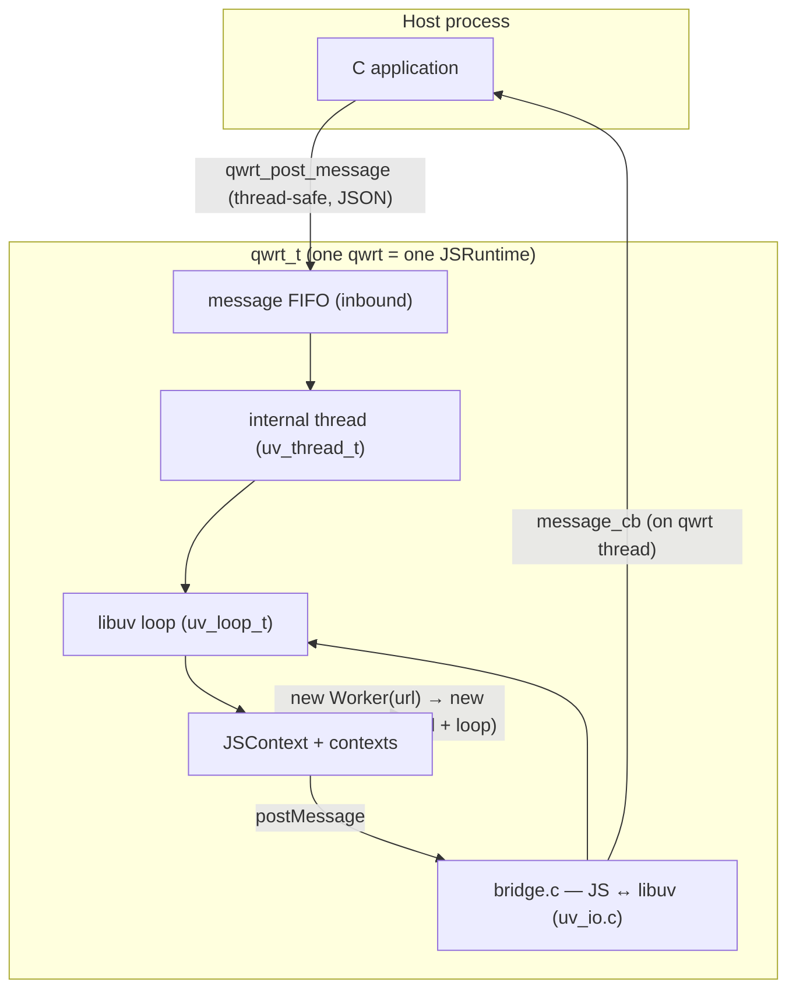

# Qwrt.js — Embeddable QuickJS Runtime

> 🌐 Website & API reference: **https://adam-ikari.github.io/qwrt/**

qwrt is a lightweight, **libuv-native** QuickJS-ng runtime wrapper for embedding
JavaScript in C applications. It provides a WinterTC-compatible runtime of
standard Web APIs (fetch, console, crypto, streams, timers, fs, …) and a small,
thread-safe C API for host ↔ runtime messaging and multi-context execution.
qwrt owns its own internal thread running a libuv event loop — the host never
touches JS directly.

## Features

- **QuickJS-ng engine** — full ES2023 support, fast startup (Release `qwrt -e 'console.log(1)'` median 4.82 ms after lazy WAMR init), low memory
- **libuv-native execution** — qwrt owns an internal thread + libuv loop; no host-side event-loop pumping
- **WinterTC-compatible runtime** — 21 modules: fetch, console, crypto.subtle, ReadableStream, setTimeout, fs, URL, TextEncoder, and more (verified as an ECMA-429 interface matrix + project gtest harness — the WPT runner was removed; this is interface parity, not byte-for-byte browser parity)
- **Streaming HTTP + TLS** — mbedTLS for HTTPS, chunked transfer decoding, certificate verification
- **Native extensions** — compression (miniz), crypto (mbedTLS), text codec (UTF-8/Base64), WebAssembly (WAMR default, wasm3 alternative)
- **Multi-context + Web Workers** — spawn isolated contexts (soft suspend/resume to disk); `new Worker(url)` runs real parallel threads
- **Host ↔ runtime messaging** — JSON messages via `qwrt_post_message` / `message_cb`; `postMessage` / `onmessage` on the JS side

## Quick Start

### Build

```bash
git clone --recursive https://github.com/adam-ikari/qwrt.git
cd qwrt
cmake -B build -DCMAKE_BUILD_TYPE=Release
cmake --build build -j$(nproc)
```
The WinterTC polyfill ships as precompiled bytecode with the JavaScript source
stripped (`qjsc -s`), shrinking the embedded polyfill bytecode by ~87%.
Polyfill initialization is lazy: core infrastructure (console, timers, event
targets, abort, URL, encoding, performance, navigator, structured clone, ...)
is set up at injection, while heavier or scenario-specific APIs (fetch,
streams, blob, worker, message-channel, caches, websocket, serve, fs,
storage, crypto.subtle, ...) initialize on first access. JS consumers observe
no difference — every name is visible (`in`/`Object.keys`) before first use
and resolves to the same descriptors as an eager install — so unused feature
APIs cost no setup time, closures, or resident instances.
The native WAMR runtime initializes lazily on first WebAssembly use as well —
end-to-end CLI startup (Release) dropped from 10.33 ms to **4.82 ms** median
for scripts that never touch `WebAssembly`.

### Minimal Example

```c
#include <qwrt/qwrt.h>
#include <stdio.h>

static void on_message(qwrt_t *rt, const char *json, size_t len, void *data) {
    (void)rt; (void)data;
    printf("received: %.*s\n", (int)len, json);
}

int main(void) {
    qwrt_config_t cfg = {0};
    cfg.initial_script = "postMessage({hello: 'world'});";
    cfg.message_cb = on_message;
    qwrt_t *rt = qwrt_create(&cfg);
    if (!rt) return 1;

    /* thread-safe inbound message; the runtime processes it on its own thread */
    qwrt_post_message(rt, "{\"cmd\":\"echo\",\"data\":\"hi\"}", 23);

    qwrt_destroy(rt);  /* graceful shutdown: request stop → join → free */
    return 0;
}
```

`qwrt_create` blocks until the internal thread is ready and `initial_script`
has been evaluated (a thrown exception makes `qwrt_create` return NULL).
`message_cb` fires on the qwrt thread for every `postMessage` from JS and must
be thread-safe.

### Examples

Runnable samples live in [`examples/`](examples/), built with `QWRT_BUILD_EXAMPLES=ON`:

```bash
cmake -B build -DCMAKE_BUILD_TYPE=Release -DQWRT_BUILD_EXAMPLES=ON
cmake --build build -j$(nproc)
./build/examples/hello/qwrt_hello   # host ↔ JS messaging
./build/examples/worker/qwrt_worker # real-thread Web Worker round-trip
```

### Build with Tests

```bash
cmake -B build -DCMAKE_BUILD_TYPE=Debug -DQWRT_BUILD_TESTS=ON
cmake --build build -j$(nproc)
cd build && ctest --output-on-failure
```

## Standalone CLI

qwrt ships a standalone runtime executable (built by default, `QWRT_BUILD_CLI=ON`)
that runs WinterTC Web APIs directly — no Node.js APIs (`process`, `require`,
`Buffer` are absent by design).

```bash
cmake --build build -j$(nproc)   # produces build/qwrt

./build/qwrt script.js a b c     # run a script, args via globalThis.arguments
./build/qwrt -e 'await fetch(url)' # evaluate a one-liner
./build/qwrt                     # interactive REPL (Ctrl-D to exit)
./build/qwrt --help
./build/qwrt --version
```

- **`globalThis.arguments`** — script args as an array (WinterCG
  `proposal-cli-api` direction; excludes the executable and script path)
- **`globalThis.env`** — process environment as a plain object
- **Async exit** — the runtime waits for pending async work (fetch, timers,
  streams) to complete before exiting, so top-level `await`-style scripts run to
  completion
- **Console routing** — `console.log`/`info`/`debug` → stdout,
  `console.warn`/`error` → stderr

```bash
./build/qwrt -e 'console.log(JSON.stringify(globalThis.arguments))' a b c
# => ["a","b","c"]
```

## Architecture



All JS runs on qwrt's single internal thread (Worker contexts on additional
threads). The host drives work by posting JSON messages and receiving replies
through `message_cb`.

## API Reference

### Core API

| Function | Description |
|----------|-------------|
| `qwrt_create(config)` | Create runtime; blocks until internal thread ready + `initial_script` eval'd. Returns NULL on failure. |
| `qwrt_destroy(rt)` | Graceful shutdown: request thread exit → join → free. Host thread only, NULL-safe. |
| `qwrt_post_message(rt, json, len)` | Thread-safe inbound JSON message (copied). Returns 0 / -1. |
| `qwrt_get_runtime_data(rt)` / `qwrt_set_runtime_data(rt, data)` | Per-runtime opaque pointer accessors. |
| `qwrt_free(ptr)` | Free malloc'd blocks. NULL-safe. |

### Configuration (`qwrt_config_t`)

| Field | Description |
|-------|-------------|
| `initial_script` | Eval'd on the qwrt thread at create; a throw → `qwrt_create` returns NULL. |
| `message_cb` | Outbound message callback, fires on the qwrt thread (must be thread-safe). |
| `debug` | DAP debugger bits (see Debugging). |
| `host_data` | Per-runtime opaque pointer, read via `qwrt_get_runtime_data`. |

### Multi-context

Multi-context (spawn/suspend/resume and `qwrtContext.*`) and Web Workers are
JS-level APIs — see the [docs](https://adam-ikari.github.io/qwrt/) for
`qwrtContext.spawn` / `suspend` / `resume` and `new Worker(url)`.

### Extensions

Extensions are registered at build time via the `QWRT_EXTENSIONS` macro (see
`include/qwrt/qwrt_ext_registry.h`); there is no runtime registration API.
Built-in extensions (compress/crypto/textcodec/wamr) are auto-registered when
their `QWRT_WITH_*` is on. A parent project adds its own extension to the table
non-invasively via the CMake `QWRT_EXTENSIONS` / `QWRT_EXTRA_SOURCES` variables.

## CMake Options

`QWRT_WITH_*` toggles optional native extensions layered on the runtime. libuv
itself is a **hard dependency** (always built from `deps/libuv`) — there is no
platform-backend option anymore.

### Feature Toggles (`QWRT_WITH_*`)

| Option | Default | Description |
|--------|---------|-------------|
| `QWRT_WITH_WAMR` | ON | WAMR WebAssembly engine (Fast Interp + AOT) |
| `QWRT_WITH_WASM3` | OFF | wasm3 WebAssembly engine (alternative; mutually exclusive with WAMR) |
| `QWRT_WITH_TLS` | ON | mbedTLS HTTPS (forces `QWRT_WITH_CRYPTO_EXT=ON`) |
| `QWRT_WITH_COMPRESS` | ON | miniz compression extension |
| `QWRT_WITH_CRYPTO_EXT` | ON | crypto.subtle extension (undefined when OFF) |
| `QWRT_WITH_TEXTCODEC` | ON | UTF-8/Base64 extension |
| `QWRT_WITH_NONUTF_ENCODINGS` | OFF | non-UTF encoding labels (Latin-1, replacement) in TextDecoder |

### Build Profiles (`QWRT_PROFILE`)

`QWRT_PROFILE` 是 `QWRT_WITH_*` 各项的预设包，**只改未显式指定的项**：
`-DQWRT_PROFILE=minimal -DQWRT_WITH_TLS=ON` 中显式的 `TLS=ON` 赢。空值
（默认）时各项行为与历史默认逐位一致。取值 `minimal | standard | bare`，
其他值 configure 报错。

| Profile | 宏效果 | qwrt 尺寸（strip 后，实测） | ECMA-429 WinterTC | 适用场景 |
|---------|--------|---------------------------|-------------------|----------|
| `standard`（与空 profile 等效） | 与历史默认相同：WAMR/TLS/COMPRESS/CRYPTO_EXT/TEXTCODEC=ON | 同默认构建 | ✅ 全量必选满足 | 通用运行时 |
| `minimal` | 同 standard 但 **TLS=OFF**（fetch 降级 http-only；ECMA-429 不含 HTTPS） | **2.45 MiB**（Release/-O3）；1.81 MiB（MinSizeRel/-Os） | ✅ 全量必选仍满足：atob/btoa、WebAssembly（WAMR）、crypto.subtle、CompressionStream 全部在 | 嵌入式/尺寸敏感，仍需过 WinterTC 一致性 |
| `bare` | WAMR/TLS/COMPRESS/CRYPTO_EXT/TEXTCODEC 全 OFF | 1.49 MiB（Release/-O3）；1.05 MiB（-Os） | ❌ **不满足**：`WebAssembly` undefined、`btoa`/`atob` 抛 TypeError、`crypto.subtle` undefined、CompressionStream 读取时抛 "Native compression extension not available" | 纯脚本执行器，无 Web API 需求 |

实测命令与行为探测（2026-09-12，x86_64 Linux）：

```bash
cmake -S . -B build_profile_min -DQWRT_PROFILE=minimal -DCMAKE_BUILD_TYPE=Release
cmake --build build_profile_min -j
strip build_profile_min/qwrt   # 2,573,536 B
./build_profile_min/qwrt -e 'console.log(typeof btoa, typeof WebAssembly, typeof crypto?.subtle, typeof CompressionStream)'
# minimal: function object object function   bare: function undefined undefined function
```

```bash
cmake -S . -B build_profile_bare -DQWRT_PROFILE=bare -DCMAKE_BUILD_TYPE=Release
cmake --build build_profile_bare -j
./build_profile_bare/qwrt -e 'console.log(typeof btoa, typeof WebAssembly, typeof crypto?.subtle, typeof CompressionStream)'
# bare: function undefined undefined function
```

### gRPC Stack (`QWRT_WITH_GRPC`)

`QWRT_WITH_GRPC`（默认 OFF）现在是 CMake option：ON 时构建系统向
polyfill rebuild 传 `QWRT_WITH_GRPC=1`，把 gRPC/HTTP2 栈（h2 + HPACK +
protobuf + grpc，~3.5k 行 JS）编进 `src/polyfill_default.c`。依赖 npm +
esbuild + qjsc（polyfill rebuild 本来就依赖，无新增前提）。手工路径仍是
`QWRT_WITH_GRPC=1 node polyfill/build.js`。

> Note: before `QWRT_WITH_GRPC` was a CMake option, the stack was gated only
> inside the polyfill **build** step (`QWRT_WITH_GRPC=1 node
> polyfill/build.js`). The CMake option drives the same rebuild
> automatically; the manual path still works.

### Build Targets (`QWRT_BUILD_*`)

| Option | Default | Description |
|--------|---------|-------------|
| `QWRT_BUILD_TESTS` | OFF | Build test suite |
| `QWRT_BUILD_DEBUGGER` | OFF | DAP step-debugger (patches QuickJS-ng; adds `src/debugger.c` + `src/debugger_dap.c`) |

### Library Outputs

| Target | Description |
|--------|-------------|
| `libqwrt.a` | Static core. Deliberately does **not** link libuv — uv symbols resolve at the final executable. |
| `libqwrt_full.a` | CMake link-interface aggregator: qwrt + real libuv + mbedTLS + miniz + WAMR + pthread/dl/rt. |
| `qwrt.pc` | pkg-config. `pkg-config --cflags --libs qwrt` yields the full static link line (all vendored archives). |

## WinterTC Modules

| Module | Globals | Backend |
|--------|---------|---------|
| fetch | `fetch`, `Headers`, `Request`, `Response` | libuv (uv_io.c) |
| console | `console` | stdout |
| crypto | `crypto`, `crypto.subtle` | ext_crypto (mbedTLS) |
| streams | `ReadableStream`, `WritableStream` | — |
| timers | `setTimeout`, `setInterval` | libuv timers |
| fs | `fs.read`, `fs.write` | libuv (uv_io.c) |
| storage | `storage.get/set/delete` | libuv in-memory map |
| encoding | `TextEncoder`, `TextDecoder` | ext_textcodec |
| url | `URL`, `URLSearchParams` | — |
| abort | `AbortController`, `AbortSignal` | — |
| performance | `performance.now()` | libuv hrtime |
| event-target | `EventTarget`, `Event` | — |
| blob | `Blob`, `File`, `FormData` | — |
| message-channel | `MessageChannel`, `MessagePort` | — |
| navigator | `navigator` | — |
| structured-clone | `structuredClone` | — |
| error-events | `ErrorEvent` | — |

## Dependencies

All dependencies are built from source via CMake `add_subdirectory` — qwrt
never links system libraries, and each dep's objects live in the main build
tree (subject to `-j` and incremental rebuild). All are git submodules with
pinned versions. qwrt and all its dependencies build under **strict C99** —
quickjs-ng and libuv ship C11 `<stdatomic.h>` code, but qwrt applies small
patches (GCC/Clang `__atomic_*` builtins, no C11) so they compile under
`-std=c99`.

| Dependency | Source | Required | Purpose |
|------------|--------|----------|---------|
| QuickJS-ng | git submodule | Yes | JS engine (C99; atomics patched) |
| libuv | git submodule | Yes | Event loop / I/O backend (C99; atomics patched) |
| mbedTLS | git submodule | No (QWRT_WITH_TLS) | TLS / crypto (C99) |
| miniz | git submodule | No (QWRT_WITH_COMPRESS) | Compression (C90) |
| WAMR | git submodule | No (QWRT_WITH_WAMR) | WebAssembly engine (default) |
| wasm3 | git submodule | No (QWRT_WITH_WASM3) | WebAssembly engine (alternative) |

## Thread Safety

- **All JS runs on qwrt's internal thread** — the host never calls into JS directly.
- `qwrt_create` / `qwrt_destroy` are host-thread calls; `qwrt_create` blocks until the internal thread is ready.
- `qwrt_post_message` is **thread-safe** (any thread may call it; the JSON is copied).
- `message_cb` fires on the qwrt thread — the host callback must be thread-safe.
- Worker contexts each run on their own thread + loop (real parallelism).

## Debugging

qwrt ships a DAP (Debug Adapter Protocol) step-debugger built into the
library — step-debug any embedded program in VS Code. Enable with
`-DQWRT_BUILD_DEBUGGER=ON` (patches QuickJS-ng to add breakpoint/step
primitives; zero overhead when OFF). Run your program with `QWRT_DEBUG=1`
(or set bit 1 of `qwrt_config_t.debug`) and VS Code attaches with
`request:"attach"`. See [docs/dev/debugging.md](docs/dev/debugging.md) for
the full setup, launch.json, and limitations.

## Testing

Tests are GoogleTest `.cpp` suites in `test/`, linked against `qwrt` plus
`mock_libuv` (a fake `uv_*` API for deterministic offline tests — see
`test/mock_libuv.h` and the `HostCtx` harness in `test/test_host.h`).

```bash
# Unit tests
cmake -B build -DCMAKE_BUILD_TYPE=Debug -DQWRT_BUILD_TESTS=ON
cmake --build build -j$(nproc)
cd build && ctest --output-on-failure

# With valgrind
valgrind --leak-check=full ./build/test/test_qwrt_gtest
```

Tests are labelled for selection (`ctest -L <label>`):
- `offline` — local, deterministic (default; what CI runs)
- `network` — outbound HTTP/HTTPS
- `benchmark` — performance, not pass/fail
- `test262` — QuickJS-ng ECMAScript conformance

```bash
ctest -L offline          # CI default — green
ctest -L network          # only when network is available
```

## License

MIT
