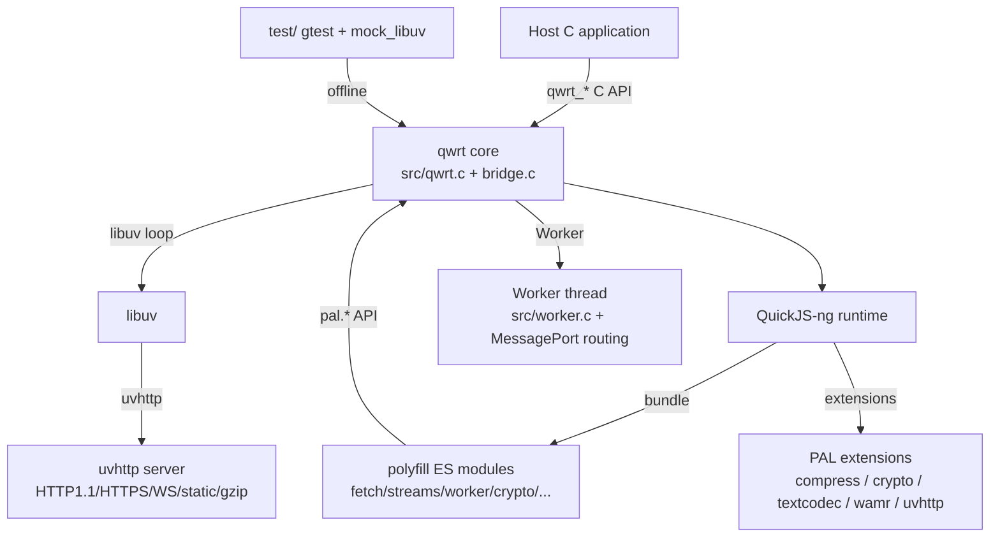

# System architecture

## Overview

qwrt 是 C99 编写的嵌入式 JS 运行时包装层：宿主通过 C API（qwrt_create/destroy/eval/tick）
与 qwrt 交互；qwrt 拥有独立内部线程 + libuv 事件循环，polyfill（ES module 经 esbuild 打包）
提供 WinterTC Web API 层；原生扩展通过 PAL 桥接暴露给 JS。

## Module graph

## Constraints

- 严格 C99，宿主零事件循环参与（qwrt 自持线程）
- 确定性离线测试:mock_libuv 替换真实 libuv，无网络/无真实时间依赖
- 子模块策略:deps/ 全部 pin 版本(quickjs-ng/wamr/uvhttp/mbedtls/...)；UVHTTP 集成走 upstream PR
- polyfill 产物(disting/polyfill.js + src/polyfill_default.c)纳入 git(git add -f)
