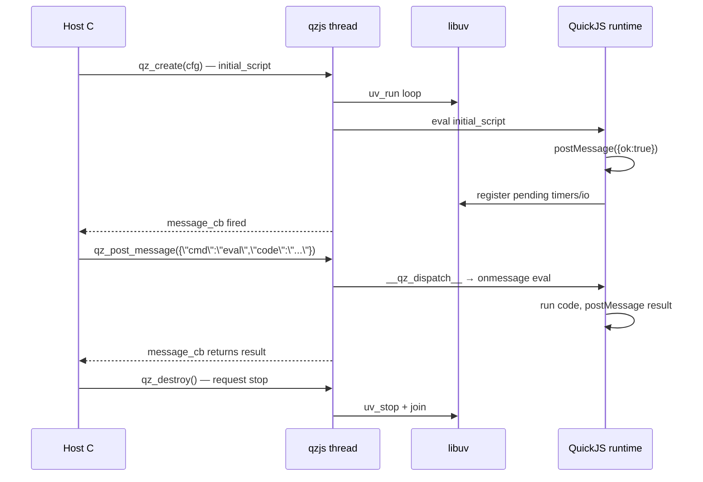

# Key flows

## End-to-end path of a typical request（宿主→JS 消息）

## Other important flows

- Worker 生命周期：qzjs 内部新建线程 → QuickJS 独立 JSRuntime → __qz_dispatch__ 消息通道
- MessagePort 跨线程：pal.portCreate() 分配全局 port id 对 → 序列化到字节通 → 接收侧 __qz_port_from_ref__ 重建代理
- HTTPServer 请求：serve() raw TCP accept → JS 解析 HTTP/1.1 → JS handler（fetch 风格）→ JS 构造 Response → 经 tcp/TLS 原语回写
