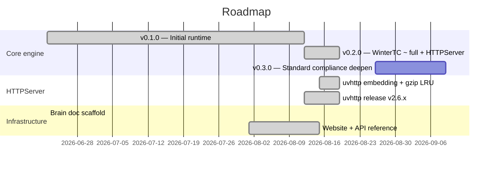

# Roadmap

## Milestones

### v0.1.0 — Initial (2026-06-22 ~ 2026-08-12)
- Core runtime: qwrt_create/destroy/tick/eval/call, multi-context, DAP debugger
- WinterTC: fetch, console, crypto, streams, timers, URL, encoding, Blob, EventTarget, AbortController, structuredClone
- Extensions: compress (miniz), crypto (mbedTLS), textcodec, WAMR/wasm3
- PAL: libuv (Linux/macOS), mock (testing), FreeRTOS (ESP32)
- test262 CI, WPT runner, WASM playground, npm compat checker

### v0.2.0 — WinterTC ~ full + HTTPServer (2026-08-12 ~ 2026-08-19)
- WinterTC ECMA-429: BYOB streams, Crypto/SubtleCrypto/Performance globals, crypto.subtle wrapKey/unwrapKey
- fetch redirect semantics + Request options storage
- streams: tee() cancel propagation, pipeTo backpressure/abort/close, TextDecoderStream
- Worker: structuredClone transferable (ArrayBuffer + MessagePort), multihop MessagePort transfer
- HTTPServer: uvhttp-backed HTTP/1.1 + HTTPS + WebSocket + static + gzip compression
- CLI: standalone REPL + script mode, WinterCG args/env bridge
- Perf: HTTPServer gzip LRU cache (+2.25x /gzip)

### v0.3.0 — Standard compliance deepen (next, ~2026-08-26)
- WinterTC gtest coverage expansion (Phase 3-style)
- Completement missing API surfaces (EventSource, PerformanceObserver, etc.)
- test262 regression baseline
- uvhttp router_cache ABI fix (#349) integrated
