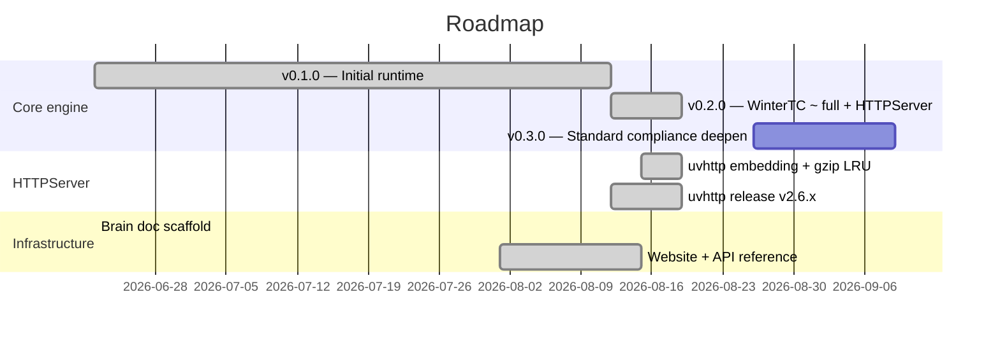

# Roadmap

> **本页是指针，不是事实源。** 执行级路线图（领域工作项、里程碑节奏、验证矩阵、明确不做）以仓库根 `ROADMAP.md` 为唯一事实源；设计原则见 `ROADMAP.md` §二，政策与裁决以 `brain/pages/` 为准（范式见 [[oss-library-policy]]）。新增里程碑只更新 `ROADMAP.md`，不在本页复制。

## Milestones（粗粒度历史视图）

各里程碑的详细交付内容、领域工作项与验证门槛见 `ROADMAP.md` §三～§六。本页甘特图仅保留粗粒度视图。
