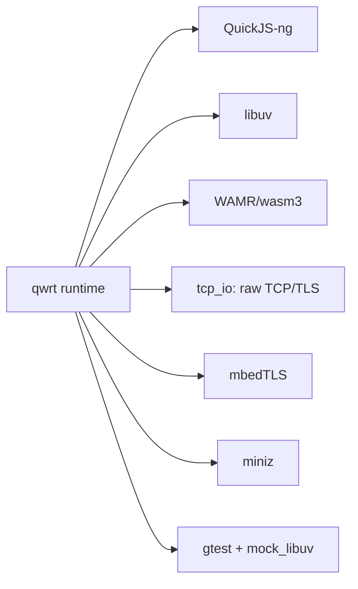

# Tech stack

## Technology choices

| domain | candidates | decision | rationale |
|---|---|---|---|
| JS engine | QuickJS-ng, V8, JSC, Hermes | QuickJS-ng | 可嵌入、ES2020 支持、低内存、C 友好，可静态链接 |
| 事件循环 | libuv, 自研, io_uring 直驱 | libuv | 跨平台、成熟、与 mbedTLS 生态一致；内核 io_uring workaround（PVE 6.17）已记录 |
| WebAssembly | WAMR, wasm3, wasmtime | WAMR-2.4.5 默认 (Fast JIT)，wasm3 可选 | 嵌入式优先；wasm3 零依赖备选 |
| HTTP 服务器 | uvhttp, libuv http-parser, 自研 | 纯 JS serve()（raw TCP + mbedTLS） | `polyfill/src/http-server.js` 实现 HTTP/1.1/HTTPS/WS/static/gzip；C 仅经 `src/tcp_io.c` 提供 TCP/TLS 原语，协议解析全在 JS 层 |
| 加密 | mbedTLS, OpenSSL, BoringSSL | mbedTLS (v3.6.x) | 嵌入式友好、MIT 许可、TLS + crypto.subtle 共用 |
| 压缩 | miniz, zlib, zstd | miniz (v3.1.2) | 单文件、无外部依赖、确定性输出（gtest 已验证） |
| 测试 | googletest + mock_libuv, WPT, cpputest | googletest + mock_libuv 离线 gtest；WPT runner 已移除 | 确定性离线测试；WinterTC 覆盖转向 gtest |
| 构建 | CMake, Meson | CMake (>=3.10) | 生态成熟、submodule 集成、ESP-IDF 兼容 |

## Decision mindmap

## Open items

- 标准合规深化（v0.3.0）：EventSource / PerformanceObserver 等缺失 API
- HTTPServer /hello 吞吐：QuickJS 请求处理路径优化
- WASM Fast JIT 内存占用基线复核
