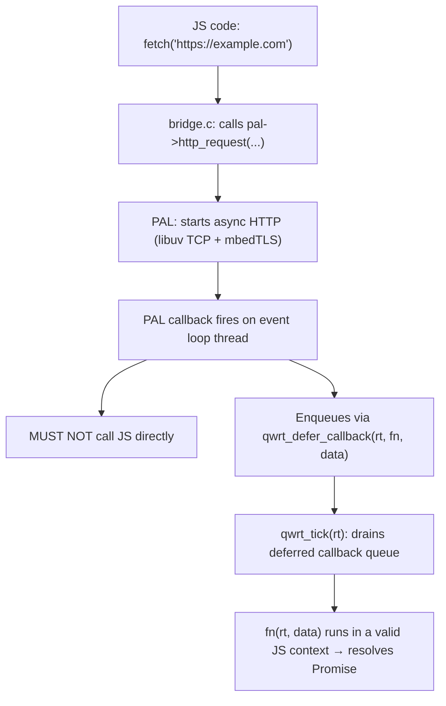

# Event Loop

qwrt is single-threaded. All async operations (HTTP requests, file I/O, timers) are driven by a cooperative event loop.

## The Loop

The host drives the event loop by alternating between two calls:

```c
while (running) {
    // 1. Drive the PAL event loop — process I/O, fire timers
    int events = pal->run_cycle(pal, 100);  // 100ms timeout

    // 2. Drain JS microtasks — resolve Promises, dispatch callbacks
    qwrt_tick(rt);

    // 3. Check exit condition
    if (events < 0) break;  // PAL requested stop
}
```

## How Async Operations Work



## Deferred Callbacks

PAL implementations must not call into JavaScript directly from their callbacks (libuv callbacks, timer fires, etc.). Instead, they enqueue work via:

```c
void qwrt_defer_callback(qwrt_t *rt, qwrt_deferred_fn fn, void *data);
```

`qwrt_tick` drains this queue, calling each `fn(rt, data)` in a valid JS context.

## `run_cycle` Semantics

| timeout_ms | Behavior |
|------------|----------|
| `< 0` | Block until an event arrives |
| `0` | Non-blocking — process ready work only |
| `> 0` | Block up to timeout_ms milliseconds |

Returns: number of events processed, 0 if timeout elapsed, or `< 0` if the loop should stop.

`run_cycle` is **optional** — if NULL, the host calls `qwrt_tick` directly on its own schedule.

## Complete Event Loop Example

```c
#include <qwrt/qwrt.h>
#include <pal_uv.h>

int main(void) {
    qwrt_pal_t *pal = pal_uv_create(NULL);
    qwrt_t *rt = qwrt_create(&(qwrt_config_t){ .pal = pal });

    // Start an async operation
    qwrt_eval(rt,
        "fetch('https://httpbin.org/json')"
        "  .then(r => r.json())"
        "  .then(d => console.log('got:', JSON.stringify(d)))",
        NULL);

    // Drive the event loop
    int running = 1;
    while (running) {
        int events = pal->run_cycle(pal, 100);
        if (events < 0) break;
        qwrt_tick(rt);
        // Check if there's more work to do...
    }

    qwrt_destroy(rt);
    return 0;
}
```

## Without an Event Loop

If your PAL has no `run_cycle` and all operations are synchronous, you can skip the loop:

```c
qwrt_eval(rt, "console.log('Hello!');", NULL);
qwrt_tick(rt);  // drain microtasks
qwrt_destroy(rt);
```

`qwrt_tick` is still needed — it drains Promise microtasks that accumulate even in synchronous code.
