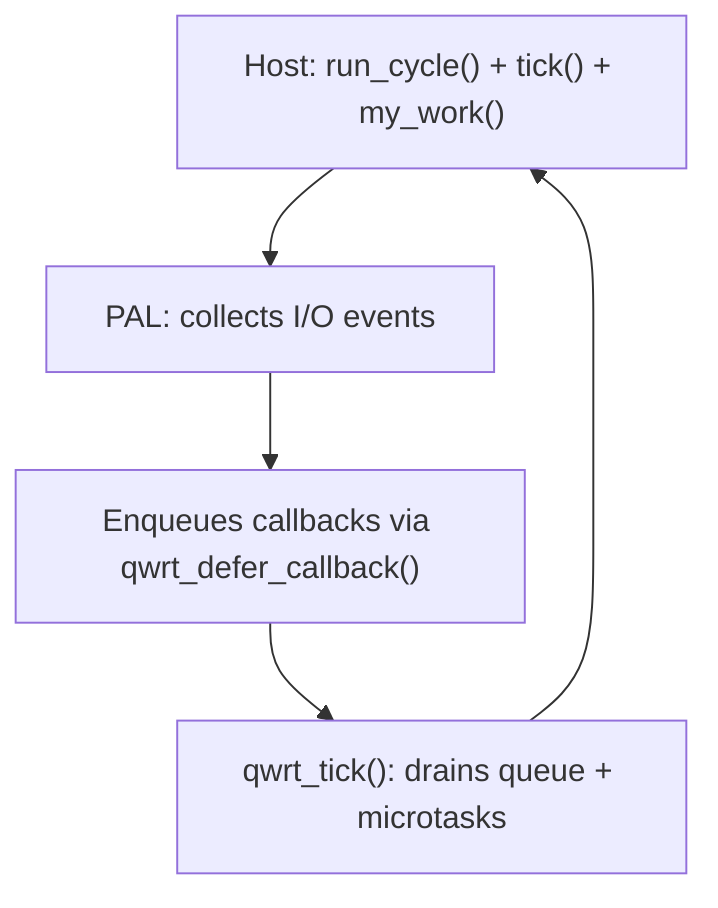

# Event Loop

qwrt is single-threaded. All async operations are driven by a cooperative event loop controlled by the host.

## The Golden Rule

**qwrt_tick processes one batch and returns.** It does NOT loop internally. The host decides the timing:

```c
while (running) {
    pal->run_cycle(pal, 100);   // collect I/O events, fire timers
    qwrt_tick(rt);               // process one batch of JS work
    my_other_work();             // YOUR code — never starved
}
```

This is the key design decision: qwrt never blocks the host. Your code runs every loop iteration, no matter how many callbacks are queued.

## How It Works



## qwrt_tick Semantics

```c
int ret = qwrt_tick(rt);
// ret == 1:  work was processed (callbacks fired, promises resolved)
// ret == 0:  nothing to do (idle)
// ret == -1: error
```

One call to `qwrt_tick` does exactly:
1. Process all deferred PAL callbacks queued since last tick
2. Execute all pending JS microtasks (Promise resolutions)

Then returns. No loops, no blocking, no starvation.

## Deferred Callbacks

PAL implementations NEVER call JS directly from their callbacks. They enqueue via:

```c
void qwrt_defer_callback(qwrt_t *rt, qwrt_deferred_fn fn, void *data);
```

`qwrt_tick` drains this queue in a valid JS context.

## run_cycle Semantics

Optional. If provided, the PAL collects I/O events and fires timers:

| timeout_ms | Behavior |
|------------|----------|
| `< 0` | Block until an event arrives |
| `0` | Non-blocking — process ready work only |
| `> 0` | Block up to timeout_ms milliseconds |

Returns events processed, or `< 0` to request loop stop.

## Why Not One Big Loop Inside qwrt_tick?

If `qwrt_tick` looped until all work was done:
- A burst of HTTP responses could delay your sensor reading by seconds
- Timer-heavy JS code could starve your UI thread
- You can't interleave qwrt with your own event sources

By returning after each batch, YOU control the scheduling.

## Complete Example

```c
#include <qwrt/qwrt.h>
#include <pal_uv.h>

int main(void) {
    qwrt_pal_t *pal = pal_uv_create(uv_default_loop());
    qwrt_t *rt = qwrt_create(&(qwrt_config_t){ .pal = pal });

    // Start an async operation
    qwrt_eval(rt,
        "fetch('https://httpbin.org/json')"
        "  .then(r => r.json())"
        "  .then(d => console.log('got:', JSON.stringify(d)))",
        NULL);

    // Drive the event loop — your code runs every iteration
    int running = 1;
    while (running) {
        int events = pal->run_cycle(pal, 100);
        if (events < 0) break;
        qwrt_tick(rt);

        // Your code here — never delayed by qwrt
        check_sensors();
        update_display();
        if (should_exit()) running = 0;
    }

    qwrt_destroy(rt);
    return 0;
}
```

## Without an Event Loop

If your PAL has no `run_cycle`:

```c
qwrt_eval(rt, "console.log('Hello!');", NULL);
qwrt_tick(rt);  // drain microtasks
qwrt_destroy(rt);
```

## Synchronous Code Still Needs Tick

Even synchronous JS can accumulate Promise microtasks that need draining:

```c
qwrt_eval(rt, "Promise.resolve(42).then(v => console.log(v));", NULL);
qwrt_tick(rt);  // required — otherwise console.log never fires
```