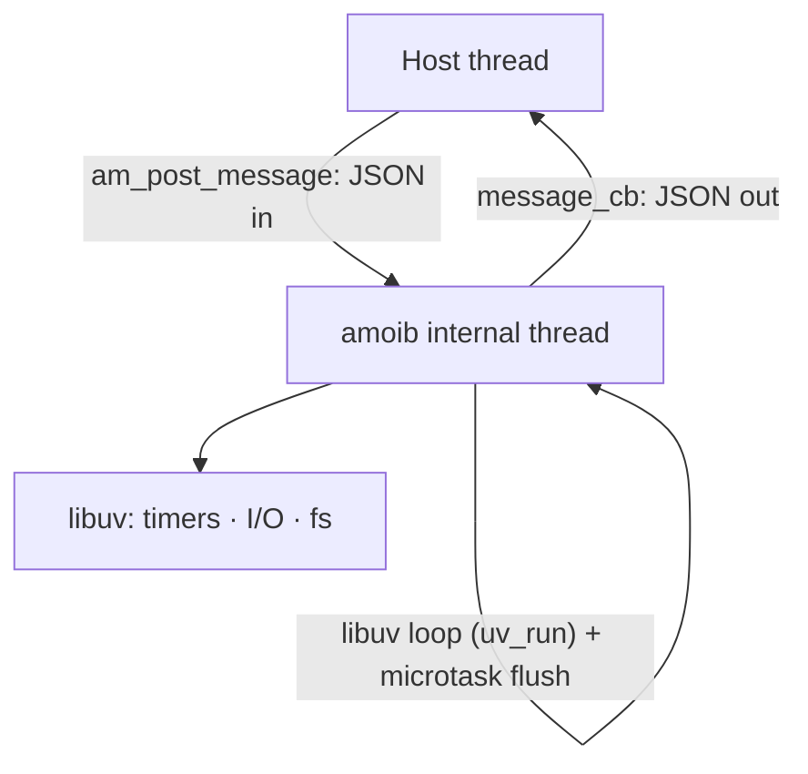

# Event Loop

amoib owns its own event loop on an internal thread. There is no `am_tick`
and no host-driven loop — the host does not pump anything.

## Who Runs the Loop

`am_create` starts a dedicated internal thread (`uv_thread_t`) that runs a
libuv loop (`uv_loop_t` embedded in the runtime). That loop drives all async
work — HTTP, file I/O, timers — and all JS runs on the same thread, so Promise
microtasks are flushed naturally between loop iterations. The host thread never
touches the loop.


```mermaid
flowchart TB
    HOST["Host thread"] -->|"am_post_message: JSON in"| AM["amoib internal thread"]
    AM -->|"libuv loop (uv_run) + microtask flush"| AM
    AM -->|"message_cb: JSON out"| HOST
    AM --> LIBUV["libuv: timers · I/O · fs"]
```

## How the Host Drives Work

The host cannot eval and does not tick. It drives the runtime by posting JSON
messages and receiving replies:

```c
#include <amoib/amoib.h>
#include <stdio.h>

static void on_message(am_t *rt, const char *json, size_t len, void *data) {
    (void)rt; (void)data;
    printf("received: %.*s\n", (int)len, json);
}

int main(void) {
    am_config_t cfg = {0};
    cfg.initial_script =
        "globalThis.onmessage = function (e) { postMessage('pong'); };";
    cfg.message_cb = on_message;
    am_t *rt = am_create(&cfg);
    if (!rt) return 1;

    am_post_message(rt, "{\"cmd\":\"ping\"}", 14);
    // on_message fires on the amoib thread when the reply is ready.
    // The host is free to do its own work meanwhile — never blocked by amoib.

    am_destroy(rt);
    return 0;
}
```

`am_post_message` is thread-safe (the JSON is copied), so it may be called
from any thread. `message_cb` fires on the amoib thread — your callback must be
thread-safe.

## Why This Design

- The host is **never** responsible for pumping an event loop — amoib runs
  itself, and the host thread stays free for its own work.
- All async events and JS callbacks are serialized on amoib's single internal
  thread — no locks, no races inside the runtime.
- No `am_tick` to forget: microtasks are flushed automatically between loop
  iterations.
