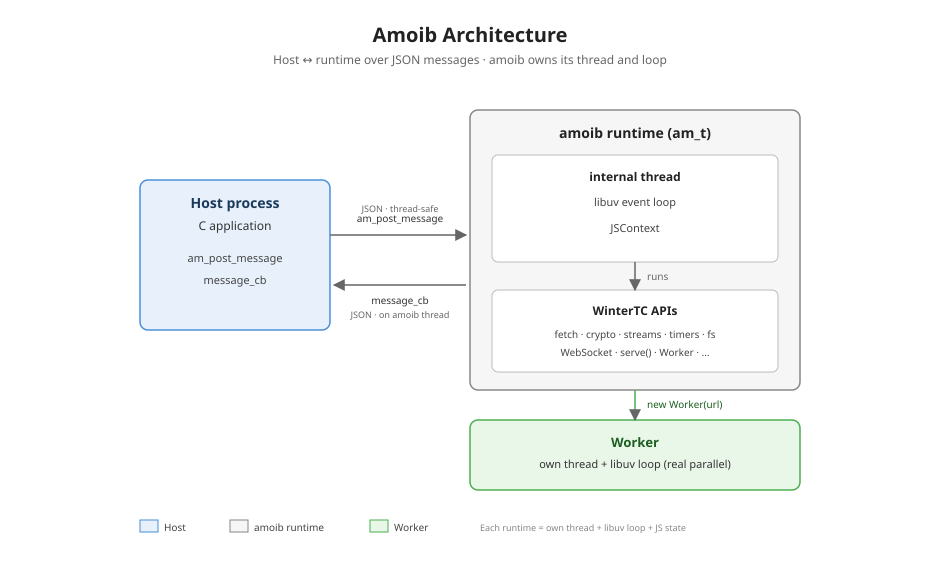

# Overview

amoib is an **embeddable QuickJS-ng runtime wrapper** written in **strict C99**. It provides a small C API on top of the QuickJS-ng engine and a **WinterTC-compatible runtime**. amoib owns its own internal thread and libuv event loop, and communicates with the host over JSON messages.

For a C application that wants part of its logic in JavaScript, amoib supplies the runtime; the host builds no event loop or thread of its own.

## How the Host Fits



- **Own thread + event loop** — amoib starts an internal thread running a libuv loop; the host never pumps it
- **Message-based host boundary** — `am_post_message` (in) / `message_cb` (out), JSON in both directions
- **Isolated runtime model** — each instance runs JS on its own internal thread; internal locks and atomics coordinate the thread, host, and worker boundaries, never JS execution
- **ECMAScript engine (ES2023)** — QuickJS-ng under the hood, fast startup, low memory
- **WinterTC-compatible runtime** — `fetch`, `console`, `crypto.subtle`, `ReadableStream`, timers, `fs`, `URL`, `TextEncoder`, WebSocket, and more
- **Native extensions** — compression (miniz), crypto (mbedTLS), text codec, WebAssembly (WAMR, wasm3 optional)
- **Zero system dependencies** — all deps built from source via CMake; libuv is built from the deps submodule
- **Multi-context + Web Workers** — isolated contexts (soft suspend/resume to disk); `new Worker(url)` runs a real parallel thread, or — with `-DAM_PROCESS_MODEL=ISOLATED`, the default — a dedicated child process (`amoib-rt` via fork+exec)

## The Host Integration Path

The Guide follows the order a host developer works in:

1. **[Quick Start](/guide/quickstart)** — build amoib and run the minimal C embedding
2. **[Host Integration](/guide/host-integration)** — the full loop: create → messaging → lending capabilities → destroy
3. **[Lifecycle](/guide/lifecycle)** — thread ownership, readiness, graceful shutdown
4. **[Multi-Context](/guide/multi-context)** — multiple isolated contexts in one runtime
5. **[Extensions](/guide/extensions)** — register your own C functions as JS globals
6. **[Bytecode](/guide/bytecode)** — precompile JS to QuickJS bytecode (faster startup, no source shipped)

## When to Use amoib

| Use Case | Why amoib |
|----------|----------|
| **Embedded / edge scripting** | C99, tiny footprint, libuv event loop built in |
| **Plugin systems** | Per-runtime isolation, multi-context handled inside the runtime |
| **Host applications needing scripting** | Script your C app's behavior in JS without shipping Node.js |
| **Edge compute** | WinterTC APIs feel familiar to JS developers |
| **Testing & simulation** | `mock_libuv` for deterministic tests, no network needed |

## When NOT to Use amoib

- You need the **Node.js module system** — amoib has no `require`/`import` of Node built-ins. Many pure-JS npm packages work (run `python3 test/compat_check.py <pkg>` (see [Compatible Packages](/guide/compatible-packages#checking-compatibility))); Node-only ones do not.
- You need **DOM** — amoib provides the WinterTC/W3C subset (fetch, WebSocket, streams, localStorage, ...) but no `document`/`window`.
- You need **shared-memory concurrency** — the main runtime is single-threaded; Web Workers run real parallel threads or processes but communicate via structured-clone messages, not shared memory.
- You need **JIT performance** — QuickJS is an interpreter, not a JIT compiler.

## Project Structure

```
amoib/
├── include/amoib/       # Public headers (amoib.h)
├── src/                 # Core runtime
│   ├── amoib.c           #   Core API (create/destroy/post_message)
│   ├── thread.c         #   Internal thread + libuv loop
│   ├── uv_io.c          #   libuv I/O (network, fs, timers)
│   ├── msgq.c           #   Message queue (host ⇄ runtime)
│   ├── worker.c         #   Message dispatch (onmessage/postMessage)
│   ├── bridge.c         #   JS ↔ runtime bridge
│   └── context.c        #   Multi-context
├── polyfill/src/        # WinterTC module source

```
