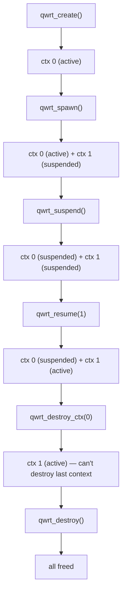

# Multi-Context

qwrt supports multiple isolated JS contexts within a single runtime. Each context has its own global object, PAL, WinterCG modules, and extension state — like lightweight sandboxes.

## Why Multi-Context?

- **Plugin isolation** — each plugin gets its own context; one crash doesn't take down others
- **Permission separation** — different PAL configurations per context (e.g., one has network access, another doesn't)
- **Request scoping** — create a fresh context per HTTP request for clean state
- **Resource limits** — destroy contexts individually to reclaim memory

## Architecture

One `qwrt_t` owns one `JSRuntime`. Multiple `JSContext` instances share that runtime. QuickJS class IDs are runtime-scoped, so class definitions are shared — but each context has independent instances.

Only **one context is active at a time**. `qwrt_eval` and `qwrt_tick` always operate on the active context.

## Spawning a Context

```c
// Create a new context with its own PAL (e.g., restricted permissions)
qwrt_config_t ctx_config = {
    .pal = restricted_pal,
    .debug = 0,
};
int ctx_id = qwrt_spawn(rt, &ctx_config);
if (ctx_id < 0) {
    // Spawn failed
}
```

The new context starts in **suspended** state. The current active context is unchanged.

## Switching Contexts

```c
// Suspend current context (deactivates it)
qwrt_suspend(rt);

// Resume a different context (activates it)
qwrt_resume(rt, ctx_id);

// Now qwrt_eval runs in ctx_id's context
qwrt_eval(rt, "console.log('Hello from context!');", NULL);
```

Suspending calls each extension's `suspend` hook. Resuming calls `resume` hooks.

## Destroying a Context

```c
qwrt_destroy_ctx(rt, ctx_id);
```

Fails if this is the **only remaining context** — you can't destroy the last context. Use `qwrt_reset` or `qwrt_destroy` to tear everything down.

## Getting Context Info

```c
// Current active context ID, or -1 if none
int active = qwrt_get_active_ctx_id(rt);

// Active context's JSContext*, or NULL
JSContext *ctx = qwrt_get_jsctx(rt);
```

## Context Lifecycle Summary


