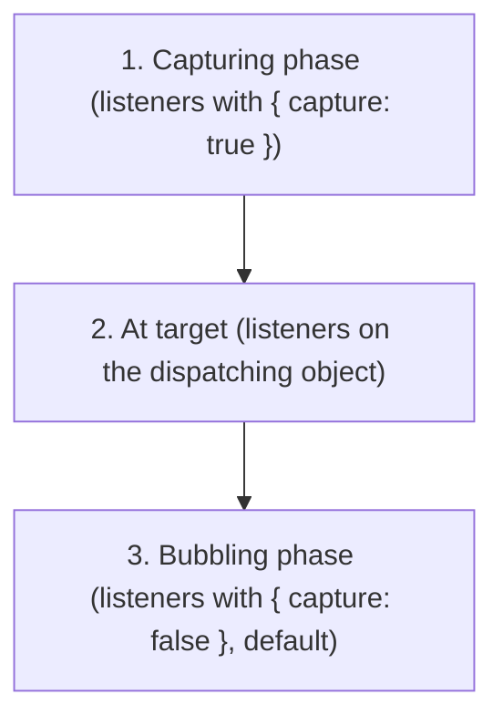

# EventTarget / Event / CustomEvent / ErrorEvent

The WHATWG DOM Events subset (no DOM nodes). `EventTarget` provides a mixin for `addEventListener` / `dispatchEvent` patterns. `ErrorEvent` integrates with `navigator.reportError`.

## Globals

| Global | Description |
|--------|-------------|
| `EventTarget` | Base class for event dispatch |
| `Event` | Base event type |
| `CustomEvent` | Event with `detail` payload |
| `ErrorEvent` | Error event with message/file/line/col/error |

## EventTarget

### Basic Usage

```js
class MyEmitter extends EventTarget {}

let emitter = new MyEmitter();

// Listen
emitter.addEventListener('update', (event) => {
    console.log('Update event:', event.detail);
});

// Dispatch
emitter.dispatchEvent(new CustomEvent('update', {
    detail: { time: Date.now() }
}));
```

### addEventListener(type, listener, options?)

```js
target.addEventListener('click', handler);

// With options
target.addEventListener('click', handler, { once: true });   // auto-remove
target.addEventListener('click', handler, { capture: true }); // capture phase
target.addEventListener('click', handler, { passive: true }); // won't preventDefault

// AbortSignal integration
let controller = new AbortController();
target.addEventListener('click', handler, { signal: controller.signal });
controller.abort(); // removes the listener
```

### removeEventListener(type, listener, options?)

```js
target.removeEventListener('click', handler);
target.removeEventListener('click', handler, { capture: true });
```

### dispatchEvent(event)

```js
let event = new Event('change');
let cancelled = !target.dispatchEvent(event);
// cancelled is true if preventDefault() was called
```

## Event

### Constructor

```js
let event = new Event('load');

let cancelable = new Event('submit', {
    bubbles: true,        // propagates up
    cancelable: true,     // can be cancelled
    composed: true        // crosses shadow DOM boundaries (not relevant in qwrt)
});
```

### Properties

```js
event.type;            // "load"
event.bubbles;         // false
event.cancelable;      // false
event.composed;        // false
event.defaultPrevented;// false
event.eventPhase;      // 0 (NONE), 1 (CAPTURING), 2 (AT_TARGET), 3 (BUBBLING)
event.target;          // EventTarget that dispatched
event.currentTarget;   // EventTarget currently processing (in listener)
event.srcElement;      // alias for target
event.timeStamp;       // ms since timeOrigin
```

### Methods

```js
event.preventDefault();     // sets defaultPrevented = true
event.stopPropagation();   // stops bubbling/capturing
event.stopImmediatePropagation(); // stops all remaining listeners
event.composedPath();      // returns [target] (no DOM tree)
```

## CustomEvent

```js
let event = new CustomEvent('user-login', {
    detail: { userId: 42, username: 'alice' }
});

target.addEventListener('user-login', (event) => {
    console.log('User:', event.detail.username);
});
```

## ErrorEvent

### Constructor

```js
let err = new Error('Something failed');
let event = new ErrorEvent('error', {
    error: err,
    message: err.message,
    filename: 'app.js',
    lineno: 42,
    colno: 10
});
```

### Properties

```js
event.error;     // Error object
event.message;   // "Something failed"
event.filename;  // "app.js"
event.lineno;    // 42
event.colno;     // 10
```

### Integration with reportError

```js
globalThis.addEventListener('error', (event) => {
    console.error('Unhandled error:', event.message);
    console.error('At:', event.filename, 'line', event.lineno);
    console.error(event.error.stack);
});

// This dispatches an ErrorEvent to globalThis
navigator.reportError(new Error('Test error'));
```

## Event Phases



Since qwrt has no DOM tree, bubbling/capturing only matters if you build your own event hierarchy.

## Notes

- `EventTarget` is a constructor — you can `new EventTarget()` directly
- `AbortSignal` is an `EventTarget` (used for `signal.addEventListener('abort', ...)`)
- No `PointerEvent`, `MouseEvent`, `KeyboardEvent`, `FocusEvent`, etc. (DOM-only)
- No `ProgressEvent` (but you can create custom events with the same shape)
- `event.composedPath()` always returns `[target]` (no shadow DOM)
- `addEventListener` with `{ once: true }` removes the listener after first dispatch
