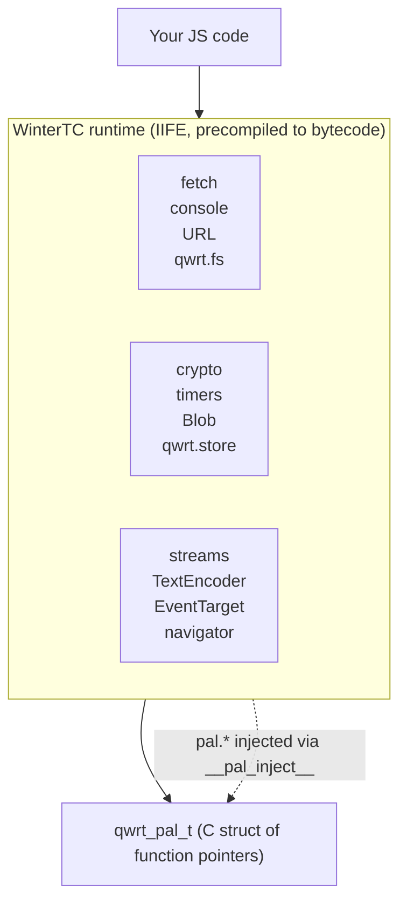

# JS API Reference

qwrt provides a WinterTC-compatible JavaScript API surface through its WinterTC modules. All globals listed here are available in any `qwrt_eval()` or `qwrt_eval_bytecode()` call without requiring `require()` or `import`.

## Architecture



## API Categories

### Core APIs

| API | Global | WinterTC |
|-----|--------|----------|
| [console](/js-api/console) | `console` | ✅ Standard |
| [performance](/js-api/performance) | `performance` | ✅ Standard |
| [timers](/js-api/timers) | `setTimeout`, `setInterval`, `clearTimeout`, `clearInterval` | ✅ Standard |
| [EventTarget](/js-api/events) | `EventTarget`, `Event`, `CustomEvent`, `ErrorEvent` | ✅ Standard |
| [AbortController](/js-api/abort) | `AbortController`, `AbortSignal`, `DOMException` | ✅ Standard |
| [URL](/js-api/url) | `URL`, `URLSearchParams`, `URLPattern` | ✅ Standard |

### Web APIs

| API | Global | WinterTC |
|-----|--------|----------|
| [fetch](/js-api/fetch) | `fetch`, `Headers`, `Request`, `Response` | ✅ Standard |
| [crypto](/js-api/crypto) | `crypto.getRandomValues()`, `crypto.subtle` | ✅ Standard |
| [streams](/js-api/streams) | `ReadableStream`, `WritableStream`, `TransformStream` | ✅ Standard |
| [TextEncoder](/js-api/encoding) | `TextEncoder`, `TextDecoder` | ✅ Standard |
| [Blob / File / FormData](/js-api/blob) | `Blob`, `File`, `FormData` | ✅ Standard |
| [structuredClone](/js-api/structured-clone) | `structuredClone` | ✅ Standard |
| [MessageChannel](/js-api/message-channel) | `MessageChannel`, `MessagePort` | ✅ Standard |
| [navigator](/js-api/navigator) | `navigator` | ✅ Standard |

### Platform APIs (qwrt extensions)

| API | Global | Notes |
|-----|--------|-------|
| [fs](/js-api/fs) | `qwrt.fs` | Filesystem operations |
| [storage](/js-api/storage) | `qwrt.storage` | Key-value storage |

## Standards Compliance

qwrt targets [WinterTC](https://wintercg.org/) compatibility — the same subset of Web APIs used by Cloudflare Workers, Deno, and other server-side runtimes. DOM-specific APIs (`document`, `window`, `HTMLElement`) are intentionally excluded.

### Not Included

These browser APIs are explicitly excluded:

- **DOM**: `document`, `window`, `HTMLElement`, `addEventListener` on globals
- **CSS**: `CSSStyleSheet`, `getComputedStyle`, CSSOM
- **Layout**: `requestAnimationFrame`, `IntersectionObserver`, `ResizeObserver`
- **Media**: `WebSocket` (use fetch + streams), `WebRTC`, `AudioContext`
- **Storage**: `localStorage`, `sessionStorage`, `indexedDB` (use `qwrt.storage`)

## Usage

All globals are available immediately — no imports needed:

```js
// Core APIs
console.log('Hello from qwrt');
setTimeout(() => console.log('tick'), 1000);

// fetch with streaming
let response = await fetch('https://example.com/data.json');
let data = await response.json();

// crypto
let bytes = crypto.getRandomValues(new Uint8Array(32));
let hash = await crypto.subtle.digest('SHA-256', new TextEncoder().encode('hello'));

// URL parsing
let url = new URL('https://example.com/path?key=value');
console.log(url.searchParams.get('key')); // "value"

// Filesystem (platform extension)
let content = await qwrt.fs.read('/app/config.json');

// Storage (platform extension)
await qwrt.storage.set('session_token', 'abc123');
```
