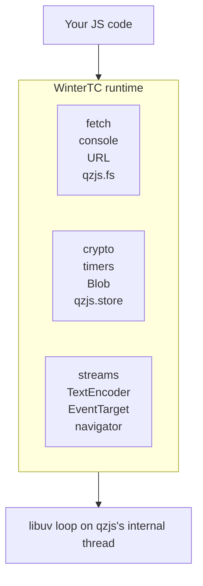

# JS API Reference

qzjs provides a WinterTC-compatible JavaScript API. The globals listed here are available in any JS that runs in the runtime (`initial_script`, message handlers, and code invoked via `qz_post_message`), without requiring `require()` or `import`.

## Architecture


```mermaid
flowchart TB
    A["Your JS code"] --> B
    subgraph B["WinterTC runtime"]
        direction LR
        C["fetch<br/>console<br/>URL<br/>qzjs.fs"]
        D["crypto<br/>timers<br/>Blob<br/>qzjs.store"]
        E["streams<br/>TextEncoder<br/>EventTarget<br/>navigator"]
    end
    B --> G["libuv loop on qzjs's internal thread"]
```

## API Categories

APIs fall into three groups by the standard they come from.

### WinterTC (WinterCG standard)

The WinterCG-compatible subset of Web APIs qzjs implements.

| API | Global |
|-----|--------|
| [console](/js-api/console) | `console` |
| [performance](/js-api/performance) | `performance` |
| [timers](/js-api/timers) | `setTimeout`, `setInterval`, `clearTimeout`, `clearInterval` |
| [EventTarget](/js-api/events) | `EventTarget`, `Event`, `CustomEvent`, `ErrorEvent` |
| [AbortController](/js-api/abort) | `AbortController`, `AbortSignal`, `DOMException` |
| [URL](/js-api/url) | `URL`, `URLSearchParams`, `URLPattern` |
| [fetch](/js-api/fetch) | `fetch`, `Headers`, `Request`, `Response` |
| [crypto](/js-api/crypto) | `crypto`, `crypto.subtle` |
| [streams](/js-api/streams) | `ReadableStream`, `WritableStream`, `TransformStream` |
| [compress](/js-api/compress) | `CompressionStream`, `DecompressionStream` |
| [TextEncoder](/js-api/encoding) | `TextEncoder`, `TextDecoder` |
| [Blob / File / FormData](/js-api/blob) | `Blob`, `File`, `FormData` |
| [structuredClone](/js-api/structured-clone) | `structuredClone` |
| [MessageChannel](/js-api/message-channel) | `MessageChannel`, `MessagePort` |
| [Worker](/js-api/worker) | `Worker` |
| [navigator](/js-api/navigator) | `navigator` |

### W3C APIs

Browser-standard APIs beyond the WinterCG core.

| API | Global |
|-----|--------|
| [WebSocket](/js-api/websocket) | `WebSocket` |
| [BroadcastChannel](/js-api/broadcast-channel) | `BroadcastChannel` |
| [EventSource](/js-api/event-source) | `EventSource` |
| [CacheStorage](/js-api/cache-storage) | `caches`, `CacheStorage`, `Cache` |
| [Service Worker](/js-api/service-worker) | `navigator.serviceWorker` |
| [localStorage](/js-api/storage#localstorage) | `localStorage`, `sessionStorage` |

### qzjs Platform Extensions

qzjs-specific APIs, not part of any Web standard. Their style is close to
Node.js but they are not Node APIs (`process`, `require`, `Buffer` are absent).

| API | Global | Notes |
|-----|--------|-------|
| [fs](/js-api/fs) | `qzjs.fs` | Filesystem operations |
| [storage](/js-api/storage) | `qzjs.storage` | Key-value storage |
| [serve](/js-api/serve) | `serve()` | HTTP / WebSocket / gRPC server |
| [grpc](/js-api/grpc) | `grpc` | gRPC client + server (`QZ_WITH_GRPC=ON`) |

## Standards Compliance

qzjs targets [WinterTC](https://wintercg.org/) compatibility — the same subset of Web APIs used by Cloudflare Workers, Deno, and other server-side runtimes. DOM-specific APIs (`document`, `window`, `HTMLElement`) are intentionally excluded.

### Not Included

These browser APIs are explicitly excluded:

- **DOM**: `document`, `window`, `HTMLElement`, `addEventListener` on globals
- **CSS**: `CSSStyleSheet`, `getComputedStyle`, CSSOM
- **Layout**: `requestAnimationFrame`, `IntersectionObserver`, `ResizeObserver`
- **Media**: `WebRTC`, `AudioContext`
- **Storage**: `indexedDB` (use `qzjs.storage`)

## Usage

All globals are available immediately — no imports needed:

```js
// Core APIs
console.log('Hello from qzjs');
setTimeout(() => console.log('tick'), 1000);

// fetch with streaming
let response = await fetch('https://example.com/data.json');
let data = await response.json();

// crypto
let bytes = crypto.getRandomValues(new Uint8Array(32));
let hash = await crypto.subtle.digest('SHA-256', new TextEncoder().encode('hello'));

// URL parsing
let url = new URL('https://example.com/path?key=value');
console.log(url.searchParams.get('key')); // "value"

// Filesystem (platform extension)
let content = await qzjs.fs.read('/app/config.json');

// Storage (platform extension)
await qzjs.storage.set('session_token', 'abc123');
```
