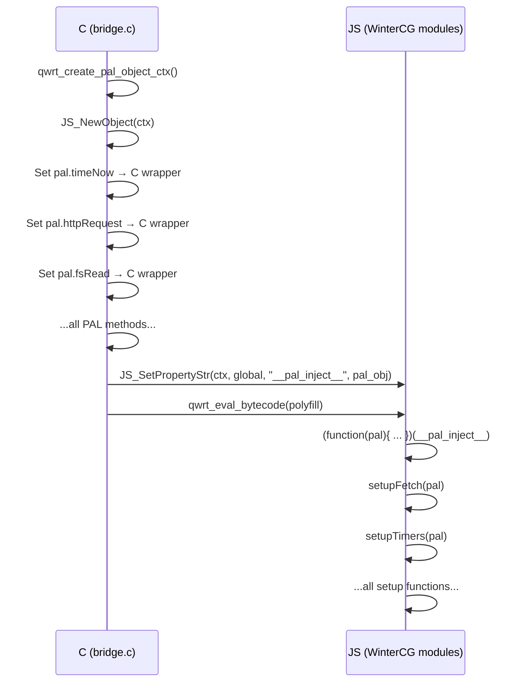

# PAL Injection (`__pal_inject__`)

The `__pal_inject__` mechanism is the bridge between the C PAL layer and the JavaScript WinterCG modules. It's how `pal.*` functions become available inside JS code.

## How It Works

1. **C side** (`bridge.c`): `qwrt_create_pal_object_ctx()` builds a JS object with all PAL methods bound as JavaScript functions
2. **Injection**: Before evaluating the WinterCG module bytecode, the C bridge sets `globalThis.__pal_inject__` to this PAL object
3. **Runtime side** (`pal.js`): The runtime reads `globalThis.__pal_inject__` and uses it as the `pal` parameter for all setup functions



## Available PAL Primitives

These are the raw primitives exposed through `pal.*` inside the WinterCG modules. User code rarely calls them directly — the higher-level APIs (fetch, fs, etc.) wrap them.

### Synchronous

| Method | Signature | Returns |
|--------|-----------|---------|
| `pal.timeNow()` | `() → number` | Milliseconds since epoch |
| `pal.log(level, msg)` | `(number, string) → void` | — |
| `pal.randomBytes(size)` | `(number) → Uint8Array` | Random bytes |

### Asynchronous (Promise-based)

| Method | Signature | Returns |
|--------|-----------|---------|
| `pal.timerStart(delay, repeat)` | `(number, bool) → {handle, promise}` | Timer handle + Promise |
| `pal.timerStop(handle)` | `(number) → void` | — |
| `pal.httpRequest(url, method, headers, body)` | `(string, string, string, string?) → Promise<string>` | Response JSON |
| `pal.httpRequestStream(url, method, headers, body, onHeaders, onData, onEnd)` | `(string, string, string, string?, fn, fn, fn) → void` | Via callbacks |
| `pal.fsRead(path)` | `(string) → Promise<string>` | File contents |
| `pal.fsWrite(path, data)` | `(string, string) → Promise<void>` | — |
| `pal.fsExists(path)` | `(string) → Promise<boolean>` | — |
| `pal.fsRemove(path)` | `(string) → Promise<void>` | — |
| `pal.fsList(path)` | `(string) → Promise<string>` | JSON array string |
| `pal.storageGet(key)` | `(string) → Promise<string\|null>` | — |
| `pal.storageSet(key, value)` | `(string, string) → Promise<void>` | — |
| `pal.storageDel(key)` | `(string) → Promise<void>` | — |

## Calling PAL from C Extensions

If you're writing a C extension (`qwrt_ext_t`), you call PAL methods directly:

```c
// From ext_myextension.c
static int myext_init(qwrt_t *rt, qwrt_ctx_t *ctx) {
    qwrt_pal_t *pal = ctx->pal;

    // Synchronous call
    uint64_t now = pal->time_now(pal);

    // Async call with callback
    pal->http_request(pal, "https://example.com", "GET",
        "{}", NULL, 0, on_response, ctx);

    return 0;
}
```

## Security Boundary

The PAL object is the **security boundary** between JS and the host. Different contexts can have different PAL objects with different capabilities. For example, a context with restricted filesystem access might have `pal.fsRead` set to a function that only allows reading from `/sandbox/`.

## Lifecycle

- Created: during `qwrt_create_ctx()` → `qwrt_create_pal_object_ctx()`
- Injected: before module evaluation
- Destroyed: with the context (garbage collected by QuickJS)
- Re-created: on `qwrt_reset()` — the modules are re-injected fresh
