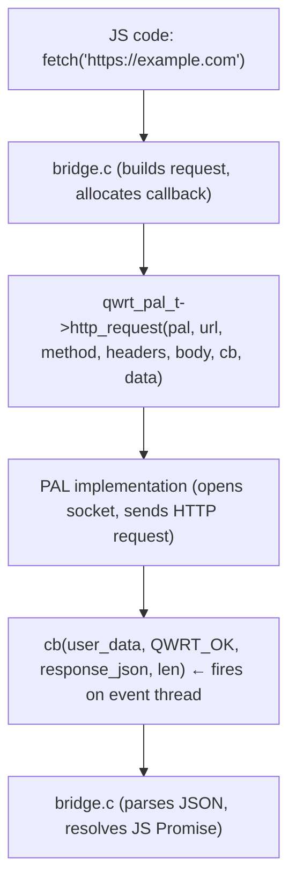

# PAL — Platform Abstraction Layer

The Platform Abstraction Layer is the heart of qwrt's portability. It's a struct of ~30 function pointers that every backend must implement. Three backends ship with qwrt; you can add your own.

## What the PAL Does

Every interaction between JavaScript and the outside world goes through the PAL:

## PAL Categories

| Category | Methods | Description |
|----------|---------|-------------|
| Identity | `user_data`, `version`, `name` | PAL identification and versioning |
| HTTP | `http_request`, `http_request_stream`, `http_abort` | HTTP client |
| Filesystem | `fs_read`, `fs_write`, `fs_exists`, `fs_remove`, `fs_list` | File I/O |
| Storage | `storage_get`, `storage_set`, `storage_del` | Key-value storage |
| Timers | `timer_start`, `timer_stop` | setTimeout/setInterval |
| Time | `time_now`, `hrtime` | Wall clock and monotonic time |
| Utilities | `log`, `mem_alloc`, `mem_free`, `random_bytes` | Logging, memory, entropy |
| Event Loop | `run_cycle` | Drive async I/O |
| Process | `spawn`, `join`, `terminate`, `channel_*` | Child process management |
| Lifecycle | `init`, `destroy` | Setup and teardown hooks |
| Reserved | `reserved[4]` | Forward compatibility |

## Built-in Backends

| Backend | Platform | Key Technologies |
|---------|----------|-----------------|
| [`pal_uv`](/pal/pal-uv) | Linux, macOS | libuv (event loop, TCP), mbedTLS (TLS), POSIX (FS) |
| [`pal_mock`](/pal/pal-mock) | Testing | In-memory responses, no I/O dependencies |
| [`pal_freertos`](/pal/pal-freertos) | ESP32-S3 | lwIP (TCP), mbedTLS (TLS), LittleFS (FS), NVS (storage) |

## Adding Your Own PAL

See the [Implementing a PAL](/pal/implementing) guide for a step-by-step walkthrough.

## Interface Stability

- `qwrt_pal_t` fields are **append-only** — new fields are added at the end
- `version` field lets code check ABI compatibility at runtime
- `reserved[4]` slots are initialized to NULL for forward compatibility
- Error codes are standardized via `qwrt_pal_err_t` enum
