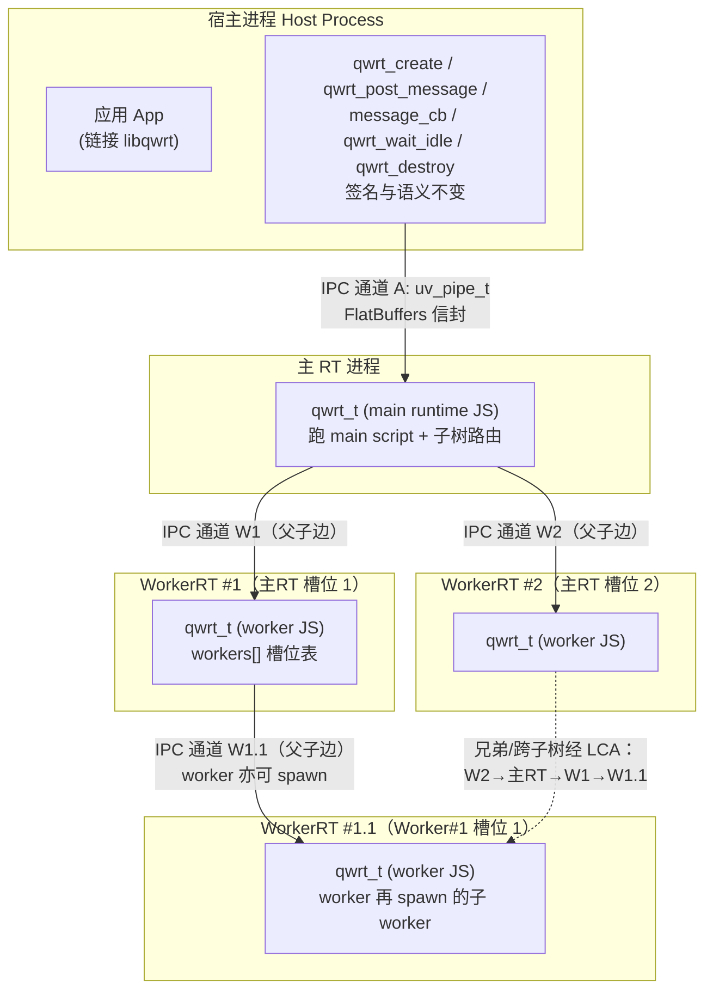

# 多进程应用模型 — Rust-free 独立进程隔离（QWRT_PROCESS_MODEL）

> 状态：设计决策文档（实施前）。方向已由用户拍板，本文落定各节实现细节，供分阶段实施。
> 日期：2026-09-04
> 修订：2026-09-04 v2 —— 树形拓扑（worker 可再 spawn worker，跨子树经 LCA 转发）+ 评审修复（§6.1 CONTROL{idle} 协议、§12.3 背压声明、§3.3 握手协议定稿、§8.2 port id 直接父本地分配、§2.1 CMake 宏映射、§4.5 对齐勘误）
> 修订：2026-09-04 v3 —— 混合模型：per-worker `mode` 显式覆盖编译默认 + 默认值调和（§1.4）；M-P1/M-P2 里程碑重排（进程 worker 先 opt-in 可用，混合默认策略落 M-P2，§11）；开放决策点新增 #8（mode API 形状）
> 修订：2026-09-04 v4 —— 单进程组合轨道：§13 多实例生命周期（M-R1：进程内多 qwrt_t 并存 + 全局状态审计 + DAP stdio 约束）、§14 多 RT 组合模型（M-R2：contexts × workers 正交组合，worker 归 rt 不归 ctx）；§11 新增 M-R1/M-R2；开放决策点新增 #9/#10
> 范围：qwrt 运行时（QuickJS-ng 嵌入式）的应用模型，从「单进程多线程」演进为「多进程隔离」。默认独立进程（`ISOLATED`），线程模型（`THREAD`）保留为编译选项回退。
> 背景（用户决策原文）：**"修改应用模型，支持宿主 主RT 和 WorkerRT 独立进程，通过编译选项设置，默认是独立进程。进程间通讯使用Flatbuffer序列化"**

**核心结论（TL;DR）**
1. **目标形态**：宿主进程（链接 libqwrt 的应用）+ 主 RT 进程（跑 main runtime JS）+ WorkerRT 进程 ×N（各跑一个 worker JS）。通讯拓扑 = **树形：宿主↔主RT 一条通道；主RT↔第一层 WorkerRT 各一条；任意 worker 亦可 spawn 子 worker（父持子通道、父的槽位表登记），跨子树消息经最近公共祖先（LCA）逐跳转发——通道数 = O(N) 树边，不做 mesh**。
2. **默认 ISOLATED 的动机**：崩溃隔离是第一优先——已在审计确认，同进程线程模型下 worker C 层段错误（segfault、非法内存访问）**不可防守**（JSRuntime 共享宿主进程地址空间，致命信号直接杀宿主/主RT）。进程模型把每个 runtime 的致命错误封在各自的地址空间里。附带收益：内存隔离、独立调度。
3. **IPC 传输**：`uv_pipe_t`（libuv 原生，Unix domain socket / Windows named pipe，全双工，与现有事件循环无缝集成）。备选 socketpair/shm+信号均否决（理由见 §3）。
4. **信封用 FlatBuffers，payload 保持现有 structured clone 字节**——JS 层**完全零改动**（`__qwrt_serialize__/__qwrt_deserialize__` 不动，Worker/postMessage/structuredClone 契约不变）。进程边界 C↔C 用 fb 信封；JS 对象图仍由现有 JS 序列化器处理。**这正是 `2026-09-03-flatbuffers-runtime-builtin.md` 定义的「跨进程 RPC」升格触发条件**，纯 C 内部格式定位应验。
5. **C 编解码器**：推荐方案 a——手写信封编解码（`src/ipc_envelope.c`，~200 行 C99），固定 schema 手写 vtable/offset/uoffset，字节级符合 fb 规范，零依赖零生成步骤。通用 fb codec（方案 b）作为信封类型扩展时的升格路径。
6. **Worker spawn**：`exec` 自身二进制（Linux `/proc/self/exe`，回退 `QWRT_EXEC_PATH`）+ `--qwrt-worker --parent-fd N --worker-id N`。`fork()` 否决（JSRuntime 已初始化状态危险，必须在 JS 启动前 fork，exec 更干净）。**v2 树形：worker 进程内用同一形态递归 spawn 子 worker**。
7. **主 RT spawn**：`exec` 自身二进制 `--qwrt-rt-server`。宿主 C API 契约 `qwrt_create/post_message/message_cb/wait_idle/destroy` **签名与语义不变**，ISOLATED 下内部走 IPC。主 RT 进程死亡 → 宿主自动感知（parent-fd EOF 监测）→ message_cb 收 ERROR。
8. **分阶段（v3 重排）**：M-P0 信封编解码（含与 Python flatbuffers 交叉验证）→ M-P1 worker 进程 spawn+握手+消息往返（**opt-in 可用**：per-worker `mode:'process'` 显式选择，缺省仍线程）→ M-P2 宿主↔主RT 进程分离+C API 透明切换+**混合默认策略落地**（ISOLATED 编译下 worker 缺省走进程）→ M-P3 MessagePort 跨进程路由 → M-P4 优雅关闭/崩溃恢复/压力测试。
9. **（v4）单进程组合轨道**：M-R1 多实例生命周期（进程内多 `qwrt_t` 并存：全局状态审计 + DAP stdio 单通道约束，§13）→ M-R2 多 RT 组合模型（contexts × workers 正交聚合，worker 归 rt 不归 context，§14）。M-R 在 THREAD 基线即可交付，是 M-P\* 进程轨道的组合语义基座。

---

# 1. 目标架构

## 1.1 进程拓扑（mermaid）



## 1.2 通讯拓扑决策

**推荐（v2 修订）：树形拓扑——「谁 spawn 谁做父」，worker 可再 spawn worker**。
- 宿主只维护**一条** IPC 通道（↔主RT）；主RT↔它 spawn 的每个 worker 各一条；worker 再 spawn 子 worker 时同理（父持子通道、父的 `workers[]` 槽位表登记子进程）。**架构上零新概念**：现有 worker 模型本就是「父 runtime 持 `workers[16]` 槽位表」（worker.c:182-246），v2 只是把「父」从「主RT 独占」放宽为「任意 runtime 进程」。
- 同树内消息沿父子边路由：子→父上行、父→子下行；**兄弟/跨子树经最近公共祖先（LCA）汇合转发**（途经节点只解信封头、payload 字节不动）。
- MessagePort/消息语义（现有 `source` 标签模型）天然映射到树形：`target` 就是现有 source 标签的对称物，路由按「树路径 + 本地槽位 id」寻址。

**备选（否决）：扁平星型（v1 草案：全部 worker 只能由主RT spawn）**。
- 否决理由：Worker API 本就允许嵌套 `new Worker`，强令全部经主RT spawn 是无谓收紧（要为主RT 增加跨层 spawn 仲裁）；且主RT 成为全树唯一的路由/生命周期单点。树形把 spawn 与管理权自然分发给各父 runtime，通道数同为 O(N) 树边，复杂度不增。

**备选（否决）：宿主直连 worker / mesh 全互联**。
- 否决理由：宿主或全节点要持有 O(N) 条通道的连接/握手/生命周期管理，worker 创建/销毁事件要全网广播。树形让每条父子边只归其父管，宿主 C API 面（§6）保持单通道语义不变。省一次 LCA 转发，代价是架构复杂度上升——不值。

## 1.3 双模型共存

| 维度 | THREAD（现状） | ISOLATED（默认） |
|---|---|---|
| qwrt_t 位置 | 宿主进程内嵌（各自 uv_thread_t） | 独立进程（各自 epoch + loop） |
| 消息后端 | lock-free MPSC + uv_async_send | uv_pipe_t + FlatBuffers 信封 |
| C API | 直接调 | 内部经 IPC 代理 |
| JS 层 | —（无感知） | —（**同样无感知**） |
| 编译走线 | `QWRT_PROCESS_MODEL=THREAD` | `QWRT_PROCESS_MODEL=ISOLATED` |

JS 层契约（Worker API、postMessage、structuredClone、MessagePort）在双模型下**完全一致**——差异只隔离在 C 层 qwrt_t 的消息后端。这是设计铁线：任何 JS 改动都视为越界，除非被 §8 MessagePort 跨进程语义或 §1.4 per-worker `mode`（v3）明确豁免。

---

## 1.4 混合模型（v3 决策）：per-worker `mode` 覆盖与默认值调和

编译开关（§2）定**可用能力集与编译期默认**；每个 worker 可在 JS 层用 `mode` 显式覆盖，双模式在**同一进程树内并存**（长命角色如 Service Worker 走进程，短命数据 worker 留线程）。这是全文档唯一新增的 JS 层可见扩展（豁免性质同 §8 MessagePort），其余 JS 契约不变。

**默认值调和规则**：

| 编译模型 | `new Worker(url)` 缺省 | `{mode:'process'}` | `{mode:'thread'}` |
|---|---|---|---|
| ISOLATED（编译默认） | **process**（进程 worker） | process | thread（同进程线程 worker） |
| THREAD（回退编译） | thread（现状不变） | **求值报错**（能力未编译即显式失败，同 §5.3 不静默降级精神） | thread |

**Service Worker 定位**：推荐缺省 `mode:'process'`——SW 生命周期独立于页面/main script（离线场景可能无主页面），其崩溃不应牵连主 RT；独立进程是唯一能提供该保证的形态。

**崩溃语义差异**（并存时同一树内两种后果）：

| 事件 | 后果 |
|---|---|
| 线程 worker C 层段错误 | 同进程**全体死亡**（含主RT/宿主地址空间被杀，不可防守，§2.2） |
| 进程 worker C 层段错误 | 仅该 worker 进程死；父进程经通道 EOF 感知 → JS 层 dispatch `error` 事件，树内其余进程继续（§9.3） |

**实现锚点：`qwrt_t` 消息后端统一收口**：消息注入/派发在 `qwrt_t` 层定义为统一后端接口——`msgq`（线程 lock-free 队列，THREAD 模式）与 `ipc envelope`（uv_pipe 信封，ISOLATED 模式）两个实现；`qwrt_worker_create` 按「编译宏 + per-worker mode」选择后端。主RT 自身的后端切换机制见 §6.2（唯一改动点即消息注入源）。

**里程碑对应**：进程 worker 能力先行 opt-in 可用（M-P1）；「ISOLATED 编译缺省 process」的混合默认策略与宿主↔主RT 分离同期落地（M-P2，§11）。

**开放点**：`mode` 的 API 形状（字段名/取值）未定稿，见文末开放决策点 #8。

# 2. 编译选项

## 2.1 CMake 开关

```cmake
set(QWRT_PROCESS_MODEL "ISOLATED" CACHE STRING
    "应用模型：ISOLATED=独立进程(默认) / THREAD=单进程多线程")

# 机制：字符串值 → 编译宏映射（源码 #if 选择的唯一依据）
if(QWRT_PROCESS_MODEL STREQUAL "ISOLATED")
  target_compile_definitions(qwrt PUBLIC QWRT_PROCESS_MODEL_ISOLATED=1)
endif()
```

- `QWRT_PROCESS_MODEL=ISOLATED`（默认）：编译 `src/ipc_*.c`（ipc_envelope、ipc_transport、ipc_process），qwrt_t 消息后端走 IPC 进程通道。
- `QWRT_PROCESS_MODEL=THREAD`：现状不变，`src/msgq.c` 路径生效，ipc_*.c 不编入（不定义 `QWRT_PROCESS_MODEL_ISOLATED` 宏，`#if` 落到 `#else` 分支）。

**实现约束**：两套后端共用一个 `qwrt_t` 结构和一个消息注入接口（`qwrt_msg_push` 的进程版 `qwrt_ipc_inject`），通过宏 `#if QWRT_PROCESS_MODEL_ISOLATED` 在 qwrt_t 内选择「线程队列字段」还是「IPC 通道字段」。**C 枚举字段可以条件编译，JS 层没有任何条件编译**。

## 2.2 为何默认 ISOLATED

1. **崩溃隔离（决定性）**：同一进程多线程下，worker 的 C 层段错误/非法访问 = 整个进程崩溃 = 宿主 + 主RT 一起死。审计已确认线程模型下**没有办法**把致命信号封在 worker 线程内（信号是进程级的，无法只杀一个线程）。进程隔离后，worker 段错误只杀 worker 进程；主RT/宿主通过 parent-fd EOF 感知并在 JS 层抛 `error` 事件，**宿主继续跑**。这是用户选择进程模型的根本原因。
2. **内存隔离**：每个 runtime 独立地址空间。worker 的 JSRuntime 堆、QuickJS 对象不共享宿主地址空间，越界写不会污染宿主/主 RT 的堆。泄漏与 fragment 也随进程回收（崩溃时操作系统回收全部内存）。
3. **独立调度**：OS 内核调度器为每个进程独立安排时间片，规避线程/timer 竞态。对 PVE 6.17 这类已确认「futex/pthread_cond 唤醒在某些 fd 创建后不可靠」的宿主内核（msgq.c 注释明言），进程 + uv_pipe 的唤醒路径比线程锁更稳。
4. **生产语义清晰**：崩溃是应用事故不是库事故。默认隔离让「最坏情况 = 崩溃最终被 JS 层 `error` 事件捕获」成为开箱即得的行为。

**成本**：进程通信多一次序列化 + 一次内核上下文切换 + fd 继承/握手。该成本在 §12 量化，预期比线程队列慢一个数量级——但这是隔离的固有代价，且 M-P4 压力测试会给出真实数字，若某些场景不能接受再按需编译回 THREAD。

---

# 3. IPC 传输机制

## 3.1 推荐：`uv_pipe_t`

- libuv 原生，`uv_pipe_connect` / `uv_read_start` / `uv_write` 全异步，**与现有 `uv_loop_t` + `uv_run(UV_RUN_ONCE)` 事件循环无缝**——主RT/worker 进程复用现有 loop，不加新线程/新 epoll。
- 全双工：双向读写同一 fd，天然适合请求/响应。
- 平台覆盖：Linux **Unix domain socket**（`AF_UNIX`，最快本机 IPC 之一）；Windows **named pipe**。
- **生命线语义**：peer 进程死亡 → fd 自动 EOF/HUP。这正是孤儿回收的基石（§9 不需额外心跳，读 EOF 即 peer 死）。

## 3.2 备选对比（全否决）

| 方案 | 优劣 | 否决理由 |
|---|---|---|
| `socketpair()` + 裸字节 | 快、双工 | 无帧协议，需自写长度前缀 + 收发状态机；与「信封需要结构化划分」目标重复 | 
| `pipe()` ×2 | 简单单向 | 单向需两条，双工语义别扭，两 fd 生命周期耦合 |
| shm + 信号 | 最快（零拷贝） | **需自研协议 + 同步**（lock-free ring + 信号量 + 所有权协议），复杂度爆炸，违背「不引系统库与复杂度控制」铁律。留作 §12「明确不做」的后续优化 |

`uv_pipe_t` 在「复用现有 loop + 平台覆盖 + 顺手拿 EOF 生命周期」三点上胜出，且把**帧同步交给承载（libuv 本就处理字节流缓冲）**——我们只需在字节流上定义信封边界（§4 长度前缀）。

## 3.3 通道生命周期

- **连接**（主RT 视角）：子进程经 `--parent-fd N` 拿到已绑定 socketpair 的一端正则 fd（§5），`uv_pipe_open` 使能读。宿主侧 `uv_pipe_connect` 连对端。
- **握手（v2 定稿协议）**：
  1. 子进程完成 `qwrt_t` 初始化 → 发 `Envelope{source=本地槽位id, target=1(父), kind=CONTROL, payload=Handshake{proto_version}}`；
  2. 父校验 `proto_version` → 回 `Envelope{kind=CONTROL, payload=HandshakeAck{ok, proto_version}}`；
  3. 父阻塞等待 ack 或超时（默认 5s，复用现有 `thread_ready` 原子手语 + 超时语义）；`ok=0`/版本不符/超时 → 关通道、spawn 显式失败（§5.3，不降级）。
  - 时序约束：握手完成前父不得向该通道发应用消息；握手完成 → 通道进入 RUN（应用消息路由开启）。
- **断开/重连**：跨进程通道**不重连**（应用模型内进程一死即整条链路算终结，重连是 M-P4 之后的能力）。EOF → 视为 peer 死亡 → 走孤儿回收 / 崩溃通知路径。**这就是生命周期**：BUILD → RUN → EOF/崩溃。

---

# 4. FlatBuffers 消息信封（核心）

## 4.1 固定 schema

遵循 FlatBuffers wire format（gen 产物字节级兼容），schema 固定：

```fbs
table Envelope {
  source: int32;    // v2 树形：逐跳相对地址。0=宿主（仅主RT 通道上合法）1=父方向 >1=本地子槽位 id；每跳转发时由路由器改写
  target: int32;    // 同 source 的相对语义；命中本地（自身消化或本地子槽位）即止，否则按树路径改写后逐跳转发
  kind:   int8;     // 0=MESSAGE 1=PORT_TRANSFER 2=ERROR 3=CONTROL
  payload:[ubyte];  // MESSAGE=structured clone 字节 / ERROR=错误文本 / CONTROL=控制参数
}
root_type Envelope;
```

## 4.2 关键决策：信封 fb、payload 保持 structured clone 字节

- **信封用 FlatBuffers**：进程边界的 C↔C 序列化边界清晰、schema 演进（未来加字段）向后兼容（vtable 缺字段回退默认值，ZeroCopy 读单字段）。
- **payload 保持现有 structured clone 字节**（`__qwrt_serialize__/__qwrt_deserialize__` 产出）：JS 层**零改动**。JS 对象图仍由现有 JS 序列化器处理，fb 只负责「信封里装什么、捎到哪个 target」。
- 划分逻辑：**进程边界用 fb；JS 对象图用现有 JS 序列化**。序列化责任不叠加、不混层。

## 4.3 `target` 语义（v2：逐跳相对寻址，无 -1 广播）

- `target` 由**当前持有信封的节点**相对解释（0=宿主仅主RT 通道、1=父、>1=本地子槽位），**无 -1 广播**。
- 理由：树形下广播 =「同一 payload 发给 N 个 target」，沿途每跳都要复制信封——语义复杂且无真实需求（应用要广播自己循环 post）。**逐跳路由**：信封自带 `source`+`target`，每跳解信封头 → 命中本地子槽位则下行、`target=1` 则上行，改写 source/target 后转发，payload 字节零拷贝透传（§7）。
- `kind=CONTROL` 的 target 恒为父（进程控制消息不进 JS 层）。

## 4.4 C 编解码器实现策略

### 方案 a（推荐起步）：手写信封编解码 `src/ipc_envelope.c`（~200 行 C99）

- 固定 schema（就一张表、4 个字段、1 个 ubyte 向量），**手写 vtable/offset/uoffset**，字节级符合 fb 规范，**零依赖、零生成步骤**。
- 枚举/标量直接内联读；payload 向量做 **zero-copy 片引用**（返回指向缓冲内 payload 的指针 + 长度，不拷贝）。
- 产出符号：`ipc_envelope_encode(Envelope*) → 字节`、`ipc_envelope_decode(bytes, len) → EnvelopeView{源指/标指/kind/payload_ptr/payload_len}`。

### 方案 b（升格路径）：通用 fb codec（存档的 flatbuffers-runtime-builtin 方案B）

- `flatbuffers.compile(fbsText)` → schema 句柄 + `flatbuffers.encode/decode` 通用编解码。
- 触发条件：**信封类型扩展**（不再单表 Envelope，或字段才真正需要动态 schema 全覆盖）。届时按 `docs/plans/2026-09-03-flatbuffers-runtime-builtin.md` 实施（约 800 行 C）。

### 方案 c（否决）：引入 flatcc

- 破坏「最小依赖」铁律（引外部编译/生成工具链 + 要 CMake 集成 + 运行时占用）。fb 信封 schema 极小，手写 200 行远小于引入 flatcc 的集成/学习/维护成本。**明确否决**，不进入备选升格路径。

## 4.5 信封二进制布局草图（vtable 偏移计算）

```
Offset 0x0000  uoffset 指 back to root table 起始（= 文件内一个相对偏移，从表 start 回跳）
               ┌────────┐
    root table 起始 ──> │ soffset │  (soffset from table start to vtable, 有符号)
                       └────────┘
                       │ field0 offset  │   (source,   if present; 0 = omitted)
                       │ field1 offset  │   (target,   if present)
                       │ field2 offset  │   (kind,     if present)
                       │ field3 offset  │   (payload 向量, if present / 空)
                       ├────────┤
                       │ source │  int32（如存在）
                       │ target │  int32
                       │ kind   │  int8（对齐后）
                       ├────────┤
                       │ payload_len │  uoffset int32
                       ├────────┤
                       │ payload 数据 │  [ubyte] 逐字节
                       └────────┘
    vtable（一起在表之前写出，含 vtable 自身长度 → 跳表 + 对齐）
```

**布局规则**（参照 fb 规范）：
- 任何数据先 16 字节对齐（builder 末尾回卷到对齐边界）。
- 每个字段「偏移存在」用 vtable 槽位记录：`table字段offset = 表起始 + 对应vtable项`。某字段缺省 → 该 vtable 项为 0 → decode 返回默认值（fb 语义）。
- `payload` 是 ubyte 向量：存储长度（uoffset）+ 数据字节，表字段指向其起始处。
- `kind: int8` 单字节但 fb 表中每个对齐到能保持其对齐度的位置（此处 int32 槽后插入不破坏 4 字节对齐即可，或按整表 16B 对齐大原则处理）。
- decode 侧：读 root soffset → 定位 vtable → 逐槽检查 → 非零则按表起始+槽值解引用字段。三条消息（MESSAGE/CONTROL/ERROR）全部套用同一布局，payload 不同而已。

**验证**：M-P0 用 Python `flatbuffers` 官方库对同一 schema 互编码/互解码，字节级比对（§11）。

---

# 5. Worker 进程 spawn

## 5.1 推荐：exec 自身二进制

```
exec  (Linux: /proc/self/exe  或 argv[0]  或 QWRT_EXEC_PATH env 覆盖)
      --qwrt-worker --parent-fd N --worker-id K [--polyfill path(polyfill B 模式)]
```

- `--parent-fd N`：spawn 前用 `socketpair(AF_UNIX, SOCK_STREAM)` 建通道，父持一端（主管道，如 fd 100），子持另一端（fd N），经 argv 传 N。机制简单纯粹——首版**不做 CMSG_PASSFD**，同二进制 spawn 时直接创建 socketpair、两端 fd 各据其位（inheritable），argv 传 N 即可（§5.2 解释为何够用）。
- `--worker-id K`：沿用现有 worker 槽位 id（`QWRT_MAX_WORKERS`），即**本地** `source` 标签（相对直接父，各父独立编号；跨子树寻址见 §4.3 树路径）。
- **worker 进程内**：完整 `qwrt_t` 初始化（`qwrt_runtime_init` 复用，含 polyfill 注入 / 扩展 / loop），`uv_pipe_open(parent-fd)` 使能读 → 发 `CONTROL{handshake}`（§3.3 定稿协议）→ 等 `__qwrt_dispatch__` 入站消息（worker-boot.js 垫片语义不变）。
- **v2 树形**：worker 进程内 `new Worker` 触发 `qwrt_worker_create` 时，**worker 自己作为父**用与本节完全相同的机制 spawn 子进程（socketpair + exec + `--parent-fd`）并在自己的 `workers[]` 槽位表登记——零新增机制，只是「父」泛化。
- polyfill：嵌入模式 C（默认，const 数组 .rodata）天然随二进制，子进程零配置。B 模式（外部 .polyfill 文件）加 `--polyfill <path>` 参数传递。

## 5.2 备选：`fork()`（否决）

- 理由：worker 的 JSRuntime、uv loop、扩展状态都在父进程已初始化。fork 后子进程是**父内存的逐字节副本**，但线程安全黑洞（线程处于未知状态不可 fork 后用）——而 qwrt 线程模型本身多线程，fork 出来的子进程里「别的线程的内存中途快照」是**未定义状态**。正确做法必须「在 JS 启动前裸 fork」，可那样不如直接 exec 干净（exec 丢地址空间、得干净 CRuntime 启动）。
- exec 额外收益：子进程从 `main()` 全新启动，polyfill/env/argv 参数化传入，**每子进程独立内存布局与运行时初始化**，与 thread.c 的 `qwrt_thread_main` 模式对齐（仅消息后端从线程队列换成 uv_pipe）。**exec 是正解**。

## 5.3 备用 spawn 失败回退

**推荐：明确报错，不自动降级**。
- spawn 失败（exec 失败、socketpair 失败、进程起不来）→ `qwrt_worker_create` 返回错误码，JS 层抛 `error`（如同现在线程创建失败）。**不自动回退 THREAD**。
- 理由：静默降级会让「应用以为进程隔离了、实际库退回线程了」——崩溃隔离承诺被悄悄打破，错误行为最难查。让失败显性化（报错），由应用/部署决定是否编译回 THREAD。降级只在部署层显式开关完成。

---

# 6. 宿主 ↔ 主RT 进程分离

## 6.1 C API 契约不变（硬约束）

`qwrt_create / qwrt_post_message / message_cb / qwrt_wait_idle / qwrt_destroy` **签名与语义不变**。

- ISOLATED 下 `qwrt_create` 内部：exec 自身 `--qwrt-rt-server --parent-fd N` → 起主RT 进程 → socketpair → 握手 → 返回 `qwrt_t*`（内部是 IPC 通道，不再内嵌线程）。
- `qwrt_post_message`：把 payload 装进 Envelope（source=0, target=1, kind=MESSAGE；payload=宿主侧 structured clone 字节，C API 的 `json` 参数是宿主原始 JSON，直接当 payload 透传）→ 写 IPC。
- `message_cb`：IPC 收到信封 → 解出 payload 字节 → 喂给回调（语义等同当前线程后端的排空派发）。
- `qwrt_wait_idle`（v2 定稿 CONTROL{idle} 协议）：宿主发出当前未决写计数 W → 主RT 排空入站且自身 loop idle 且子树（经各子通道 CONTROL{idle} 汇总）idle → 回 `CONTROL{idle, epoch=W}`；宿主 `qwrt_wait_idle` 阻塞在该 ack 或 EOF（主RT 死亡 → EOF → 立即返回 + `message_cb` 收 `{type:'error'}`）。复用 thread.c 的 `qwrt_loop_idle` 逻辑与 `thread_ready` 阻塞语义，协议补上「为什么宿主能等到 idle」的显式信号（v1 草案缺该定义，评审指出）。

## 6.2 主RT 进程模式

- `qwrt` 二进制新增 serve 子命令形态：`qwrt --qwrt-rt-server --parent-fd N`。
- 内部复用现有 `thread.c` 的 `qwrt_thread_main` 循环（loop + idle 检测 + 派发），**唯一改动**：消息注入源从「线程 lock-free 队列」切到「IPC 信道」（`qwrt_ipc_inject` 从 uv_pipe 读信封 → 解 payload → 派发）。thread_main 的 rest 完全复用。

## 6.3 备选：宿主 fork 出主RT（否决）

同 §5.2 论证——JSRuntime 已初始化状态下 fork 危险，exec 干净。主RT 与 worker 同走 exec。

## 6.4 孤儿处理

- 宿主进程死亡 → 主RT/worker 通过 `parent-fd` 读 EOF 检测 → 自杀（`uv_run` 结束 → teardown → exit）。不依赖家长存活信号，fd EOF 是唯一真相（无需 SIGCHLD/孤儿进程组 hack，纯 libuv 语义）。

---

# 7. 消息路由

## 7.1 主RT 角色：消息路由器 + 它自己也是 JS runtime

**v2：每个 runtime 进程都是路由器——主RT 兼跑 main script，worker 兼跑 worker script**。路由是 C 层裸逻辑（不解 payload，只解信封头），不占用 JS 执行时间。

## 7.2 路由决策：按 target 改指 + payload 零拷贝透传（给推荐）

逐跳路由示例（信封头 `source`/`target` 每跳由当前节点改写为相对下一跳，payload 字节永不动）：
- **子→宿主**：worker W1.1 发 `target=1` 上行到父 W1 → W1 解头，`target` 非本地槽位 → 改写继续上行到主RT → 主RT 解头 `target==0` → 写宿主通道（改写 source 使宿主见「完整来源」语义不变）。
- **宿主→嵌套子**：宿主发 target=K（主RT 槽位 K）→ 主RT 若 K 本地有槽则直接下行；若 K 是已转出的子树根，则下行给该子（父），父再按自己的本地槽位表逐级下行。
- **兄弟/跨子树**：W1.1 → W2：上行至最近公共祖先（LCA=主RT）→ 下行至 W2。途经节点只改信封头。

**核心主张：信封在原进程只 `uv_write` 排队，payload `[ubyte]` 零拷贝、字节不动，途经路由节点只改信封头（source/target 字段），不重新序列化 payload。**

**「双重序列化」问题消解**：
- 错误做法：途经节点把 payload 解码成 JS 对象再重封（双重序列化，慢且绕）。
- 正确做法（推荐）：**路由节点只当信封路由器，不动 payload**。payload 对路由节点完全不透明——它只是要透传的字节。序列化只在信源（发出端 fb 信封）和信宿（转发时**重建一个信封包住同一 payload 字节**）发生，payload 自身不重编码。代价：每跳一次 memcpy（把 payload 从入站缓冲拷进新出站信封的 payload 向量）——拷贝无可避免但**远小于 JS 重编**，且可用 §12 的 shm/零拷贝作为后续优化。

**明确不做**：不做 shm 直通（跨子树进程 shm 直写——违背树形拓扑 + 引入多写同步），每个路由节点是其子树边界的唯一读写点（单一仲裁，崩溃隔离最清晰）。

---

# 8. MessagePort / transferable 跨进程语义

## 8.1 现状（同进程跨线程）

- MessagePort transfer = 同进程内跨线程，`{id, peerId, peerThread}` 路由（内存指针级，peer 线程直接可见）。
- `peerThread` 是线程概念，同进程内 port 消息是共享内存指针。

## 8.2 进程模式重新设计

**给推荐 (b)：port 消息经 IPC 路由，port id 全局化 + peerThread 概念扩展为 peerEndpoint。**

- port transfer 在进程模式下**不再是指针传递**，而是**端点注册**：
  - `id` 沿用现有**全局原子分配器**，但 v2 改为**直接父本地分配**（v1 草案：主RT 为全树发放，每次 transfer 多一次主RT 往返且主RT 成 id 单点；评审否决）。port id 只需**同父兄弟间唯一**，跨进程可寻址性由「父槽位路径 + 本地 id」承担（类比进程树 PID/文件路径语义）：`peerEndpoint = {path: [自主RT 起的父槽位 id 链], port: id}`。
- transfer 一个 port 到另一个进程（比如 worker→宿主）：**两进程的 LCA**（最坏主RT）添加路由表项 `(port path → 对端 peerEndpoint)`；后续该 port 的 postMessage 消息信封 `kind=PORT_TRANSFER` 沿树路由到 LCA，按表项改指转发，payload 仍是 structured clone 字节（对 port 消息也是同一套信封，只是 `kind=PORT_TRANSFER`）。
- 语义保持：JS 层 `port.postMessage/onmessage/close` **不变**——跨进程后仍是「发到 port」，只是底层从指针路由变成「信封 + 主RT 路由表」。
- 失败语义：port 归属进程死亡 → 主RT 清路由表项 → 对端 port 触发 `error`/close 事件（M-P3）。

**备选 (a) 禁用跨进程 transfer（否决）**：打破 Worker 契约（现有应用可能 transfer port），且能力退化。
**备选 (c) fd passing（否决）**：把 socketpair 的另一个 fd 直接给对端进程，双进程共享同一条亲缘通道——需要 `CMSG_PASSFD` + 对端「已打开的 uv_pipe」注入 + 复杂度高。除非 port 需要独立高吞吐通道，否则经主RT 信封路由足够（worker 已共享主RT 通道）。留作后续优化。

---

# 9. 生命周期与错误恢复

## 9.1 启动顺序（推荐：宿主见一条通道，主RT 统管 spawn workers）

```
宿主 qwrt_create
  └→ exec 主RT (--qwrt-rt-server)
       └→ uv_pipe 握手 (CONTROL handshake) → thread_ready 语义
  └→ 返回 qwrt_t（宿主侧只有主RT一条通道）

主RT 启动 main script
  └→ JS new Worker(...)（worker-boot 垫片）
       └→ 主RT spawn worker 进程 (--qwrt-worker --parent-fd --worker-id K)
            └→ worker 握手 → 槽位登记
```

**决策：主RT 统一 spawn workers**（而非宿主 spawn）。
- 理由：宿主只见一条通道（主RT），worker 的创建/销毁/崩溃仲裁全在主RT 进程内；宿主不持有 worker 的 fd/进程句柄，隔离最彻底。与现有架构「worker 是父 runtime（主RT）的 `workers[16]` 槽位表」语义一致——只是「父 runtime」从线程升级为「主RT 进程」。
- JS 层 `new Worker` 触发 C 层 `qwrt_worker_create` 时，主RT 内部 spawn 新进程并登记，宿主完全无感。

## 9.2 优雅关闭链

```
宿主 qwrt_destroy
  └→ 主RT 通道写 CONTROL{shutdown}
       └→ 主RT 广播 CONTROL{shutdown} 给所有 worker（自身也退出）
            └→ 每个 worker 完成排空 → teardown → exit
  └→ 宿主 join 主RT（或 EOF）→ 释放 qwrt_t
```

组件各自 `uv_run` 结束、各自 teardown（复用 `qwrt_thread_teardown`）。

## 9.3 崩溃检测

- **worker 进程崩溃**：主RT 的 worker 通道读 EOF → 清槽位 + 在主RT 的 main runtime 内 dispatch `error` 事件（JS `Worker.onerror`/`error`）→ worker 槽位释放。宿主不直接感知（除非 main script 转发），符合"浏览器里 worker 崩了页面继续"语义。
- **主RT 崩溃/死亡**：宿主通道 EOF → `message_cb` 收 `{type:'error', ...}` + `qwrt_wait_idle` 立即返回 → 宿主决定重启还是报错退出。
- 检测机制：**纯 fd EOF（uv_pipe 读回调拿 `UV_EOF`）**，无需心跳/看门狗。进程崩溃/unlink 必然关 fd → EOF。

## 9.4 孤儿回收

- worker/主RT 进程 `parent-fd` EOF → 自查为孤儿 → 自杀（见 §6.4）。主RT 崩溃时所有 worker 一起当孤儿自杀（它们共享与主RT 的 fd）——**连锁死亡是预期行为**，避免半死进程互相等。
- 宿主崩溃时主RT + 所有 worker 自杀。无泄漏进程。

---

# 10. 与现有子系统的相容性

| 子系统 | 现状 | ISOLATED 影响 | 处理 |
|---|---|---|---|
| **DAP 调试器** | stdio 单通道，worker 不 auto-attach | worker 独立进程后 stdio 天然独立，可各自 attach | 写为后续改进；首版 worker 调试沿用「父 RT 转发调试事件」或暂不自动 attach |
| **structuredClone / Worker postMessage** | JS 序列化字节 | payload 透传，JS 层零改动 | 无动作 |
| **localStorage** | 同进程内串行访问存储文件 | **多进程并发写同一文件** → 竞态 | 写为已知限制：首版不做文件锁（文档注记）；后续加 `flock` 或移到主RT 单点代理存储 |
| **tcp serve()** | loop 内监听端口 | worker 进程内监听端口——进程内天然隔离，无新问题 | 无动作（端口冲突由 OS 处理，同现） |
| **mock_libuv 测试桩** | mock uv 做确定性单进程调度 | ISOLATED 下自 mock uv 不含 IPC fd | 测试策略见 §10.1 |

## 10.1 mock_libuv 测试策略

- **THREAD 模式**：现有 mock_libuv 单进程离线调度测试**原样保留**（回归基线）。
- **ISOLATED 模式**：引入 `mock_ipc` 测试桩 —— 单进程内用 socketpair（或内存 pipe）模拟 IPC 通道，让信封编解码 + 路由逻辑在单进程 gtest 里确定性验证，**不开真进程**。进程 spawn/握手/fd 继承的集成测试走「真 exec + 真 uv_pipe」e2e（M-P1/M-P4，放 ctest）。
- 层次：M-P0/M-P3 逻辑层（mock_ipc 单进程 gtest）× M-P1/M-P4 集成层（真进程 e2e）。

---

# 11. 分阶段实施计划

> 每阶段独立可提交，各自有验证门（gtest + e2e），可单独评审/回退。

> v4 新增**单进程组合轨道 M-R\***，与进程轨道 M-P\* 并行：M-R1/M-R2 在 THREAD 基线交付（详见 §13/§14），M-P\* 依次把 worker/宿主拆进进程。两轨道唯一交点：M-P1 的进程 worker 后端是 M-R2 worker 轴的升级实现。

## M-R1：多实例生命周期（多 qwrt_t 并存；§13）

- 产出：多实例全局状态审计落地（§13.2 清单）+ DAP stdio 冲突防护（第二实例默认 stdio attach 显式报错）+ 双实例回归测试。
- 能力：一个宿主进程 N 个 `qwrt_t` 独立 `qwrt_create`/`qwrt_destroy` 互不干扰（THREAD 基线，零新机制——现状 per-rt 字段已齐）。
- **验证门**：双实例交错 eval/postMessage/wait_idle/destroy 无串扰；DAP 约束按 §13.2 生效。

## M-R2：多 RT 组合模型（contexts × workers 正交组合；§14）

- 产出：组合语义定稿（worker 归 rt 不归 ctx、上限沿用现状常量、destroy 链）+ 组合 gtest（§14.3）。
- 能力：单 `qwrt_t` 内 contexts ×N 与 workers ×N 正交并存，suspend/resume/serialize 与 worker 消息交错语义明确。
- **验证门**：§14.3 场景全绿；M-P1 合入后同场景以 `mode:'process'` worker 回归。

## M-P0：信封编解码器（最快独立里程碑）

- 产出：`src/ipc_envelope.c/.h`（~200 行 C99，手写 vtable/offset/uoffset）+ `test/ipc_envelope_test.c`（gtest）。
- 能力：encode/decode Envelope 全字段 + payload 零拷贝片引用 + 对齐 + vtable 缺字段默认值。
- **验证门**：与 **Python `flatbuffers` 官方库**交叉验证——同一 schema，Python 编码 → C decode 逐字段比对；C 编码 → Python decode 比对。字节级 fb 兼容性证明，这正是「符合 fb wire format」的硬证据。

## M-P1：worker 进程 spawn + fd 通道 + 握手 + 消息往返（v3：opt-in 可用）

- 产出：`src/ipc_process.c`（exec 自身 + socketpair + `--qwrt-worker --parent-fd --worker-id` 参数）、worker 进程内 `qwrt_t` 初始化、CONTROL handshake。
- 能力：main↔worker **跨进程 postMessage 通**（worker 独立进程里 `postMessage` → 主RT 进程收；反向同理）。
- **交付形态（v3 重排）**：本阶段进程 worker 仅 **opt-in**——per-worker `mode:'process'` 显式选择才走进程；编译/JS 缺省仍为线程 worker。混合默认策略（ISOLATED 编译缺省 process）不在本阶段，落 M-P2（§1.4）。
- **验证门**：e2e 两进程实际跑通消息往返 + 握手时序；THREAD 回归不走样。

## M-P2：宿主↔主RT 进程分离 + C API 透明切换

- 产出：`qwrt --qwrt-rt-server --parent-fd N` serve 形态、`qwrt_create` 内部 exec + 握手、`qwrt_post_message/message_cb/wait_idle` 走 IPC。
- 能力：宿主 C API **签名不变**、ISOLATED 下透明切换。
- **新增（v3）**：混合默认策略落地——ISOLATED 编译下 `new Worker` 缺省 `mode:'process'`（§1.4 调和表）；THREAD 编译行为不变。
- **验证门**：宿主程序（现有 cli 或测试宿主）在 ISOLATED 下跑通，行为与 THREAD 一致；宿主进程被杀 → 主RT 自杀（孤儿回收）。

## M-P3：MessagePort 跨进程路由 + transfer 语义

- 产出：port id 主RT 统一分配 + peerEndpoint 路由表 + `kind=PORT_TRANSFER` 消息 + 归属进程死亡清表。
- 能力：跨进程 port transfer 语义保持（port.postMessage 跨进程可用）。
- **验证门**：worker↔宿主 port 消息往返 + 死亡清理触发对端 error。

## M-P4：优雅关闭 / 崩溃恢复 / 孤儿回收 + 压力测试

- 产出：关闭链、崩溃检测、孤儿回收全接通；压力/故障注入测试。
- 能力：崩溃注入（kill 一个 worker/主RT）+ 消息洪泛下的稳定性。
- **验证门**：`kill -KILL`/`-SEGV` 单个 worker → 其余进程继续；洪泛 10^5 消息无泄漏/无丢失；孤儿回收确认无僵尸进程。

---

# 12. 风险与明确不做

## 12.1 平台风险

- **Windows named pipe 差异**：首版 **Linux-only**（Unix domain socket 是唯一 IPC 路径）。Windows 的 named pipe 双工/EOF 语义与 AF_UNIX 不同（EOF 靠 `ConnectNamedPipe` 断连而非读 EOF，需 `ReadFile` 返回 0 判定），版本差异大。**首版明确 Linux-only**，Windows 后置为独立票。
- **LibUV 版本**：已编译的 libuv 需要 `uv_pipe_*` 全家（connect/open/read/write），当前 deps/libuv 已含（tcp_io/uv_io 已用 uv_* 管道/流）。无新增依赖。

## 12.2 性能预期（诚容量化）

- **IPC 往返延迟**：同机 Unix domain socket 单次往返通常 ~几微秒（相对线程队列共享内存的 ~百纳秒级）。**预期比线程队列慢约 10~50×**。
- 但：worker 是 `postMessage` 粒度（默认结构化 clone 已经编码），信封只在进程边界加一次编码；路由透传不重编（零拷贝 payload）。**大多数 worker 消息的 P99 从「线程切换」升到「进程往返」，仍是毫秒以下量级**，对多数边缘/异步 worker 场景可接受。
- 决定由 M-P4 压力测试给出真实数字；若某 hot path 不可接受，编译回 THREAD 或 §12.3 的 shm 优化。

## 12.3 明确不做

- **共享内存零拷贝**（shm + 信号同步）：最大吞吐路径，但自研同步协议复杂度高，违背复杂度控制铁律。**后续优化**（触发：M-P4 显示 payload 拷贝成为瓶颈）。
- **多宿主连接同一主RT**：首版宿主 ↔ 主RT 严格 1:1。多宿主共享同一主RT 是多租户能力，非本案范围。
- **worker↔worker 直连通道**：星型经主RT 路由，不做直连专用高速通道（§8 备选 c 同理由）。
- **跨平台（Windows）IPC**：首版 Linux-only（§12.1）。

---

# 13. 多实例生命周期（v4：M-R1）

## 13.1 目标与现状

一个宿主进程内并存 N 个 `qwrt_t`（各自 `qwrt_create`/`qwrt_destroy` 独立生命周期，互不知晓）。现状已是 per-rt 一切——线程、uv loop、JSRuntime、msgq、storage store、`workers[]`/`contexts[]` 表（qwrt_internal.h `qwrt_t` 全部字段按 rt 归属），`qwrt_create` 无进程级单例锁。**M-R1 不是新机制，是审计 + 约束声明 + 回归证明。**

## 13.2 全局状态审计（多实例安全清单）

| 全局项 | 归属 | 多实例判定 |
|---|---|---|
| polyfill 模式 C/A（.rodata） | 进程只读共享 | 安全：只读；各 rt 独立 lazily 缓存指针 |
| polyfill 模式 B（外部 .polyfill 文件） | per-load | 安全：各 rt 独立读 |
| polyfill 模式 D（`qwrt_polyfill_load_custom` weak 符号） | 进程级符号 | 约束：多实例共用同一宿主实现，无 per-instance 分发钩子（文档注记） |
| JSClassID（QuickJS 类 id 计数器） | 进程原子计数器 | 安全：多 runtime 自动错开 |
| DAP 调试器 | **stdio 单通道** | **约束：进程内仅一个实例可 stdio attach**（默认 `dcfg.in/out=NULL` 抢 stdin/stdout）；其余实例必须显式注入独立 fd/通道（`qwrt_dap_config_t`），否则 attach 拒绝报错 |
| 进程 env / cwd / locale / malloc | 进程共享 | 安全：常规 C 语义（文档注记，应用层约定） |
| 信号 handler | qwrt 不安装 | 安全：生命周期全靠 fd EOF（§9.4），无 SIGCHLD/信号依赖 |

## 13.3 崩溃语义（与 §1.4 衔接）

多实例**不改变**线程模型致命限制：任一实例 C 层段错误仍杀全进程（§2.2——信号进程级，不可防守）。多实例提供的是「组合密度」；「崩溃域」能力仍由进程轨道（M-P\* / §1.4 `mode:'process'`）承担。

## 13.4 验证门

- 双实例 gtest/e2e：两个 rt 各自 eval/postMessage/wait_idle/destroy 交错执行互不串扰；一个 destroy 后另一个继续收发。
- DAP 约束回归：第二实例默认 stdio attach → 显式报错；注入独立 fd → 各自可用。

---

# 14. 多 RT 组合模型（v4：M-R2）

## 14.1 目标：两个正交组合原语

宿主把多个执行域聚合进**一棵有关系的组合树**（而非 §13 的互不知晓并存）。组合只用两个现状已有、语义正交的原语：

| 原语 | 机制 | 隔离级别 | 归属 |
|---|---|---|---|
| **context** | context.c：`qwrt_ctx_spawn/suspend/resume/serialize/rebuild`（复用，零新码） | 同一 JSRuntime 堆内多 JSContext；软隔离（可挂起/序列化/重建） | 挂在 qwrt_t（`rt->contexts[]`） |
| **worker** | worker.c 槽位表 + §1.4 `mode` 选后端 | 独立消息循环并发域（thread 或 process） | 挂在 qwrt_t（`rt->workers[]`） |

## 14.2 组合拓扑与正交性（决策）

```
宿主
 └→ qwrt_t（主 RT 角色；THREAD 基线=线程托管，M-P2 后=独立进程）
      ├→ contexts ×N（同进程同堆，qwrtContext 经 bridge 驱动，宿主只见主 context）
      └→ workers ×N（mode:'thread' | 'process'；M-R2 先 thread，M-P1 起 process）
```

- **正交铁则**：worker 归属 rt 不归属 context（`rt->workers[]` 与 `rt->contexts[]` 平级）。同一 rt 的所有 context 共享同一 workers 表；context 挂起/销毁**不**波及 worker——其入队消息照常派发，worker 生命周期只随 rt。首版不做 worker↔context 亲和（YAGNI：无真实需求）。
- **上限**：`QWRT_MAX_CONTEXTS` / `QWRT_MAX_WORKERS` 沿用现状编译期常量，M-R2 不调参。
- **与进程模型的关系**：M-R2 是单进程组合语义（THREAD 基线交付）；M-P1 只是 worker 轴的后端升级（`mode:'process'`），组合语义不变——这是「先组合、后隔离」的里程碑排序理由。

## 14.3 验证门

gtest：主 rt spawn 2 context + 2 thread worker → ctx suspend/resume 与 worker postMessage 交错无死锁；ctx destroy 后 worker 消息照常派发；整树 destroy（rt destroy → workers terminate → contexts 回收）一次干净。M-P1 合入后同场景回归（其一 worker 换 `mode:'process'`）。

---

# 开放决策点（需用户拍板）

1. **默认 ISOLATED 的性能取舍**：接受「worker 消息 P99 比线程慢约 10~50×」去换崩溃隔离？（§1.2/§12.2——虽然方向已定 ISOLATED 默认，但这里量化了成本，若边缘场景追求极致吞吐可能想关）——**倾向：维持 ISOLATED 默认**，成本在可接受区间。**v3 已裁决**：维持 ISOLATED 编译默认；性能敏感的个别 worker 用 `mode:'thread'` 显式豁免（§1.4），不做自动降级。
2. **spawn 失败是「显式报错」还是「自动回退 THREAD」**：文档推荐显式报错（不静默降级，保存隔离承诺的真实性）。需你确认不接受「部署层自动降级」。（§5.3）
3. **`--parent-fd` + socketpair 的 fd 传递**：首版用「spawn 前建 socketpair + argv 传 fd」，**不做 CMSG_PASSFD**（简单、够用）。是否接受首版牺牲 CMSG？（§5.1）——推荐接受。
4. **`target` 不做 -1 广播**：广播语义（同 payload 发多 target）首版不做，应用自循环。是否认可？（§4.3）
5. **MessagePort 跨进程走 (b)「经主RT 信封路由」** 而非 (c) fd-passing 专用通道。是否接受首版经主RT 路由？（§8.2）——推荐接受，fd-passing 后置。
6. **首版 Linux-only**：Windows 命名管道后置。是否认可？（§12.1）
7. **localStorage 多进程并发**：首版不做文件锁（文档注记已知限制），还是加 `flock`？——倾向首版记录为已知限制，后续单点代理。（§10）

8. **per-worker `mode` 的 JS API 形状**：字段名（`mode` / `isolation` / …）与取值（`'process'/'thread'` / …）未定稿；本设计暂以 `mode: 'process' | 'thread'` 行文（§1.4）。不阻塞 M-P1（内部可先用 C 层开关验证进程后端）。
9. **DAP stdio 单通道约束**（§13.2）：进程内仅一个实例可 stdio attach，其余必须显式注入独立 fd——首版按此硬约束（attach 冲突显式报错），不做自动仲裁/通道复用。是否认可？
10. **worker 与 context 正交（无亲和）**（§14.2）：worker 归 qwrt_t 不归 context，context 挂起/销毁不影响 worker；首版不做 worker↔context 绑定。是否认可？

---

> 附件/引用：`docs/plans/2026-09-03-flatbuffers-runtime-builtin.md`（fb 定位 + 升格触发条件，本设计即该触发）；`docs/plans/2026-09-03-grpc-http2-design.md`（风格参照）；`src/qwrt.c` / `src/thread.c` / `src/worker.c` / `src/msgq.c` / `src/cli.c` / `src/context.c`（现状架构）。