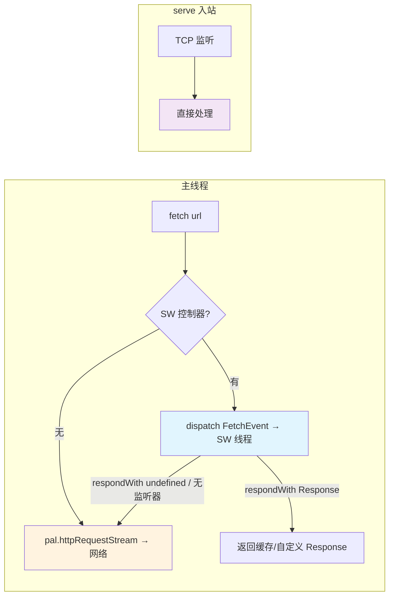
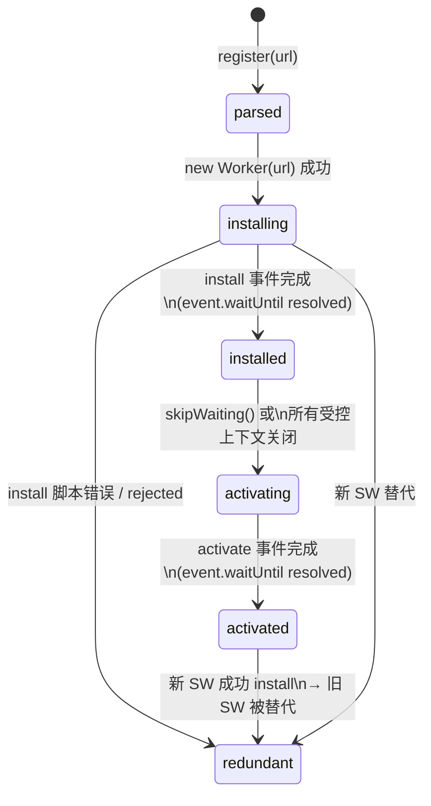
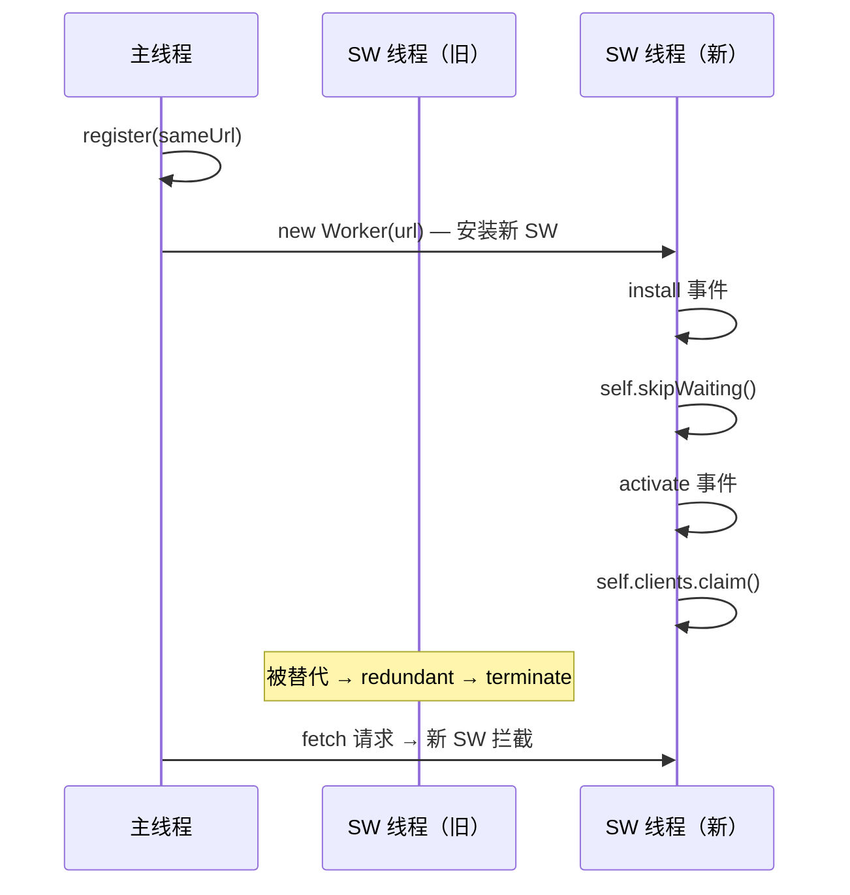
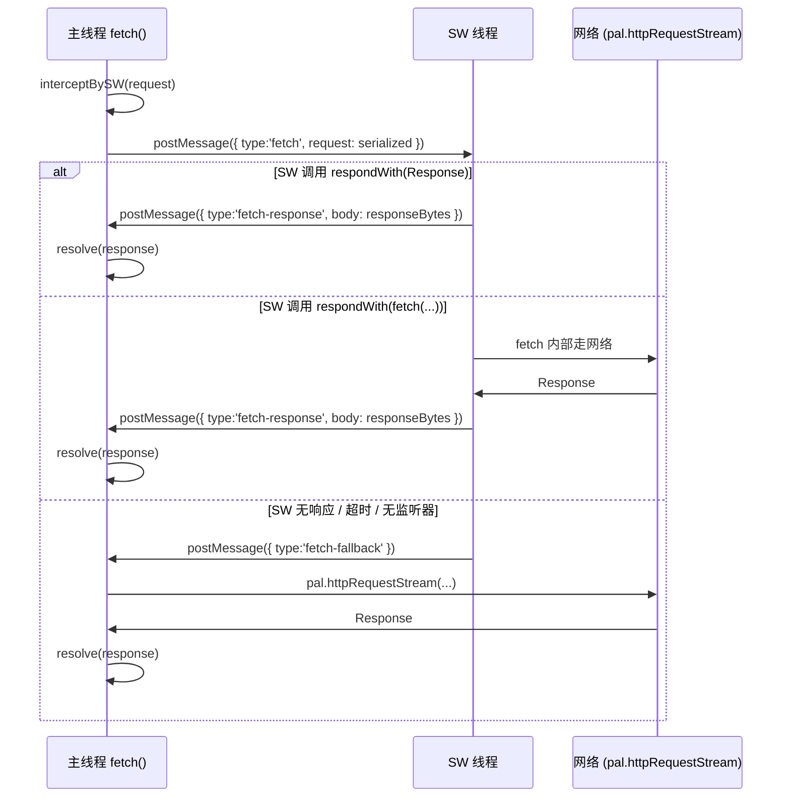
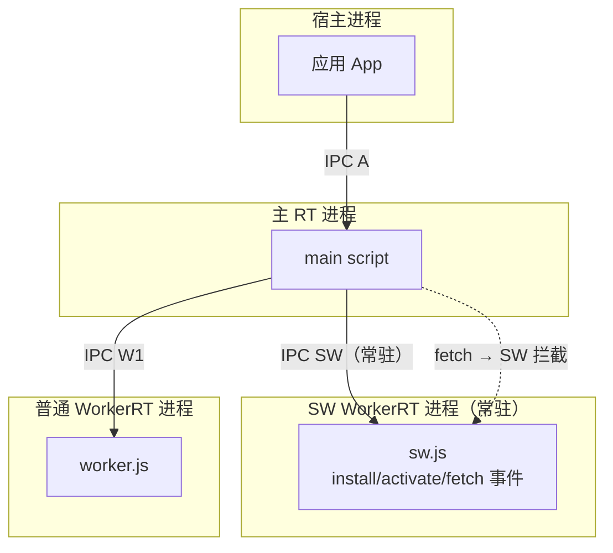

# Service Worker 设计 — qwrt 嵌入式运行时的 SW 子集与分阶段落地

> 状态：设计文档（实施前）。
> 日期：2026-09-04
> 范围：qwrt 运行时（QuickJS-ng 嵌入式）的 Service Worker 能力子集。目标是**在非浏览器宿主环境中提供 SW 核心语义：注册/生命周期管理 + fetch 客户端拦截 + 离线缓存**，不依赖浏览器平台。
> 背景：qwrt 已有 Worker（真线程隔离 qwrt_t）、CacheStorage/Cache（内存 Map 实现）、fetch（libuv HTTP/HTTPS）、serve()（纯 JS HTTP/WS 服务器）、BroadcastChannel、MessageChannel/MessagePort、structuredClone。多进程模型处于设计阶段（`2026-09-04-multi-process-model.md`）。

**核心结论（TL;DR）**
1. **定位裁剪**：qwrt SW = **fetch 客户端拦截 + 离线缓存 + 消息通信**；不纳入 push/notification/background-sync（宿主平台依赖，首版不做）。`serve()` 入站拦截作为扩展点预留，首版不做——标准 SW 的 `FetchEvent` 语义映射到**主线程 `fetch()` 调用拦截**，而非服务端入站请求。
2. **执行上下文**：SW 跑在**独立 Worker 线程**（复用现有 `qwrt_worker_create` + `worker-boot.js` 垫片），天然隔离（独立 JSRuntime + 线程 + 事件循环）。多进程模型落地后无缝接入 SW 常驻进程（同一 spawn 路径，仅消息后端从线程队列切换到 IPC 信封）。
3. **作用域**：qwrt 无页面导航概念，scope 简化为**全局注册（每进程唯一 SW）**；scope 参数保留但默认覆盖所有 `fetch()` 调用，不做 URL 前缀匹配。
4. **更新策略**：新 SW install 成功后直接 skipWaiting + clients.claim（无"等待旧 SW 控制页关闭"——qwrt 无页面概念），**零等待切换**。
5. **fetch 拦截机制**：在 `fetch.js` 的 `doRequest` 层加钩子——调用 `pal.httpRequestStream` 前先查询 SW 控制器，若 SW 已注册则 dispatch `FetchEvent` 到 SW 线程，SW 通过 `event.respondWith()` 返回 Response 或 `undefined`（回退网络）。**单向拦截：主线程 fetch → SW；serve() 入站不经 SW**。
6. **Cache API**：现有 `cache-storage.js` 内存 Map 实现**语义够用**（put/match/delete/keys 全有），但**断电丢失**。离线缓存（SW install pre-cache + fetch 时 cache-first）在首版用内存 Cache 即可；持久化存储作为后续扩展（`pal.fsWrite` 写文件，或 localStorage 桥接）。
7. **分四阶段**：SW-0 注册/生命周期（无 fetch 拦截）→ SW-1 fetch 拦截 + clients → SW-2 Cache 集成 + 离线策略 → SW-3 更新机制（字节对比 + 多版本）。每阶段独立可验证。

---

# 1. Service Worker 在 qwrt 中的定位

## 1.1 标准 SW 能力 vs qwrt 裁剪

| 标准 SW 能力 | qwrt 首版 | 理由 |
|---|---|---|
| `navigator.serviceWorker.register(url)` | ✅ | 核心入口 |
| SW 独立上下文（ServiceWorkerGlobalScope） | ✅ 复用 Worker | 独立 JSRuntime + 线程，天然隔离 |
| install / activate 生命周期 | ✅ | 状态机核心 |
| fetch 拦截（FetchEvent） | ✅ SW-1 | 核心价值：客户端请求路由 |
| clients.matchAll / clients.claim | ✅ SW-1 | 控制权转移必需 |
| `self.skipWaiting()` | ✅ | 配合 clients.claim 实现零等待更新 |
| `self.registration` | ✅ | SW 内访问注册信息 |
| postMessage 主线程 ↔ SW | ✅ | 复用现有 Worker postMessage + MessageChannel |
| Cache API（caches.open/match/put） | ✅ SW-2 复用现有 | 内存 Map 实现，语义完备 |
| `event.waitUntil(promise)` | ✅ | 延迟 install/activate 完成 |
| PushManager / push 事件 | ❌ | 依赖浏览器推送平台 |
| Notification API | ❌ | 依赖浏览器/OS 通知 |
| Background Sync | ❌ | 依赖浏览器后台调度 |
| Navigation Preload | ❌ | 无导航概念 |
| updateViaCache | ❌ | 无 HTTP 缓存语义 |
| scope URL 前缀匹配 | ❌ 简化为全局 | 无页面导航，SW 拦截所有 fetch |
| 强制 HTTPS（secure context） | ❌ 豁免 | 非浏览器，qwrt 可在任意网络环境运行 |

**明确不做**（首版 + 中期）：
- **push/notification/background-sync**：这些 API 依赖宿主平台推送服务（浏览器 Push API、OS 通知中心）。qwrt 是嵌入式运行时，无浏览器宿主，无推送基础设施。若未来需要后台推送，需自建推送通道（与 SW 核心语义解耦），不在本设计范围。
- **强制 HTTPS 要求**：Web 标准 SW 要求 secure context（HTTPS 或 localhost）。qwrt 非浏览器——可在内网 HTTP、嵌入式设备、甚至 Unix socket 上运行。**明确豁免 secure context 要求**，`register()` 不检查协议。文档标注"开发者自行确保传输安全"。
- **多 SW 版本并行控制页面**：无页面概念，不存在"页面 A 被 SW-1 控制、页面 B 被 SW-2 控制"的场景。全局唯一 SW 实例。

## 1.2 拦截目标：fetch 客户端请求（推荐）vs serve() 入站请求

**推荐：先做 fetch 客户端拦截（贴合 Web 标准语义），serve() 入站拦截作为扩展。**

理由：

1. **Web 标准对齐**：SW 的 `FetchEvent` 在浏览器中拦截的是**客户端发起的 `fetch()` / XHR 请求**。qwrt 的 `fetch()` 是客户端 API（`polyfill/src/fetch.js`，经 `pal.httpRequestStream` 走 libuv HTTP），语义上完全对应。保持标准语义让用户已有 SW 知识直接迁移。
2. **实现简单**：`fetch.js` 的 `doRequest` 函数是单一入口点，加钩子只需在 `pal.httpRequestStream` 调用前插入 SW 查询逻辑——不涉及 TCP 层改动。
3. **serve() 入站拦截是非标准扩展**：`serve()` 的请求来自 TCP 监听端口，语义上是"服务端收到的请求"，不是"客户端发起的请求"。拦截 serve() 入站请求等价于 Service Worker 作为反向代理——这在 Web 标准中不存在。若未来需要，可作为 `qwrt.sw.interceptServe()` 扩展 API，与标准 SW 语义分离。



**备选（不推荐）：同时拦截 fetch + serve() 入站**。技术上可行（在 `http-server.js` 的请求解析后加 SW 钩子），但增加复杂度且无标准对齐需求。serve() 的 handler 回调已是 JS 层完全控制，应用可自行实现"拦截"逻辑（在 handler 里查 Cache、做路由），不需要 SW 机制。

## 1.3 作用域概念

Web 标准 SW 有 scope（URL 前缀匹配）：注册在 `/app/` 的 SW 只拦截路径以 `/app/` 开头的请求。

**qwrt 简化：全局注册，一个进程一个 SW，拦截所有 fetch() 调用。**

理由：

1. **无页面导航**：qwrt 不做 HTML 页面加载，不存在"页面在 `/app/` 下"的概念。`fetch()` 调用来自用户 JS 代码，不绑定 URL 路径层级。
2. **scope 参数保留**：`register(url, {scope})` 接受 scope 参数但**首版忽略其值**（所有 fetch 均被拦截）。scope 保留是为了 API 兼容——若未来 qwrt 支持模块化加载或 URL 路由，scope 可启用。文档标注"scope 参数当前被忽略"。
3. **单 SW 限制**：`navigator.serviceWorker.register()` 同时只允许一个活跃 SW。重复注册新 SW 脚本 URL → 替换旧 SW（触发旧 SW→redundant + 新 SW→install）。这与浏览器的"每个 scope 一个 SW"不同，但对嵌入式场景足够——应用通常只有一个拦截点。

---

# 2. 生命周期

## 2.1 状态机

完全遵循 W3C Service Worker Lifecycle 状态机：



| 状态 | 含义 | 对应动作 |
|---|---|---|
| `parsed` | register() 调用，URL 已验证 | 无（等待调度） |
| `installing` | Worker 线程已启动，运行 SW 脚本 | 触发 `install` 事件；SW 可 `skipWaiting()` |
| `installed` | install 完成，等待激活 | 等待 skipWaiting 或旧 SW 释放控制权 |
| `activating` | 已决定激活（skipWaiting 或无旧 SW） | 触发 `activate` 事件；SW 可 `clients.claim()` |
| `activated` | SW 已激活，可拦截 fetch / 接收消息 | `fetch` 事件监听器生效 |
| `redundant` | 被新 SW 替代或 install 失败 | Worker 线程 terminate |

## 2.2 事件

| 事件 | 触发时机 | SW 侧 API |
|---|---|---|
| `install` | SW 脚本加载完成 | `event.waitUntil(promise)` 延迟 installing→installed |
| `activate` | SW 被激活 | `event.waitUntil(promise)` 延迟 activating→activated |
| `fetch` | 主线程 `fetch()` 被 SW 控制 | `event.respondWith(promise<Response>)` / `event.request` |
| `message` | 主线程 `sw.postMessage(data)` | `event.data` / `event.source` |

## 2.3 更新机制

Web 标准 SW 更新：`register()` 同 URL → 浏览器检查字节变化 → 新 SW installing → install 完成后进入 installed（等待）→ 旧 SW 控制的"页面"全部关闭后才 activating。

**qwrt 简化：新 SW install 完成后直接 skipWaiting + clients.claim（零等待切换）。**

理由：

1. **无页面概念**：不存在"等待页面关闭"的等待条件。qwrt 的"受控上下文"是主线程 JS 本身——它始终在运行，不会"关闭"。若等待，SW 永远不会激活。
2. **skipWaiting 语义保留**：SW 脚本可通过 `self.skipWaiting()` 显式控制激活时机（标准行为）。但 qwrt 的默认行为是 **install 完成即自动 skipWaiting**（与浏览器的"默认等待"不同，但对嵌入式场景更实用）。
3. **更新检测**：`register(url)` 被调用时，若 URL 与当前活跃 SW 相同，触发更新检查。首版不做字节级 diff——直接重新加载脚本并走 install 流程（install 失败则旧 SW 不受影响）。字节对比优化放在 SW-3。



## 2.4 执行上下文：复用现有 Worker 机制（推荐）

**推荐：SW 跑在独立 Worker 线程（复用 `qwrt_worker_create` + worker-boot.js 垫片）。**

理由：

1. **真隔离**：独立 JSRuntime + 线程 + 事件循环。SW 脚本的 bug 不会影响主线程。这是 Web 标准 SW 的核心安全保证。
2. **代码复用**：`worker.js` 的 Worker 构造 + `worker-boot.js` 的 postMessage/dispatch 移植 + `message-channel.js` 的 MessagePort 跨线程路由——全部复用，不需要新 PAL 原语。
3. **多进程自然接入**：多进程模型落地后，SW Worker 从"线程 qwrt_t"升级为"进程 qwrt_t"（exec 自身 + `--qwrt-worker`），JS 层零改动。SW 是常驻进程的理想候选（生命周期长、可被主 RT 按需唤醒）。
4. **message 通信**：主线程 ↔ SW 通过现有 Worker postMessage / MessagePort，序列化走 structuredClone（`__qwrt_serialize__`/`__qwrt_deserialize__`），跨线程原子队列（或未来 IPC 信封）。

**备选（不推荐）：同进程软隔离 context（`context.js` 的 suspend/resume 模式）**。context.js 做的是"拍快照→销毁 JSContext→重建→恢复"，设计目标是**可挂起/恢复的任务**，不是常驻拦截器。SW 需要长期存活 + 实时响应 fetch 事件，suspend/resume 的"销毁重建"语义不匹配。且 context.js 的 JSContext 不是独立线程——SW 的阻塞或慢操作会卡主线程。

---

# 3. API 面

## 3.1 主线程侧

### `navigator.serviceWorker` 对象

```js
// 注册
const registration = await navigator.serviceWorker.register('/sw.js', { scope: '/' });
// scope 参数首版忽略，所有 fetch 均被拦截

// registration 属性
registration.installing  // ServiceWorker | null — 安装中的 SW
registration.waiting     // ServiceWorker | null — 等待激活的 SW
registration.active      // ServiceWorker | null — 已激活的 SW
registration.scope       // string — 返回传入的 scope（首版恒为 '/'）

// registration 方法
await registration.update();           // 触发更新检查
await registration.unregister();       // 注销 SW

// ServiceWorker 对象
sw.state        // 'installing' | 'installed' | 'activating' | 'activated' | 'redundant'
sw.scriptURL    // string — 注册的脚本 URL
sw.postMessage(data, transfer);       // 向 SW 发消息
sw.addEventListener('statechange', fn);
sw.addEventListener('message', fn);   // SW 向主线程发消息

// navigator.serviceWorker 全局
navigator.serviceWorker.controller    // ServiceWorker | null — 当前控制的 SW
await navigator.serviceWorker.ready   // Promise<ServiceWorkerRegistration> — SW 激活后 resolve
```

### ServiceWorkerContainer 完整 API 面

| API | 类型 | 首版 | 说明 |
|---|---|---|---|
| `.register(url, opts?)` | method → Promise\<Registration\> | ✅ | 核心入口 |
| `.getRegistration()` | method → Promise\<Registration\> | ✅ | 获取当前注册 |
| `.getRegistrations()` | method → Promise\<Registration[]> | ✅ | 返回 [registration] 或 [] |
| `.controller` | property → SW \| null | ✅ | 当前控制的 SW |
| `.ready` | property → Promise\<Registration\> | ✅ | SW 激活后 resolve |
| `.oncontrollerchange` | event handler | ✅ | controller 变化时触发 |
| `.startMessages()` | method | ❌ | 无页面概念，不适用 |

## 3.2 SW 侧（ServiceWorkerGlobalScope）

SW 脚本运行在独立 Worker 线程的全局作用域。需要扩展 `worker-boot.js` 垫片，注入 SW 特有 API：

```js
// —— ServiceWorkerGlobalScope 专属 API ——

// 生命周期控制
self.skipWaiting();                    // 跳过等待，立即激活
self.addEventListener('install', (event) => {
  event.waitUntil(
    caches.open('v1').then(cache => cache.addAll(['/app.js', '/style.css']))
  );
});
self.addEventListener('activate', (event) => {
  event.waitUntil(self.clients.claim());
});

// fetch 拦截
self.addEventListener('fetch', (event) => {
  event.respondWith(
    caches.match(event.request).then(cached => cached || fetch(event.request))
  );
});

// 消息接收
self.addEventListener('message', (event) => {
  console.log('Message from client:', event.data);
  event.source.postMessage('ack');
});

// registration 信息
self.registration        // ServiceWorkerRegistration（只读）
self.clients             // ClientIds 对象
self.caches              // CacheStorage（复用现有 globalThis.caches）
```

### Clients API

| API | 类型 | 首版 | 说明 |
|---|---|---|---|
| `self.clients.matchAll()` | method → Promise\<Client[]> | ✅ | 返回受控客户端列表 |
| `self.clients.claim()` | method → Promise | ✅ | SW 主动接管所有客户端 |
| `self.clients.get(id)` | method → Promise\<Client> | ✅ | 按 id 获取客户端 |
| `client.postMessage(data)` | method | ✅ | 向客户端发消息 |
| `client.id` | property | ✅ | 客户端唯一 id |
| `client.type` | property | ✅ | 恒为 `'window'`（qwrt 无 window/worker 区分，或返回 `'worker'`） |
| `client.url` | property | ✅ | 恒为 `''`（qwrt 无 URL 概念） |

### FetchEvent

| API | 类型 | 首版 | 说明 |
|---|---|---|---|
| `event.request` | property → Request | ✅ | 被拦截的请求对象 |
| `event.respondWith(response)` | method | ✅ | 提供自定义响应（Response \| Promise\<Response>） |
| `event.waitUntil(promise)` | method | ✅ | 延迟事件生命周期 |
| `event.preloadResponse` | property | ❌ | 无 Navigation Preload |
| `event.clientId` | property | ✅ | 发起请求的客户端 id |
| `event.handled` | property | ❌ | 不做 |

## 3.3 fetch 拦截机制（核心设计）

### 钩子位置：`fetch.js` 的 `doRequest` 函数

```
fetch(input, init)
  └→ doRequest(request, resolve, reject, redirectCount)
       ├─ ① 序列化 headers/body
       ├─ ② [新增] SW 拦截查询 ──────────────────────┐
       │     navigator.serviceWorker.controller        │
       │     ├ 有 controller → dispatch FetchEvent     │
       │     │  ├ event.respondWith(promise) → resolve │
       │     │  └ 无 respondWith / 超时 → 回退网络     │
       │     └ 无 controller → 直接走网络               │
       ├─ ③ pal.httpRequestStream(...) ←── 网络回退   │
       └─ ④ 处理 onHeaders/onData/onEnd                │
```

### 拦截流程详解

**主线程侧（fetch.js 改动）**：

```js
// 在 doRequest 内，pal.httpRequestStream 调用前插入：

function interceptBySW(request, resolve, reject) {
  var controller = navigator.serviceWorker && navigator.serviceWorker.controller;
  if (!controller || controller.state !== 'activated') {
    return false; // 无 SW 控制，回退网络
  }

  // 构建 FetchEvent，序列化 request 传给 SW 线程
  var eventObj = {
    type: 'fetch',
    request: request,        // 需要 structuredClone 序列化
    clientId: 'main'         // 主线程 id
  };

  // 通过 Worker.postMessage 发送 FetchEvent 到 SW 线程
  // SW 线程收到后创建 FetchEvent 对象，运行事件监听器
  // 若调用了 event.respondWith(promise)：
  //   → promise resolve 为 Response → 通过 postMessage 回传 → resolve 给主线程 fetch
  // 若未调用 respondWith 或 promise reject：
  //   → 通过 postMessage 通知主线程 → 回退网络

  return true; // 已交给 SW 处理（异步）
}
```

**SW 线程侧（worker-boot.js 扩展）**：

```js
// SW 侧 __qwrt_dispatch__ 收到 type='fetch' 消息后：
// 1. 从 structuredClone 字节重建 Request 对象
// 2. 创建 FetchEvent(request, { clientId })
// 3. dispatchEvent(fetchEvent)
// 4. 监听 event.respondWith 调用：
//    - 若被调用，等待 promise 结果（Response 序列化回主线程）
//    - 若事件处理完未调用 respondWith，发 undefined 通知主线程回退网络
//    - 超时（如 30s）未 settle，自动回退网络
```

**数据流**：



### 关键设计决策：拦截是同步还是异步？

**推荐：异步拦截（发 postMessage 等 SW 响应）。**

`fetch()` 返回 Promise，`doRequest` 本身是异步的——拦截查询发生在 Promise 内部，不阻塞主线程事件循环。SW 线程收到 FetchEvent 后运行 JS 代码（可能涉及 Cache 查询、网络请求），通过 postMessage 将结果回传。主线程等待 SW 响应或超时回退。

这与浏览器 SW 拦截语义一致：浏览器中 `fetch()` 事件也是异步分发到 SW 线程。

## 3.4 Cache API 语义

### 现有实现评估

`polyfill/src/cache-storage.js` 的实现：

| API | 实现 | 状态 |
|---|---|---|
| `caches.open(name)` | 内存 Map，按 name 缓存 | ✅ 语义完备 |
| `cache.put(request, response)` | URL string key → Response clone | ✅ |
| `cache.match(request)` | URL 精确匹配 → Response clone | ✅ |
| `cache.matchAll(request?)` | 过滤返回 clone 数组 | ✅ |
| `cache.delete(request)` | URL 删除 | ✅ |
| `cache.keys(request?)` | 返回 URL key 数组 | ✅ |
| `caches.has(name)` | 检查缓存存在 | ✅ |
| `caches.delete(name)` | 删除整个缓存 | ✅ |
| `caches.keys()` | 返回所有缓存名 | ✅ |

**结论：现有 Cache API 语义**完备**，SW-2 直接复用。**

### 离线缓存用例落地

**SW install 时 pre-cache**：

```js
// sw.js — install 事件
self.addEventListener('install', (event) => {
  event.waitUntil(
    caches.open('app-v1').then(cache =>
      cache.addAll([
        '/api/config',
        '/assets/app.js',
        '/assets/style.css'
      ])
    )
  );
});
```

`cache.addAll(urls)` 当前未实现——需在 `cache-storage.js` 新增：

```js
Cache.prototype.addAll = function(requests) {
  var self = this;
  return Promise.all(requests.map(function(url) {
    return fetch(url).then(function(response) {
      if (!response.ok) throw new TypeError('addAll: fetch failed for ' + url);
      return self.put(url, response);
    });
  }));
};
```

**fetch 时 cache-first 策略**：

```js
// sw.js — fetch 事件
self.addEventListener('fetch', (event) => {
  event.respondWith(
    caches.match(event.request).then(cached => {
      return cached || fetch(event.request);
    })
  );
});
```

### 持久化问题

**现状**：Cache 是内存 Map，断电/进程退出后丢失。SW 重启后需要重新 pre-cache。

**首版处理**：接受内存 Cache 的局限。SW 每次启动（install 事件）重新 pre-cache，fetch 拦截在 pre-cache 完成前回退网络。对嵌入式常驻进程（不频繁重启）足够。

**后续扩展**（非首版）：
- 方案 A：Cache 写入文件持久化（`pal.fsWrite`，SW activate 时写、install 时读）。
- 方案 B：Cache 桥接到 localStorage（已有持久化实现）。
- 方案 C：新增 `pal.cachePersist(name, data)` C 原语，专门做 KV 存储。

---

# 4. 与多进程模型的关系

## 4.1 演进关系

多进程模型（`2026-09-04-multi-process-model.md`）定义了：
- 宿主进程 → 主 RT 进程 → WorkerRT 进程 ×N 的星型拓扑
- Worker 进程通过 `exec` 自身 + `--qwrt-worker --parent-fd N --worker-id K` spawn
- 消息走 `uv_pipe_t` + FlatBuffers 信封

**SW 自然成为树中的一个常驻 WorkerRT 进程**：



## 4.2 本期实现（基于线程 Worker）

本期 SW 实现基于现有线程 Worker 机制（`qwrt_worker_create` 线程模式）：
- SW Worker = 一个普通 Worker，加载 SW 脚本而非用户脚本
- 主线程 fetch → postMessage FetchEvent → SW 线程 → postMessage 响应
- 消息走现有 lock-free MPSC + `uv_async_send`

## 4.3 多进程演进预留

**设计原则：SW 上下文创建走 `qwrt_worker_create` 同路径。**

多进程落地时：
- `QWRT_PROCESS_MODEL=ISOLATED`：SW Worker 从线程升级为进程（exec + socketpair），JS 层零改动。`postMessage`/FetchEvent 序列化仍走 structuredClone；进程边界加 FlatBuffers 信封（C 层透明，JS 不感知）。
- SW 是**常驻进程**的天然候选：生命周期长（install→activated 后持续运行）、不需要频繁 spawn/destroy。主 RT 可在 SW 注册时 spawn SW 进程、注销时 terminate。
- `QWRT_PROCESS_MODEL=THREAD`：SW 继续用线程，编译选项回退无缝。

**无额外 C 改动需求**：SW 的核心操作（postMessage、terminate、事件分发）全部走现有 Worker 路径。多进程模型只改变消息后端，不改变 JS API。

---

# 5. 分阶段实施计划

## SW-0：注册 / 生命周期状态机 / 基础 API 面（无 fetch 拦截）

**目标**：SW 注册、状态机运转、SW 线程存活、install/activate/message 事件可用。

**实现范围**：
- `polyfill/src/service-worker.js`（新文件）— SW 注册/状态机/管理器
- `polyfill/src/worker-boot.js` 扩展 — SW 侧全局 API 注入（skipWaiting、clients、registration、FetchEvent 类）
- `polyfill/src/fetch.js` 小改 — 暂不加拦截钩子，但预留 `__qwrt_sw_intercept__` 钩子点
- `polyfill/src/cache-storage.js` 扩展 — `cache.addAll()` 方法
- `polyfill/src/index.js` 接线 — `setupServiceWorker(pal)`

**核心模块设计**：

```js
// service-worker.js — 主线程侧管理器
export function setupServiceWorker(pal) {
  var registrations = new Map();   // url → ServiceWorkerRegistration
  var activeSW = null;             // 当前激活的 ServiceWorker 实例

  class ServiceWorkerRegistration {
    constructor(url, scope) {
      this._url = url;
      this._scope = scope;
      this._installing = null;  // ServiceWorker
      this._waiting = null;
      this._active = null;
    }
    get installing() { return this._installing; }
    get waiting()    { return this._waiting; }
    get active()     { return this._active; }
    get scope()      { return this._scope; }

    update() { /* 重新加载脚本，走 install 流程 */ }
    unregister() { /* terminate SW，清理状态 */ }
  }

  class ServiceWorker {
    constructor(url) {
      this._url = url;
      this._state = 'installing';
      this._worker = new Worker(/* SW boot URL */);  // 复用 Worker 机制
    }
    get state()     { return this._state; }
    get scriptURL() { return this._url; }
    postMessage(data, transfer) { this._worker.postMessage(data, transfer); }
    terminate()     { this._worker.terminate(); }
  }

  // navigator.serviceWorker 对象
  globalThis.navigator.serviceWorker = {
    register: function(url, options) {
      // 1. 加载 SW 脚本（loadScript）
      // 2. 创建 ServiceWorkerRegistration
      // 3. 创建 ServiceWorker → 启动安装
      // 4. 返回 registration
    },
    get controller() { return activeSW; },
    ready: new Promise(/* SW activated 后 resolve */),
    getRegistrations: function() { /* 返回所有 registration */ },
    getRegistration: function() { /* 返回当前 registration */ }
  };
}
```

**SW 侧 boot 垫片扩展**（在 `worker-boot.js` 中注入）：

```js
// SW 侧全局扩展（仅当 SW 模式时注入）
if (globalThis.__qwrt_sw_mode__) {
  globalThis.self.skipWaiting = function() {
    pal.postMessage(__qwrt_serialize__({ __qwrt_sw: 'skipWaiting' }));
  };
  globalThis.self.clients = {
    claim: function() {
      pal.postMessage(__qwrt_serialize__({ __qwrt_sw: 'clients.claim' }));
      return Promise.resolve();
    },
    matchAll: function() {
      pal.postMessage(__qwrt_serialize__({ __qwrt_sw: 'clients.matchAll' }));
      return Promise.resolve([{ id: 'main', type: 'window', url: '' }]);
    },
    get: function(id) {
      return Promise.resolve({ id: id, type: 'window', url: '' });
    }
  };
  globalThis.self.registration = { /* 只读属性 */ };
}
```

**验证门**：
- 单元测试：注册 SW → 状态机流转（parsed→installing→installed→activating→activated）。
- e2e：SW 脚本中 `addEventListener('install')` 和 `addEventListener('activate')` 被调用；`skipWaiting()` 触发状态跃迁；`postMessage` 双向通信。

## SW-1：fetch 拦截 + clients / clients.claim

**目标**：主线程 `fetch()` 被 SW 拦截，`event.respondWith()` 提供 Response，无 SW 时回退网络。

**实现范围**：
- `polyfill/src/fetch.js` — `doRequest` 内加 SW 拦截钩子
- `polyfill/src/service-worker.js` — FetchEvent 分发 + 响应回传
- `polyfill/src/worker-boot.js` — SW 侧 FetchEvent 类 + respondWith 实现
- FetchEvent 超时机制（30s 默认）→ 回退网络

**核心改动**：

```js
// fetch.js — doRequest 内部
function doRequest(request, resolve, reject, redirectCount) {
  // ... 原有序列化逻辑 ...

  // [SW-1 新增] 拦截查询
  var swController = globalThis.navigator &&
    globalThis.navigator.serviceWorker &&
    globalThis.navigator.serviceWorker.controller;

  if (swController && swController.state === 'activated') {
    // 发 FetchEvent 到 SW 线程
    var fetchId = __nextFetchId__++;
    __pendingFetches__.set(fetchId, { resolve: resolve, reject: reject });
    swController._worker.postMessage({
      __qwrt_sw_event: 'fetch',
      fetchId: fetchId,
      request: { url: request.url, method: request.method,
                 headers: request._headers, body: request._body }
    });
    // 超时回退
    setTimeout(function() {
      if (__pendingFetches__.has(fetchId)) {
        __pendingFetches__.delete(fetchId);
        fallbackToNetwork(request, resolve, reject, redirectCount);
      }
    }, 30000);
    return;
  }

  // 无 SW → 走网络
  fallbackToNetwork(request, resolve, reject, redirectCount);
}
```

**验证门**：
- e2e：SW 注册后 `fetch(url)` 被拦截 → SW 返回自定义 Response → 主线程收到自定义 Response。
- e2e：SW 注册后 `fetch(url)` 不调用 respondWith → 回退网络 → 正常响应。
- e2e：SW 脚本内 `fetch(event.request)` 内部 fetch 不被递归拦截（防重入）。

## SW-2：Cache API 集成（离线缓存用例）

**目标**：SW install 时 pre-cache + fetch 时 cache-first / stale-while-revalidate 策略可用。

**实现范围**：
- `polyfill/src/cache-storage.js` — 新增 `cache.addAll(requests)` 方法
- SW 脚本中 `self.caches` 可用（复用全局 `globalThis.caches`）
- 离线策略：cache-first / network-first / stale-while-revalidate 由 SW 脚本组合 Cache + fetch 实现

**验证门**：
- e2e：SW install → `cache.addAll(['/api/data'])` → `fetch('/api/data')` → 返回缓存 Response（不走网络）。
- e2e：Cache 未命中 → fetch → SW 收到网络 Response → `cache.put()` → 下次命中缓存。

## SW-3：更新机制（字节对比 + skipWaiting + 多版本策略）

**目标**：`register()` 同 URL → 检查脚本字节变化 → 仅变化时触发更新。

**实现范围**：
- `service-worker.js` — register 时加载脚本 → 与活跃 SW 脚本哈希对比 → 相同则跳过、不同则走 install
- skipWaiting / clients.claim 更新切换
- 多版本共存策略：新 SW install 期间旧 SW 仍控制 fetch（installed 态的旧 SW 继续工作，新 SW activate 后替换）

**验证门**：
- e2e：register 同 URL 不变 → 不触发 install。
- e2e：register 同 URL 但 SW 脚本字节变化 → 新 SW install → activate → 替换旧 SW。
- 回归：旧 SW 在新 SW install 期间继续拦截 fetch（无控制真空期）。

---

# 6. 关键设计决策总结

## 决策 1：SW 上下文 = Worker 线程（推荐）vs 软隔离 context

| 维度 | Worker 线程（推荐） | 软隔离 context |
|---|---|---|
| 隔离度 | 独立 JSRuntime + 线程 | 同进程 JSContext |
| 阻塞影响 | 不阻塞主线程 | 慢操作卡主线程 |
| postMessage | 现有 Worker 机制 | 需新 IPC |
| 多进程接入 | 无缝（同一 spawn 路径） | 需改造 |
| 复杂度 | 低（复用已有） | 中（context.js suspend/resume 不匹配 SW 常驻语义） |

**选择：Worker 线程。** 理由：真隔离 + 代码复用 + 多进程自然接入。context.js 的 suspend/resume 设计目标是"可挂起任务"，SW 是"常驻拦截器"，语义不匹配。

## 决策 2：全局注册 vs URL scope 匹配

| 维度 | 全局注册（推荐） | URL scope 匹配 |
|---|---|---|
| 复杂度 | 低（一个 SW 管所有 fetch） | 中（URL 前缀匹配 + 多 SW 路由） |
| 适用性 | 嵌入式单应用足够 | 多应用共享运行时 |
| 标准对齐 | 偏离（标准有 scope） | 对齐 |
| 预留 | scope 参数保留但忽略 | — |

**选择：全局注册，scope 参数保留但忽略。** 理由：qwrt 无页面导航概念，全局一个 SW 是最自然的语义。scope 保留为 API 兼容 + 未来扩展。

## 决策 3：更新策略 = install 后自动 skipWaiting（推荐）vs 等待

| 维度 | 自动 skipWaiting（推荐） | 等待旧 SW 释放 |
|---|---|---|
| 切换延迟 | 零等待 | 无限等待（qwrt 无页面关闭） |
| 用户控制 | 通过 activate 事件做迁移 | — |
| 标准对齐 | 偏离（标准默认等待） | 对齐但不可行 |

**选择：install 完成后自动 skipWaiting + clients.claim。** 理由：qwrt 无"等待页面关闭"条件，必须自动切换。

## 决策 4：拦截范围 = 仅 fetch 客户端（推荐）vs fetch + serve()

| 维度 | 仅 fetch 客户端（推荐） | fetch + serve() |
|---|---|---|
| 标准对齐 | ✅ 完全对齐 | ❌ serve() 拦截非标准 |
| 实现范围 | fetch.js 单点改动 | fetch.js + http-server.js |
| 适用性 | 客户端请求路由足够 | 需要反向代理能力 |

**选择：首版仅 fetch 客户端拦截。** serve() 入站拦截作为扩展点预留（`qwrt.sw.interceptServe()`）。

## 决策 5：Cache 持久化 = 内存首版（推荐）vs 立即持久化

| 维度 | 内存首版（推荐） | 立即持久化 |
|---|---|---|
| 复杂度 | 零（现有实现） | 需新 C 原语或文件存储 |
| 断电丢失 | 是 | 否 |
| pre-cache 开销 | 每次重启重新缓存 | 一次缓存 |
| 嵌入式适用性 | 常驻进程重启少，够用 | 频繁重启场景需要 |

**选择：首版内存 Cache，持久化作为后续扩展。** 理由：大多数嵌入式场景 SW 进程常驻（不频繁重启），内存 Cache 足够；重启时重新 pre-cache 是可接受的代价。

---

# 7. 风险与权衡

## 7.1 性能

- **fetch 拦截延迟**：主线程 fetch → postMessage → SW 线程处理 → postMessage 回传。额外延迟 = 两次消息传递（跨线程队列）。预期 ~百微秒到毫秒级（取决于 SW 处理复杂度）。对非热路径 fetch 可接受；热路径可直接绕过 SW（fetch 内部检测递归）。
- **内存开销**：SW Worker 线程 = 独立 JSRuntime（~数 MB 堆）。Cache 内存占用取决于缓存的 Response 数量/大小。

## 7.2 正确性

- **递归拦截防护**：SW 脚本内调用 `fetch()` 不应被自身拦截（浏览器行为）。实现：SW 线程内的 fetch 调用绕过 SW 拦截钩子（通过 `__qwrt_sw_mode__` 标志判断）。
- **FetchEvent 超时**：SW 处理慢或 hang 时，主线程 fetch 需超时回退。30 秒默认值与浏览器一致。
- **多版本 install 期间的控制真空**：新 SW installing 时，旧 SW 仍控制 fetch。若旧 SW 被 terminate（如错误），新 SW 尚未 activated → 无 SW 控制 → fetch 回退网络。这是预期行为。

## 7.3 安全

- SW 脚本加载：首版仅 `file://`（与 Worker 一致）。远程 SW 脚本需要网络加载能力（`fetch` 自举问题——SW 拦截 fetch，fetch 又要加载 SW，鸡生蛋）。留作后续讨论。
- SW 脚本注入风险：qwrt 是嵌入式运行时，SW 脚本来源由宿主控制（非用户上传），安全边界与 Worker 一致。

---

# 8. 明确不做

| 能力 | 理由 |
|---|---|
| Push / Notification API | 依赖浏览器推送平台 / OS 通知中心，qwrt 无此基础设施 |
| Background Sync | 依赖浏览器后台调度，qwrt 无此概念 |
| Navigation Preload | 无导航概念 |
| updateViaCache | 无 HTTP 缓存语义（fetch 走 libuv 原始 HTTP） |
| 强制 HTTPS（secure context） | 非浏览器，豁免 secure context 要求 |
| 多 SW 版本并行控制页面 | 无页面概念 |
| serve() 入站拦截（首版） | 非标准语义，作为扩展预留 |
| SW 脚本远程加载（首版） | 鸡生蛋问题，首版 file:// only |
| Cache 持久化（首版） | 内存 Map 够用，持久化作为后续扩展 |

---

# 开放决策点（需用户拍板）

1. **全局注册 vs 保留 scope 参数**：推荐全局注册（scope 参数保留但忽略）。scope 未来启用条件不明确——是否认可当前"忽略 scope"策略？（§1.3）

2. **自动 skipWaiting vs 用户控制**：推荐 install 完成后自动 skipWaiting（无等待条件）。是否认可？还是希望 SW 脚本必须显式调用 `skipWaiting()` 才激活？（§2.3）

3. **FetchEvent 超时值**：推荐 30 秒（与浏览器一致）。是否调整？过短可能导致慢 Cache 查询回退网络，过长可能卡住主线程 fetch。（§5 SW-1）

4. **SW 脚本自举问题**：SW 脚本通过什么方式加载？选项：
   - (a) `file://` only（与 Worker 一致，首版）
   - (b) 允许通过 `fetch()` 加载远程 SW 脚本（但 fetch 可能被自身 SW 拦截——需在 register 内部绕过拦截）
   - (c) 通过 `pal.httpRequestStream` 直接加载（绕过 fetch，无拦截风险）
   推荐 (a) 首版，后续 (c) 扩展。（§7.3）

5. **SW-2 Cache 持久化时机**：首版内存够用，持久化放在 SW-3 之后还是与 SW-2 同步？推荐 SW-3 之后独立票。（§3.4）

6. **clients.type 返回值**：qwrt 无 window/worker 区分。`client.type` 返回 `'window'`（贴合标准默认值）还是 `'worker'`（更准确）？推荐 `'window'`（不暴露实现细节）。（§3.2）
