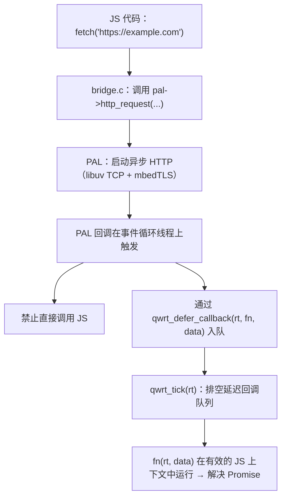

# 事件循环

qwrt 是单线程的。所有异步操作（HTTP 请求、文件 I/O、定时器）都由协作式事件循环驱动。

## 循环

宿主通过交替调用两个函数来驱动事件循环：

```c
while (running) {
    // 1. 驱动 PAL 事件循环 — 处理 I/O、触发定时器
    int events = pal->run_cycle(pal, 100);  // 100ms 超时

    // 2. 排空 JS 微任务 — 解决 Promise、分发回调
    qwrt_tick(rt);

    // 3. 检查退出条件
    if (events < 0) break;  // PAL 请求停止
}
```

## 异步操作的工作原理



## 延迟回调

PAL 实现禁止在其回调（libuv 回调、定时器触发等）中直接调用 JavaScript。相反，它们通过以下方式将工作入队：

```c
void qwrt_defer_callback(qwrt_t *rt, qwrt_deferred_fn fn, void *data);
```

`qwrt_tick` 排空此队列，在有效的 JS 上下文中依次调用每个 `fn(rt, data)`。

## `run_cycle` 语义

| timeout_ms | 行为 |
|------------|----------|
| `< 0` | 阻塞直到有事件到达 |
| `0` | 非阻塞 — 仅处理就绪的工作 |
| `> 0` | 阻塞最多 timeout_ms 毫秒 |

返回：已处理的事件数量，超时则返回 0，如果循环应停止则返回 `< 0`。

`run_cycle` 是**可选的** — 如果为 NULL，宿主按自己的调度直接调用 `qwrt_tick`。

## 完整事件循环示例

```c
#include <qwrt/qwrt.h>
#include <pal_uv.h>

int main(void) {
    qwrt_pal_t *pal = pal_uv_create(uv_default_loop());
    qwrt_t *rt = qwrt_create(&(qwrt_config_t){ .pal = pal });

    // 启动异步操作
    qwrt_eval(rt,
        "fetch('https://httpbin.org/json')"
        "  .then(r => r.json())"
        "  .then(d => console.log('got:', JSON.stringify(d)))",
        NULL);

    // 驱动事件循环
    int running = 1;
    while (running) {
        int events = pal->run_cycle(pal, 100);
        if (events < 0) break;
        qwrt_tick(rt);
        // 检查是否还有更多工作要做...
    }

    qwrt_destroy(rt);
    return 0;
}
```

## 不使用事件循环

如果你的 PAL 没有 `run_cycle` 且所有操作都是同步的，你可以跳过循环：

```c
qwrt_eval(rt, "console.log('Hello!');", NULL);
qwrt_tick(rt);  // 排空微任务
qwrt_destroy(rt);
```

仍然需要 `qwrt_tick` — 它会排空即使在同步代码中也会累积的 Promise 微任务。