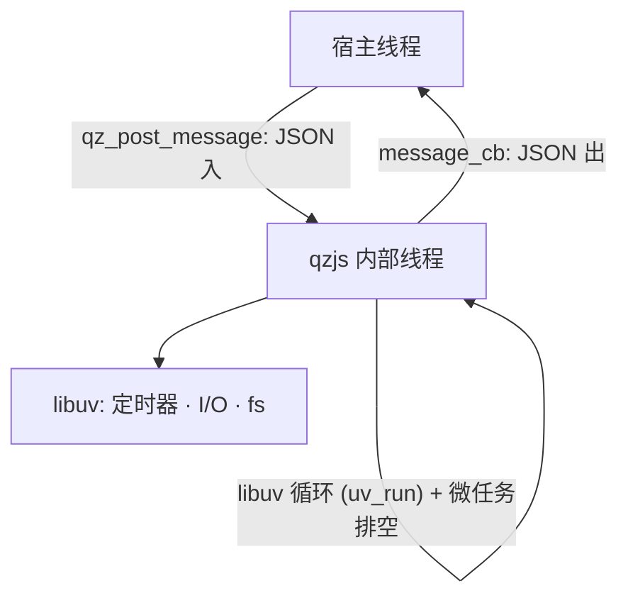

# 事件循环

qzjs 在自己的内部线程上拥有一个事件循环。没有 `qz_tick`，也没有宿主驱动的循环 — 宿主不泵动任何东西。

## 谁在运行循环

`qz_create` 启动一个专用内部线程（`uv_thread_t`），该线程运行一个 libuv 循环（嵌入式在运行时中的 `uv_loop_t`）。该循环驱动所有异步工作 — HTTP、文件 I/O、定时器 — 且所有 JS 都在同一线程上运行，因此 Promise 微任务在循环迭代之间自然排空。宿主线程从不触碰循环。


```mermaid
flowchart TB
    HOST["宿主线程"] -->|"qz_post_message: JSON 入"| AM["qzjs 内部线程"]
    AM -->|"libuv 循环 (uv_run) + 微任务排空"| AM
    AM -->|"message_cb: JSON 出"| HOST
    AM --> LIBUV["libuv: 定时器 · I/O · fs"]
```

## 宿主如何驱动工作

宿主不能求值，也不 tick。它通过发送 JSON 消息并接收回复来驱动运行时：

```c
#include <qzjs/qzjs.h>
#include <stdio.h>

static void on_message(qz_t *rt, const char *json, size_t len, void *data) {
    (void)rt; (void)data;
    printf("received: %.*s\n", (int)len, json);
}

int main(void) {
    qz_config_t cfg = {0};
    cfg.initial_script =
        "globalThis.onmessage = function (e) { postMessage('pong'); };";
    cfg.message_cb = on_message;
    qz_t *rt = qz_create(&cfg);
    if (!rt) return 1;

    qz_post_message(rt, "{\"cmd\":\"ping\"}", 14);
    // on_message 在回复就绪时于 qzjs 线程上触发。
    // 宿主同时可以自由做自己的工作 — 从不被 qzjs 阻塞。

    qz_destroy(rt);
    return 0;
}
```

`qz_post_message` 是线程安全的（JSON 会被拷贝），因此可以从任何线程调用。`message_cb` 在 qzjs 线程上触发 — 你的回调必须线程安全。

## 为什么这样设计

- 宿主**从不**负责泵动事件循环 — qzjs 自驱运行，宿主线程保持自由去做自己的工作。
- 所有异步事件和 JS 回调在 qzjs 单一内部线程上串行化 — 运行时内部无锁、无竞争。
- 无需 `qz_tick`：微任务在循环迭代之间自动排空。
