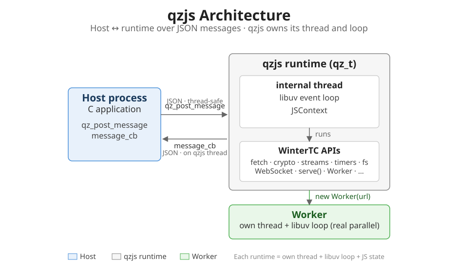

# 概述

qzjs 是一个用**严格 C99** 编写的**可嵌入运行时**。它提供精简的 C API 和
**WinterTC 兼容的运行时**，自带内部
线程和 libuv 事件循环，通过 JSON 消息与宿主通信。

C 应用想把一部分逻辑放进 JavaScript 的话，qzjs 提供运行时；宿主不用自己搭事件循环和线程。



- **基于消息的宿主边界** — `qz_post_message`（入）/ `message_cb`（出），双向 JSON
- **隔离运行时模型** — 每个实例在自己的内部线程上运行 JS；内部锁与原子操作协调线程、宿主与 worker 边界，从不参与 JS 执行
- **ECMAScript 引擎（ES2023）** — 完整 ES2023 支持，启动快，内存占用低
- **WinterTC 兼容运行时** — `fetch`、`console`、`crypto.subtle`、`ReadableStream`、定时器、`fs`、`URL`、`TextEncoder`、WebSocket、`serve()` 等（见 [JS API](/zh/js-api/) 索引）
- **原生扩展** — 压缩（miniz）、加密（mbedTLS）、文本编解码、WebAssembly（WAMR，可选 wasm3）
- **零系统依赖** — 所有依赖通过 CMake 从源码构建；libuv 从 deps 子模块构建
- **多上下文 + Web Worker** — 隔离上下文（软挂起/恢复到磁盘）；`new Worker(url)` 运行真并行线程，或在 `-DQZ_PROCESS_MODEL=ISOLATED`（默认）下运行独立子进程（`qzjs-rt`，经 fork+exec）

## 宿主集成路径

Guide 按宿主开发者的工作顺序组织：

1. **[快速开始](/zh/guide/quickstart)** — 构建 qzjs 并运行最小的 C 嵌入
2. **[独立 CLI](/zh/guide/cli)** — 用 `qzjs` 可执行文件直接运行 JS
3. **[主机集成](/zh/guide/host-integration)** — 完整闭环：create → 消息通信 → 出借能力 → destroy
4. **[运行时生命周期](/zh/guide/lifecycle)** — 线程所有权、就绪、优雅关闭
5. **[多上下文](/zh/guide/multi-context)** — 单个运行时内多个隔离上下文
6. **[扩展](/zh/guide/extensions)** — 把你自己的 C 函数注册为 JS 全局
7. **[字节码](/zh/guide/bytecode)** — 把 JS 预编译为字节码（启动更快、不携带源码）

## 何时使用 qzjs

| 使用场景 | 为什么选择 qzjs |
|----------|----------------|
| **嵌入式 / 边缘脚本** | C99，体积小，内置 libuv 事件循环 |
| **插件系统** | 按运行时隔离，多上下文在运行时内部处理 |
| **需要脚本化的宿主应用** | 在 JS 里脚本化你 C 应用行为，无需交付 Node.js |
| **边缘计算** | WinterTC API 让 JS 开发者感到熟悉 |
| **测试与模拟** | `mock_libuv` 用于确定性测试，无需网络 |

## 何时不应使用 qzjs

- 你需要 **Node.js 模块系统** —— qzjs 没有 `require`/`import`（Node 内置模块不可用）。很多纯 JS npm 包能用（用 `python3 test/compat_check.py <pkg>` 测（见[兼容包](/zh/guide/compatible-packages#如何验证)））；依赖 Node 专属模块的不行。
- 你需要 **DOM** —— qzjs 提供 WinterTC/W3C 子集（fetch、WebSocket、streams、localStorage 等），但没有 `document`/`window`。
- 你需要 **共享内存并发** —— 主运行时单线程；Web Worker 是真并行线程或进程，但通过 structured-clone 消息通信，不共享内存。
- 你需要 **JIT 性能** —— qzjs 的引擎是解释器，不是 JIT 编译器。

## 项目结构

```
qzjs/
├── include/qzjs/       # 公开头（qzjs.h）
├── src/                 # 核心运行时
│   ├── qzjs.c           #   Core API (create/destroy/post_message)
│   ├── thread.c         #   内部线程 + libuv 循环
│   ├── uv_io.c          #   libuv I/O（网络、fs、定时器）
│   ├── msgq.c           #   消息队列（宿主 ⇄ 运行时）
│   ├── worker.c         #   消息分发（onmessage/postMessage）
│   ├── bridge.c         #   JS ↔ 运行时桥接
│   └── context.c        #   多上下文
├── polyfill/src/        # WinterTC 模块源
├── test/                # 测试套件（C + gtest + mock_libuv）
├── deps/                # Git 子模块（引擎、libuv、mbedTLS……）
└── docs/                # 本文档
```
