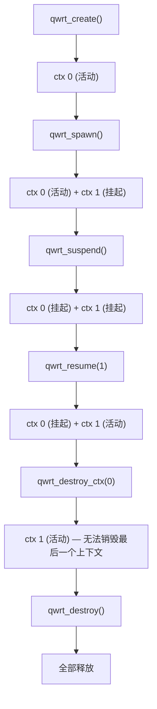

# 多上下文

qwrt 支持在单个运行时中拥有多个隔离的 JS 上下文。每个上下文拥有自己的全局对象、PAL、WinterCG 模块和扩展状态——就像轻量级沙箱。

## 为什么需要多上下文？

- **插件隔离** — 每个插件获得自己的上下文；一个崩溃不会影响其他
- **权限分离** — 每个上下文可以有不同的 PAL 配置（如一个有网络访问权限，另一个没有）
- **请求作用域** — 为每个 HTTP 请求创建全新的上下文，获得干净的状态
- **资源限制** — 单独销毁上下文以回收内存

## 架构

一个 `qwrt_t` 拥有一个 `JSRuntime`。多个 `JSContext` 实例共享该运行时。QuickJS 类 ID 是运行时作用域的，因此类定义是共享的——但每个上下文拥有独立的实例。

同一时间只有**一个上下文处于活动状态**。`qwrt_eval` 和 `qwrt_tick` 始终在活动上下文上操作。

## 派生上下文

```c
// 创建一个拥有自己 PAL 的新上下文（如受限权限）
qwrt_config_t ctx_config = {
    .pal = restricted_pal,
    .debug = 0,
};
int ctx_id = qwrt_spawn(rt, &ctx_config);
if (ctx_id < 0) {
    // 派生失败
}
```

新上下文以**挂起**状态启动。当前活动上下文保持不变。

## 切换上下文

```c
// 挂起当前上下文（停用）
qwrt_suspend(rt);

// 恢复另一个上下文（激活）
qwrt_resume(rt, ctx_id);

// 现在 qwrt_eval 在 ctx_id 的上下文中运行
qwrt_eval(rt, "console.log('Hello from context!');", NULL);
```

挂起会调用每个扩展的 `suspend` 钩子。恢复会调用 `resume` 钩子。

## 销毁上下文

```c
qwrt_destroy_ctx(rt, ctx_id);
```

如果这是**唯一剩余的上下文**则会失败——你不能销毁最后一个上下文。使用 `qwrt_reset` 或 `qwrt_destroy` 来完全拆除。

## 获取上下文信息

```c
// 当前活动上下文 ID，无则为 -1
int active = qwrt_get_active_ctx_id(rt);

// 活动上下文的 JSContext*，无则为 NULL
JSContext *ctx = qwrt_get_jsctx(rt);
```

## 上下文生命周期总结

