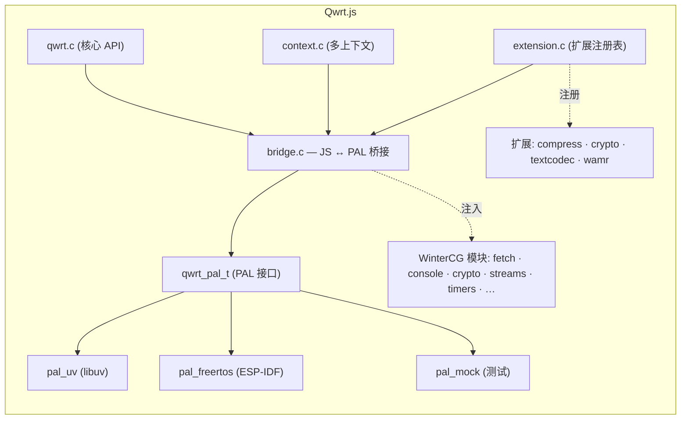

## 快速开始

```bash
# 克隆仓库及所有子模块
git clone --recursive https://github.com/adam-ikari/qwrt.git
cd qwrt

# 配置并构建
cmake -B build -DCMAKE_BUILD_TYPE=Release
cmake --build build -j$(nproc)
```

```c
#include <qwrt/qwrt.h>
#include <pal_uv.h>

int main(void) {
    qwrt_pal_t *pal = pal_uv_create(uv_default_loop());
    qwrt_t *rt = qwrt_create(&(qwrt_config_t){ .pal = pal });

    // 执行 JavaScript
    char *result = NULL;
    qwrt_eval(rt, "1 + 1", &result);
    printf("1 + 1 = %s\n", result);  // "2"
    qwrt_free(result);

    // 驱动事件循环
    pal->run_cycle(pal, 100); qwrt_tick(rt);

    qwrt_destroy(rt);
    return 0;
}
```

## 架构

