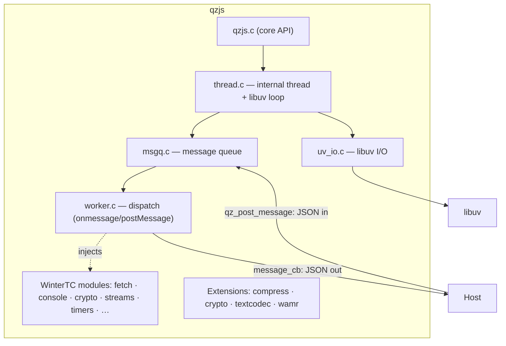

## 快速开始

```bash
# Clone with all submodules
git clone --recursive https://github.com/adam-ikari/qzjs.git
cd qzjs

# Configure and build
cmake -B build -DCMAKE_BUILD_TYPE=Release
cmake --build build -j$(nproc)
```

```c
#include <qzjs/qzjs.h>
#include <stdio.h>

static void on_message(qz_t *rt, const char *json, size_t len, void *data) {
    (void)rt; (void)data;
    printf("received: %.*s\n", (int)len, json);
}

int main(void) {
    qz_config_t cfg = {0};
    cfg.initial_script = "postMessage({hello: 'world'});";
    cfg.message_cb = on_message;
    qz_t *rt = qz_create(&cfg);
    if (!rt) return 1;
    qz_post_message(rt, "{\"cmd\":\"echo\",\"data\":\"hi\"}", 26);
    qz_destroy(rt);
    return 0;
}
```

完整步骤见[快速开始](/zh/guide/quickstart)。

## 架构


```mermaid
flowchart TB
    subgraph AM["qzjs"]
        direction TB
        Core["qzjs.c (core API)"]
        Thread["thread.c — internal thread + libuv loop"]
        Msgq["msgq.c — message queue"]
        Worker["worker.c — dispatch (onmessage/postMessage)"]
        UvIO["uv_io.c — libuv I/O"]
        Core --> Thread
        Thread --> Msgq
        Msgq --> Worker
        Thread --> UvIO
        JS["WinterTC modules: fetch · console · crypto · streams · timers · …"]
        ExtList["Extensions: compress · crypto · textcodec · wamr"]
        Worker -.injects.-> JS
    end
    HOST["Host"] -->|"qz_post_message: JSON in"| Msgq
    Worker -->|"message_cb: JSON out"| HOST
    UvIO --> LIBUV["libuv"]
```
