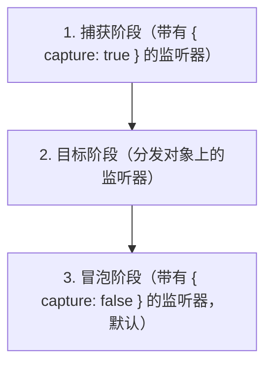

# EventTarget / Event / CustomEvent / ErrorEvent

WHATWG DOM Events 子集（无 DOM 节点）。`EventTarget` 提供了用于 `addEventListener` / `dispatchEvent` 模式的混入。`ErrorEvent` 与 `navigator.reportError` 集成。

## 全局对象

| 全局对象 | 描述 |
|--------|-------------|
| `EventTarget` | 事件分发的基类 |
| `Event` | 基础事件类型 |
| `CustomEvent` | 带有 `detail` 载荷的事件 |
| `ErrorEvent` | 带有 message/file/line/col/error 的错误事件 |

## EventTarget

### 基本用法

```js
class MyEmitter extends EventTarget {}

let emitter = new MyEmitter();

// 监听
emitter.addEventListener('update', (event) => {
    console.log('更新事件:', event.detail);
});

// 分发
emitter.dispatchEvent(new CustomEvent('update', {
    detail: { time: Date.now() }
}));
```

### addEventListener(type, listener, options?)

```js
target.addEventListener('click', handler);

// 带选项
target.addEventListener('click', handler, { once: true });   // 自动移除
target.addEventListener('click', handler, { capture: true }); // 捕获阶段
target.addEventListener('click', handler, { passive: true }); // 不会调用 preventDefault

// AbortSignal 集成
let controller = new AbortController();
target.addEventListener('click', handler, { signal: controller.signal });
controller.abort(); // 移除监听器
```

### removeEventListener(type, listener, options?)

```js
target.removeEventListener('click', handler);
target.removeEventListener('click', handler, { capture: true });
```

### dispatchEvent(event)

```js
let event = new Event('change');
let cancelled = !target.dispatchEvent(event);
// 如果 preventDefault() 被调用，cancelled 为 true
```

## Event

### 构造函数

```js
let event = new Event('load');

let cancelable = new Event('submit', {
    bubbles: true,        // 向上传播
    cancelable: true,     // 可以被取消
    composed: true        // 跨越 shadow DOM 边界（在 qwrt 中不相关）
});
```

### 属性

```js
event.type;            // "load"
event.bubbles;         // false
event.cancelable;      // false
event.composed;        // false
event.defaultPrevented;// false
event.eventPhase;      // 0（NONE）、1（CAPTURING）、2（AT_TARGET）、3（BUBBLING）
event.target;          // 分发事件的 EventTarget
event.currentTarget;   // 当前正在处理的 EventTarget（在监听器中）
event.srcElement;      // target 的别名
event.timeStamp;       // 自 timeOrigin 以来的毫秒数
```

### 方法

```js
event.preventDefault();     // 设置 defaultPrevented = true
event.stopPropagation();   // 停止冒泡/捕获
event.stopImmediatePropagation(); // 停止所有剩余的监听器
event.composedPath();      // 返回 [target]（没有 DOM 树）
```

## CustomEvent

```js
let event = new CustomEvent('user-login', {
    detail: { userId: 42, username: 'alice' }
});

target.addEventListener('user-login', (event) => {
    console.log('用户:', event.detail.username);
});
```

## ErrorEvent

### 构造函数

```js
let err = new Error('出错了');
let event = new ErrorEvent('error', {
    error: err,
    message: err.message,
    filename: 'app.js',
    lineno: 42,
    colno: 10
});
```

### 属性

```js
event.error;     // Error 对象
event.message;   // "出错了"
event.filename;  // "app.js"
event.lineno;    // 42
event.colno;     // 10
```

### 与 reportError 集成

```js
globalThis.addEventListener('error', (event) => {
    console.error('未处理的错误:', event.message);
    console.error('位置:', event.filename, '行', event.lineno);
    console.error(event.error.stack);
});

// 这会向 globalThis 分发一个 ErrorEvent
navigator.reportError(new Error('测试错误'));
```

## 事件阶段



由于 qwrt 没有 DOM 树，冒泡/捕获只有在你构建自己的事件层次结构时才有意义。

## 注意事项

- `EventTarget` 是一个构造函数——你可以直接 `new EventTarget()`
- `AbortSignal` 是一个 `EventTarget`（用于 `signal.addEventListener('abort', ...)`）
- 不支持 `PointerEvent`、`MouseEvent`、`KeyboardEvent`、`FocusEvent` 等（DOM 专用）
- 不支持 `ProgressEvent`（但你可以创建具有相同形状的自定义事件）
- `event.composedPath()` 始终返回 `[target]`（没有 shadow DOM）
- 带有 `{ once: true }` 的 `addEventListener` 在第一次分发后移除监听器