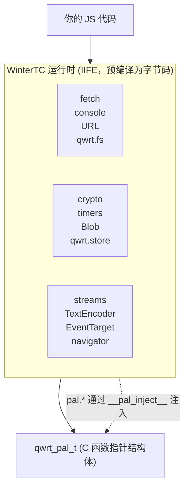

# JS API 参考

qwrt 通过其 WinterTC 模块提供 WinterTC 兼容的 JavaScript API 接口。此处列出的所有全局对象在任何 `qwrt_eval()` 或 `qwrt_eval_bytecode()` 调用中均可用，无需 `require()` 或 `import`。

## 架构



## API 分类

### 核心 API

| API | 全局对象 | WinterTC |
|-----|--------|----------|
| [console](/zh/js-api/console) | `console` | ✅ 标准 |
| [performance](/zh/js-api/performance) | `performance` | ✅ 标准 |
| [timers](/zh/js-api/timers) | `setTimeout`、`setInterval`、`clearTimeout`、`clearInterval` | ✅ 标准 |
| [EventTarget](/zh/js-api/events) | `EventTarget`、`Event`、`CustomEvent`、`ErrorEvent` | ✅ 标准 |
| [AbortController](/zh/js-api/abort) | `AbortController`、`AbortSignal`、`DOMException` | ✅ 标准 |
| [URL](/zh/js-api/url) | `URL`、`URLSearchParams`、`URLPattern` | ✅ 标准 |

### Web API

| API | 全局对象 | WinterTC |
|-----|--------|----------|
| [fetch](/zh/js-api/fetch) | `fetch`、`Headers`、`Request`、`Response` | ✅ 标准 |
| [crypto](/zh/js-api/crypto) | `crypto.getRandomValues()`、`crypto.subtle` | ✅ 标准 |
| [streams](/zh/js-api/streams) | `ReadableStream`、`WritableStream`、`TransformStream` | ✅ 标准 |
| [TextEncoder](/zh/js-api/encoding) | `TextEncoder`、`TextDecoder` | ✅ 标准 |
| [Blob / File / FormData](/zh/js-api/blob) | `Blob`、`File`、`FormData` | ✅ 标准 |
| [structuredClone](/zh/js-api/structured-clone) | `structuredClone` | ✅ 标准 |
| [MessageChannel](/zh/js-api/message-channel) | `MessageChannel`、`MessagePort` | ✅ 标准 |
| [navigator](/zh/js-api/navigator) | `navigator` | ✅ 标准 |

### 平台 API（qwrt 扩展）

| API | 全局对象 | 备注 |
|-----|--------|-------|
| [fs](/zh/js-api/fs) | `qwrt.fs` | 文件系统操作 |
| [storage](/zh/js-api/storage) | `qwrt.storage` | 键值存储 |

## 标准合规性

qwrt 目标是 [WinterTC](https://wintercg.org/) 兼容性 — 与 Cloudflare Workers、Deno 和其他服务端运行时使用的 Web API 子集相同。DOM 专用 API（`document`、`window`、`HTMLElement`）被有意排除。

### 不包含的内容

以下浏览器 API 被明确排除：

- **DOM**：`document`、`window`、`HTMLElement`、全局对象上的 `addEventListener`
- **CSS**：`CSSStyleSheet`、`getComputedStyle`、CSSOM
- **布局**：`requestAnimationFrame`、`IntersectionObserver`、`ResizeObserver`
- **媒体**：`WebSocket`（使用 fetch + streams）、`WebRTC`、`AudioContext`
- **存储**：`localStorage`、`sessionStorage`、`indexedDB`（使用 `qwrt.storage`）

## 使用方式

所有全局对象立即可用 — 无需导入：

```js
// 核心 API
console.log('Hello from qwrt');
setTimeout(() => console.log('tick'), 1000);

// 带流式传输的 fetch
let response = await fetch('https://example.com/data.json');
let data = await response.json();

// crypto
let bytes = crypto.getRandomValues(new Uint8Array(32));
let hash = await crypto.subtle.digest('SHA-256', new TextEncoder().encode('hello'));

// URL 解析
let url = new URL('https://example.com/path?key=value');
console.log(url.searchParams.get('key')); // "value"

// 文件系统（平台扩展）
let content = await qwrt.fs.read('/app/config.json');

// 存储（平台扩展）
await qwrt.storage.set('session_token', 'abc123');
```
