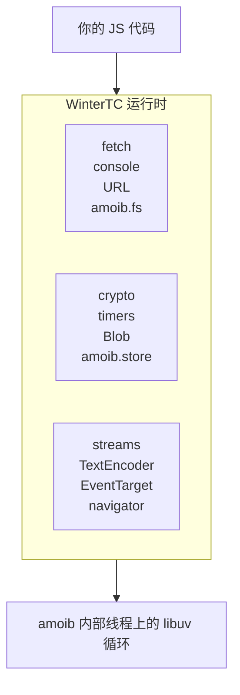

# JS API 参考

amoib 提供一组 WinterTC 兼容的 JS API。下面列出的全局对象在任何跑在运行时里的 JS 中都能直接用（`initial_script`、消息处理器、`am_post_message` 触发的代码），不用 `require()` 或 `import`。

## 架构


```mermaid
flowchart TB
    A["你的 JS 代码"] --> B
    subgraph B["WinterTC 运行时"]
        direction LR
        C["fetch<br/>console<br/>URL<br/>amoib.fs"]
        D["crypto<br/>timers<br/>Blob<br/>amoib.store"]
        E["streams<br/>TextEncoder<br/>EventTarget<br/>navigator"]
    end
    B --> G["amoib 内部线程上的 libuv 循环"]
```

## API 分类

API 按来源标准分三类。

### WinterTC（WinterCG 标准）

amoib 实现的 WinterCG 兼容 Web API 子集。

| API | 全局对象 |
|-----|--------|
| [console](/zh/js-api/console) | `console` |
| [performance](/zh/js-api/performance) | `performance` |
| [timers](/zh/js-api/timers) | `setTimeout`、`setInterval`、`clearTimeout`、`clearInterval` |
| [EventTarget](/zh/js-api/events) | `EventTarget`、`Event`、`CustomEvent`、`ErrorEvent` |
| [AbortController](/zh/js-api/abort) | `AbortController`、`AbortSignal`、`DOMException` |
| [URL](/zh/js-api/url) | `URL`、`URLSearchParams`、`URLPattern` |
| [fetch](/zh/js-api/fetch) | `fetch`、`Headers`、`Request`、`Response` |
| [crypto](/zh/js-api/crypto) | `crypto`、`crypto.subtle` |
| [streams](/zh/js-api/streams) | `ReadableStream`、`WritableStream`、`TransformStream` |
| [compress](/zh/js-api/compress) | `CompressionStream`、`DecompressionStream` |
| [TextEncoder](/zh/js-api/encoding) | `TextEncoder`、`TextDecoder` |
| [Blob / File / FormData](/zh/js-api/blob) | `Blob`、`File`、`FormData` |
| [structuredClone](/zh/js-api/structured-clone) | `structuredClone` |
| [MessageChannel](/zh/js-api/message-channel) | `MessageChannel`、`MessagePort` |
| [Worker](/zh/js-api/worker) | `Worker` |
| [navigator](/zh/js-api/navigator) | `navigator` |

### W3C API

WinterCG 核心之外的浏览器标准 API。

| API | 全局对象 |
|-----|--------|
| [WebSocket](/zh/js-api/websocket) | `WebSocket` |
| [BroadcastChannel](/zh/js-api/broadcast-channel) | `BroadcastChannel` |
| [EventSource](/zh/js-api/event-source) | `EventSource` |
| [CacheStorage](/zh/js-api/cache-storage) | `caches`、`CacheStorage`、`Cache` |
| [Service Worker](/zh/js-api/service-worker) | `navigator.serviceWorker` |
| [localStorage](/zh/js-api/storage#localstorage-sessionstorage) | `localStorage`、`sessionStorage` |

### amoib 平台扩展（类 Node 风格）

amoib 特有的 API，不属于任何 Web 标准。风格接近 Node.js，但不是 Node API
（`process`、`require`、`Buffer` 缺席）。

| API | 全局对象 | 备注 |
|-----|--------|-------|
| [fs](/zh/js-api/fs) | `amoib.fs` | 文件系统操作 |
| [storage](/zh/js-api/storage) | `amoib.storage` | 键值存储 |
| [serve](/zh/js-api/serve) | `serve()` | HTTP / WebSocket / gRPC 服务器 |
| [grpc](/zh/js-api/grpc) | `grpc` | gRPC 客户端 + 服务端（`AM_WITH_GRPC=ON`） |

## 标准合规性

amoib 目标是 [WinterTC](https://wintercg.org/) 兼容性 — 与 Cloudflare Workers、Deno 和其他服务端运行时使用的 Web API 子集相同。DOM 专用 API（`document`、`window`、`HTMLElement`）被有意排除。

### 不包含的内容

以下浏览器 API 被明确排除：

- **DOM**：`document`、`window`、`HTMLElement`、全局对象上的 `addEventListener`
- **CSS**：`CSSStyleSheet`、`getComputedStyle`、CSSOM
- **布局**：`requestAnimationFrame`、`IntersectionObserver`、`ResizeObserver`
- **媒体**：`WebRTC`、`AudioContext`
- **存储**：`indexedDB`（用 `amoib.storage`）

## 使用方式

所有全局对象立即可用 — 无需导入：

```js
// 核心 API
console.log('Hello from amoib');
setTimeout(() => console.log('tick'), 1000);

// 带流式传输的 fetch
let response = await fetch('https://example.com/data.json');
let data = await response.json();

// crypto
let bytes = crypto.getRandomValues(new Uint8Array(32));
let hash = await crypto.subtle.digest('SHA-256', new TextEncoder().encode('hello'));

// URL 解析
let url = new URL('https://example.com/path?key=value');
console.log(url.searchParams.get('key')); // "value"

// 文件系统（平台扩展）
let content = await amoib.fs.read('/app/config.json');

// 存储（平台扩展）
await amoib.storage.set('session_token', 'abc123');
```
