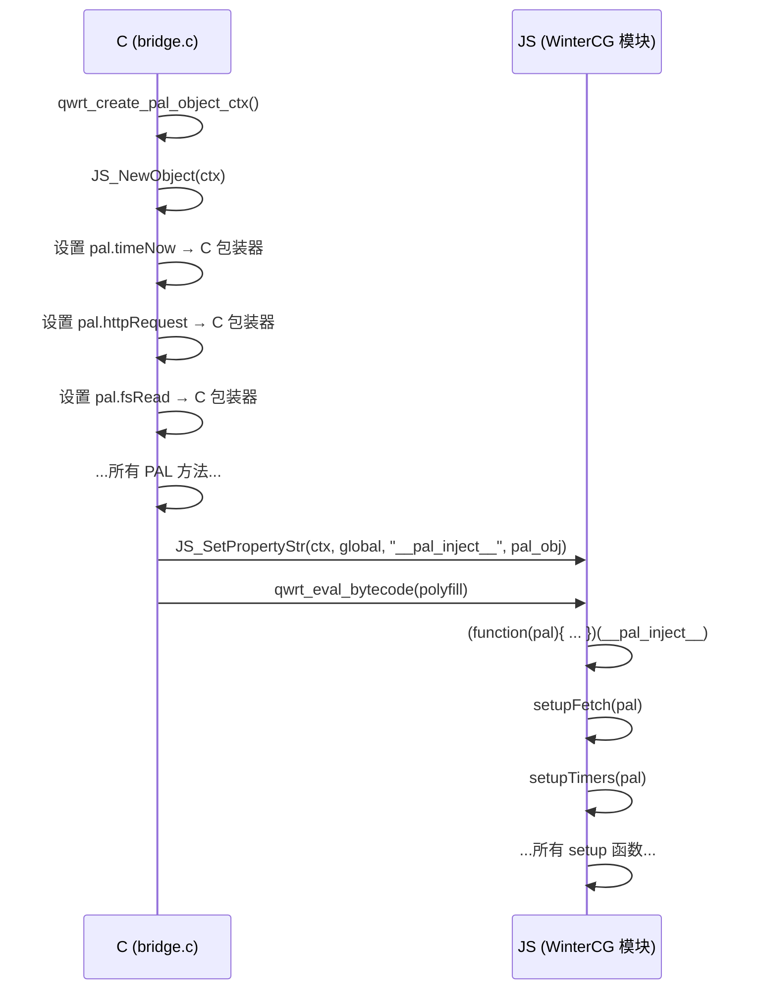

# PAL 注入 (`__pal_inject__`)

`__pal_inject__` 机制是 C PAL 层与 JavaScript WinterCG 模块之间的桥梁。它使得 `pal.*` 函数在 JS 代码中可用。

## 工作原理

1. **C 侧** (`bridge.c`)：`qwrt_create_pal_object_ctx()` 构建一个 JS 对象，将所有 PAL 方法绑定为 JavaScript 函数
2. **注入**：在评估 WinterCG 模块字节码之前，C 桥接层将 `globalThis.__pal_inject__` 设置为该 PAL 对象
3. **运行时侧** (`pal.js`)：运行时读取 `globalThis.__pal_inject__` 并将其用作所有 setup 函数的 `pal` 参数



## 可用的 PAL 原语

这些是通过 `pal.*` 在 WinterCG 模块中暴露的原始原语。用户代码很少直接调用它们——更高级的 API（fetch、fs 等）会对其进行包装。

### 同步方法

| 方法 | 签名 | 返回值 |
|--------|-----------|---------|
| `pal.timeNow()` | `() → number` | 自 epoch 以来的毫秒数 |
| `pal.log(level, msg)` | `(number, string) → void` | — |
| `pal.randomBytes(size)` | `(number) → Uint8Array` | 随机字节 |

### 异步方法（基于 Promise）

| 方法 | 签名 | 返回值 |
|--------|-----------|---------|
| `pal.timerStart(delay, repeat)` | `(number, bool) → {handle, promise}` | 定时器句柄 + Promise |
| `pal.timerStop(handle)` | `(number) → void` | — |
| `pal.httpRequest(url, method, headers, body)` | `(string, string, string, string?) → Promise<string>` | 响应 JSON |
| `pal.httpRequestStream(url, method, headers, body, onHeaders, onData, onEnd)` | `(string, string, string, string?, fn, fn, fn) → void` | 通过回调 |
| `pal.fsRead(path)` | `(string) → Promise<string>` | 文件内容 |
| `pal.fsWrite(path, data)` | `(string, string) → Promise<void>` | — |
| `pal.fsExists(path)` | `(string) → Promise<boolean>` | — |
| `pal.fsRemove(path)` | `(string) → Promise<void>` | — |
| `pal.fsList(path)` | `(string) → Promise<string>` | JSON 数组字符串 |
| `pal.storageGet(key)` | `(string) → Promise<string\|null>` | — |
| `pal.storageSet(key, value)` | `(string, string) → Promise<void>` | — |
| `pal.storageDel(key)` | `(string) → Promise<void>` | — |

## 从 C 扩展调用 PAL

如果你正在编写 C 扩展 (`qwrt_ext_t`)，可以直接调用 PAL 方法：

```c
// 来自 ext_myextension.c
static int myext_init(qwrt_t *rt, qwrt_ctx_t *ctx) {
    qwrt_pal_t *pal = ctx->pal;

    // 同步调用
    uint64_t now = pal->time_now(pal);

    // 带回调的异步调用
    pal->http_request(pal, "https://example.com", "GET",
        "{}", NULL, 0, on_response, ctx);

    return 0;
}
```

## 安全边界

PAL 对象是 JS 与宿主之间的**安全边界**。不同的上下文可以拥有不同的 PAL 对象，具有不同的能力。例如，一个受限文件系统访问的上下文可能将 `pal.fsRead` 设置为只允许从 `/sandbox/` 读取的函数。

## 生命周期

- 创建：在 `qwrt_create_ctx()` → `qwrt_create_pal_object_ctx()` 期间
- 注入：在模块评估之前
- 销毁：随上下文一起销毁（由 QuickJS 垃圾回收）
- 重建：在 `qwrt_reset()` 时——模块会被重新注入