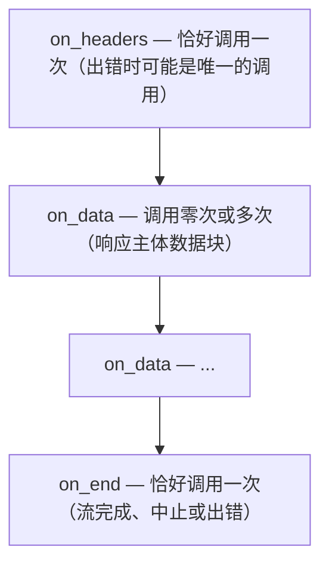

# PAL 回调类型

PAL 使用两种回调类型：一次性完成回调和流式回调三件套。

## 一次性回调：`qwrt_pal_cb_t`

```c
typedef void (*qwrt_pal_cb_t)(void *user_data, int status,
                               const char *data, size_t data_len);
```

使用者：`http_request`、`fs_read`、`fs_write`、`fs_exists`、`fs_remove`、`fs_list`、`storage_get`、`storage_set`、`storage_del`、`timer_start`、`channel_recv`。

### 参数

| 参数 | 描述 |
|-----------|-------------|
| `user_data` | 从调用点传递过来的不透明指针 |
| `status` | 一个 `qwrt_pal_err_t` 值：成功时为 `QWRT_OK`（0），错误时为 `< 0` |
| `data` | 结果载荷（JSON 字符串、文件内容等），错误时为 NULL |
| `data_len` | `data` 的字节长度，如果 `data` 为 NULL 则为 0 |

### 回调约定

- 每个操作的回调**恰好触发一次**
- 回调在**事件循环线程**上触发，而非 JS 线程
- 回调**不得**直接调用 JavaScript — 应使用 `qwrt_defer_callback`
- `data` 的所有权在回调返回前属于 PAL；桥接层在需要时复制

## 流式回调：`qwrt_pal_stream_ops_t`

```c
typedef struct qwrt_pal_stream_ops {
    void (*on_headers)(void *user_data, int status, const char *headers_json);
    void (*on_data)(void *user_data, const char *data, size_t len);
    void (*on_end)(void *user_data, int error_status);
    void *user_data;
} qwrt_pal_stream_ops_t;
```

使用者：`http_request_stream`。

### 调用时序



### `on_headers`

```c
void (*on_headers)(void *user_data, int status, const char *headers_json);
```

在 HTTP 状态行和头部解析完成后调用。

- `status` — HTTP 状态码（200、404、500 等）
- `headers_json` — 响应头部的 JSON 对象，例如 `{"Content-Type":"text/html","Content-Length":"1024"}`

连接失败时（DNS、TLS、超时），`on_headers` 可能以负状态码调用，且跳过 `on_data`/`on_end`。PAL 仍应在错误 `on_headers` 之后调用 `on_end`。

### `on_data`

```c
void (*on_data)(void *user_data, const char *data, size_t len);
```

每个主体数据块调用一次。`len` 可能为 0（空数据块，通常跳过）。数据指针仅在调用期间有效。

### `on_end`

```c
void (*on_end)(void *user_data, int error_status);
```

流结束时调用。

- `error_status` — 正常关闭时为 `QWRT_OK`，中止时为 `QWRT_ERR_CANCELLED`，连接错误时为 `QWRT_ERR_NETWORK` 等。

`on_end` 之后，该流不再触发任何回调。

## 线程安全

所有回调在**事件循环线程**（调用 `pal->run_cycle` 的线程）上触发。它们不得直接调用 `qwrt_eval`、`qwrt_call` 或任何其他执行 JS 的 API。

相反，应将工作排入 JS 线程：

```c
static void my_http_callback(void *user_data, int status,
                              const char *data, size_t len) {
    my_ctx_t *ctx = (my_ctx_t *)user_data;

    // 错误：从 PAL 回调线程调用 JS
    // qwrt_eval(ctx->rt, "handleResponse()", NULL);

    // 正确：延迟到 JS 线程
    qwrt_defer_callback(ctx->rt, process_response, data_copy);
}
```

延迟的回调在宿主调用 `qwrt_tick(rt, 100)` 时运行。
