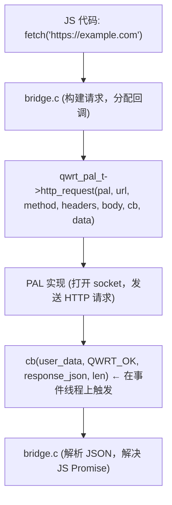

# PAL — 平台抽象层

平台抽象层是 qwrt 可移植性的核心。它是一个包含约 30 个函数指针的结构体，每个后端都必须实现。qwrt 内置三个后端；你可以添加自己的后端。

## PAL 做什么

JavaScript 与外部世界的每一次交互都经过 PAL：

## PAL 分类

| 类别 | 方法 | 描述 |
|----------|---------|-------------|
| 标识 | `user_data`、`version`、`name` | PAL 标识和版本 |
| HTTP | `http_request`、`http_request_stream`、`http_abort` | HTTP 客户端 |
| 文件系统 | `fs_read`、`fs_write`、`fs_exists`、`fs_remove`、`fs_list` | 文件 I/O |
| 存储 | `storage_get`、`storage_set`、`storage_del` | 键值存储 |
| 定时器 | `timer_start`、`timer_stop` | setTimeout/setInterval |
| 时间 | `time_now`、`hrtime` | 墙上时钟和单调时间 |
| 工具 | `log`、`mem_alloc`、`mem_free`、`random_bytes` | 日志、内存、熵 |
| 事件循环 | `run_cycle` | 驱动异步 I/O |
| 进程 | `spawn`、`join`、`terminate`、`channel_*` | 子进程管理 |
| 生命周期 | `init`、`destroy` | 初始化和清理钩子 |
| 保留 | `reserved[4]` | 前向兼容 |

## 内置后端

| 后端 | 平台 | 关键技术 |
|---------|----------|-----------------|
| [`pal_uv`](/zh/pal/pal-uv) | Linux、macOS | libuv（事件循环、TCP）、mbedTLS（TLS）、POSIX（FS） |
| [`pal_mock`](/zh/pal/pal-mock) | 测试 | 内存响应，无 I/O 依赖 |
| [`pal_freertos`](/zh/pal/pal-freertos) | ESP32-S3 | lwIP（TCP）、mbedTLS（TLS）、LittleFS（FS）、NVS（存储） |

## 添加你自己的 PAL

请参阅[实现 PAL](/zh/pal/implementing) 指南，了解分步操作说明。

## 接口稳定性

- `qwrt_pal_t` 字段是**仅追加**的 — 新字段添加到末尾
- `version` 字段允许代码在运行时检查 ABI 兼容性
- `reserved[4]` 槽位初始化为 NULL，用于前向兼容
- 错误码通过 `qwrt_pal_err_t` 枚举进行标准化